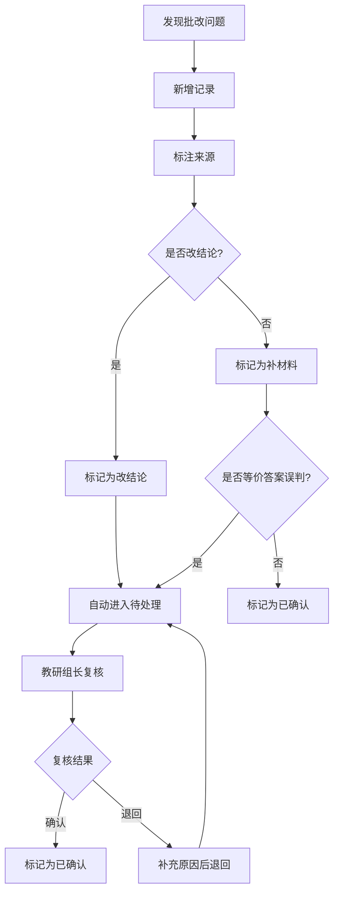

## 1. 产品概述

集合关系批改是一个轻量级批改记录追踪系统，解决数学周测出卷前教师与助教对难度标签、题库表、讲评记录口径不一致的问题。核心目标：每条批改记录可追溯来源、看清当前状态、知道谁改过、理解为何进入待处理，让等价答案误判等争议记录有复核依据，导出的讲评稿可被下一班继续查用，无需翻聊天记录。

- 目标用户：数学教师、助教、教研组长
- 核心价值：把"补材料"和"改结论"区分清楚，消除临时补材料带来的混乱

## 2. 核心功能

### 2.1 用户角色

| 角色 | 进入方式 | 核心权限 |
|------|----------|----------|
| 教师 | 选择身份进入 | 查看全部记录、新增/修改记录、标记待处理、导出讲评稿 |
| 助教 | 选择身份进入 | 查看全部记录、新增记录、标记待处理、导出讲评稿 |
| 教研组长 | 选择身份进入 | 教师全部权限 + 复核争议记录、关闭待处理 |

### 2.2 功能模块

1. **记录总览页**：记录列表、多维度筛选、状态标签、来源追溯、批量操作
2. **记录详情页**：完整审计轨迹、修改历史时间线、待处理原因、等价答案复核区

### 2.3 页面详情

| 页面名称 | 模块名称 | 功能描述 |
|----------|----------|----------|
| 记录总览页 | 顶部筛选栏 | 按状态（待处理/已确认/已关闭）、来源（难度标签/讲评记录/题库表）、变更类型（补材料/改结论）、操作人筛选 |
| 记录总览页 | 记录卡片列表 | 每张卡片展示：题号、集合关系描述、当前状态标签、来源标签、最近修改人、修改时间、是否涉及结论变更 |
| 记录总览页 | 统计摘要栏 | 待处理数、补材料vs改结论比例、等价答案误判数、今日新增数 |
| 记录总览页 | 导出讲评稿按钮 | 生成可查续用的讲评稿文本，按题号排序 |
| 记录详情页 | 基本信息 | 题号、集合关系描述、难度标签、原始答案、标准答案 |
| 记录详情页 | 审计时间线 | 按时间倒序展示所有变更：谁在什么时间做了什么操作，标注变更类型（补材料/改结论） |
| 记录详情页 | 待处理原因区 | 显示进入待处理的原因，支持教研组长填写复核结论 |
| 记录详情页 | 等价答案复核区 | 展示被标记为误判的等价答案，提供复核理由输入和确认按钮 |
| 记录详情页 | 操作区 | 修改状态、添加备注、标记为补材料/改结论 |

## 3. 核心流程

### 3.1 记录生命周期

教师或助教发现批改问题 → 新增记录并标注来源（难度标签/讲评记录/题库表）→ 系统自动标记变更类型（补材料/改结论）→ 如涉及结论变更或等价答案误判，自动进入"待处理"→ 教研组长复核 → 确认或关闭

### 3.2 讲评稿导出流程

点击导出 → 筛选范围（全量/仅待处理/仅改结论）→ 生成讲评稿文本 → 复制或下载

## 4. 用户界面设计

### 4.1 设计风格

- **主色调**：墨蓝（#1a2744）为基底，琥珀色（#d97706）为强调色，灰白为内容区
- **辅助色**：补材料标签用灰蓝，改结论标签用琥珀，待处理用红色系
- **字体**：标题用 Noto Serif SC，正文用 Noto Sans SC，数字用 JetBrains Mono
- **布局**：左侧固定导航 + 右侧内容区，卡片式布局
- **图标**：lucide-react 线性图标
- **风格关键词**：实用主义、表格感、审计日志风——信息密度高但不杂乱

### 4.2 页面设计概览

| 页面名称 | 模块名称 | UI要素 |
|----------|----------|--------|
| 记录总览页 | 筛选栏 | 紧凑横排筛选，pill 形状标签切换，选中态有底色 |
| 记录总览页 | 统计摘要 | 四个指标卡片横排，数字突出，标签小字 |
| 记录总览页 | 记录卡片 | 左侧状态色条，卡片内分两行：首行题号+来源标签+变更类型标签，次行描述+修改人+时间 |
| 记录总览页 | 导出按钮 | 右上角固定，琥珀色实心按钮 |
| 记录详情页 | 审计时间线 | 垂直时间线，左侧时间戳+操作人，右侧操作描述+变更类型标签，补材料灰色节点，改结论琥珀节点 |
| 记录详情页 | 等价答案复核区 | 独立卡片，左侧展示误判答案和标准答案对比，右侧复核理由输入+确认按钮 |
| 记录详情页 | 操作区 | 底部固定操作栏，状态切换+备注输入+提交 |

### 4.3 响应式

桌面优先，内容区最小宽度 1024px。平板端筛选栏折叠为下拉，卡片变为单列。手机端仅保留列表和基础操作。

### 4.4 无3D场景
