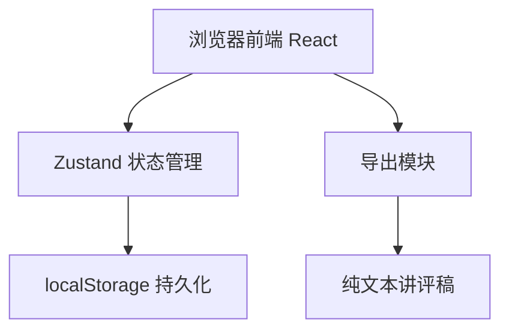
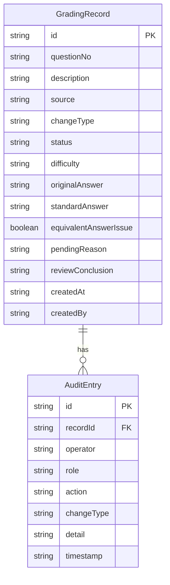

## 1. 架构设计



纯前端方案，数据持久化到 localStorage，无需后端服务。

## 2. 技术说明

- **前端**：React@18 + TypeScript + Tailwind CSS@3 + Vite
- **初始化工具**：vite-init（react-ts 模板）
- **状态管理**：Zustand（含 persist 中间件自动同步 localStorage）
- **路由**：react-router-dom@6
- **图标**：lucide-react
- **后端**：无（纯前端，localStorage 持久化）
- **数据库**：无（localStorage 模拟持久化）

## 3. 路由定义

| 路由 | 用途 |
|------|------|
| `/` | 记录总览页，含筛选、统计、卡片列表、导出入口 |
| `/record/:id` | 记录详情页，含审计时间线、复核区、操作区 |

## 4. API 定义

无后端 API。所有数据操作通过 Zustand store 完成。

### 4.1 Store 方法签名

```typescript
interface GradingRecord {
  id: string
  questionNo: string
  description: string
  source: "difficulty_label" | "review_record" | "question_bank"
  changeType: "supplementary" | "conclusion_change"
  status: "pending" | "confirmed" | "closed"
  difficulty: string
  originalAnswer: string
  standardAnswer: string
  equivalentAnswerIssue: boolean
  equivalentAnswers: string[]
  pendingReason: string
  reviewConclusion: string
  createdAt: string
  updatedAt: string
  createdBy: string
}

interface AuditEntry {
  id: string
  recordId: string
  operator: string
  role: "teacher" | "assistant" | "lead"
  action: string
  changeType: "supplementary" | "conclusion_change"
  detail: string
  timestamp: string
}

interface GradingStore {
  records: GradingRecord[]
  auditLog: AuditEntry[]
  currentUser: { name: string; role: "teacher" | "assistant" | "lead" }
  
  addRecord: (record: Omit<GradingRecord, "id" | "createdAt" | "updatedAt">) => void
  updateRecord: (id: string, updates: Partial<GradingRecord>, auditDetail: string) => void
  addAuditEntry: (entry: Omit<AuditEntry, "id" | "timestamp">) => void
  reviewEquivalentAnswer: (recordId: string, conclusion: string) => void
  exportReviewNotes: (filter: "all" | "pending" | "conclusion_change") => string
  setCurrentUser: (user: { name: string; role: "teacher" | "assistant" | "lead" }) => void
}
```

## 5. 服务器架构图

无后端服务。

## 6. 数据模型

### 6.1 数据模型定义



### 6.2 初始数据

系统预置 5 条示范记录，覆盖不同来源、变更类型和状态组合，包含等价答案误判样例，方便用户理解系统运作方式。
