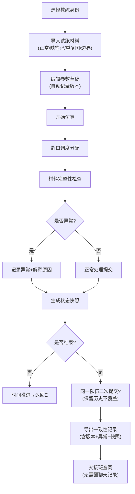

## 1. 产品概述

排队窗口仿真系统是为竞赛教练设计的工作流管理工具，用于仿真多窗口队伍材料提交过程，解决参数草稿修改无迹可寻、历史记录易被覆盖、异常情况难以追溯的问题。

- 核心问题：参数草稿修改依赖记忆、历史记录易被覆盖、异常情况缺乏解释、交接班信息断层
- 目标用户：竞赛教练、赛事运营人员
- 核心价值：可追溯、可回看、可解释、可导出的仿真工作流

## 2. 核心特性

### 2.1 用户角色
| 角色 | 注册方式 | 核心权限 |
|------|---------|----------|
| 竞赛教练 | 本地身份选择 | 运行仿真、修改参数草稿、查看历史、导出记录 |
| 交接班教练 | 本地身份选择 | 查看历史记录、导出记录、继续未完成仿真 |

### 2.2 功能模块
1. **仿真控制台**：参数配置、窗口调度、实时状态监控
2. **草稿版本中心**：参数草稿修改历史、版本对比、修改人追溯
3. **时间线回看**：状态快照、任意时间点回放、历史状态对比
4. **异常中心**：异常检测、原因解释、边界情况处理记录
5. **导出中心**：一致性导出、交接班说明、不可篡改的审计记录

### 2.3 页面详情
| 页面名称 | 模块名称 | 功能描述 |
|---------|---------|----------|
| 仿真控制台 | 窗口状态面板 | 实时显示各窗口当前处理队伍、排队队列、处理进度 |
| 仿真控制台 | 草稿编辑区 | 参数草稿编辑、保存、标记修改人 |
| 仿真控制台 | 仿真控制 | 开始/暂停/步进/重置、速度调节 |
| 草稿版本中心 | 版本列表 | 所有草稿版本、修改人、修改时间、版本差异 |
| 草稿版本中心 | 版本对比 | 任意两个版本的差异对比 |
| 时间线回看 | 时间轴 | 所有状态快照时间点、拖动回放 |
| 时间线回看 | 状态快照 | 任意时间点的完整状态（窗口、队列、提交记录） |
| 异常中心 | 异常列表 | 所有异常记录、类型、发生时间、涉及队伍 |
| 异常中心 | 异常解释 | 异常原因说明、影响范围、建议处理方式 |
| 导出中心 | 导出配置 | 选择导出范围、格式、内容 |
| 导出中心 | 导出预览 | 导出内容预览、校验一致性 |

## 3. 核心流程

## 4. 用户界面设计

### 4.1 设计风格
- **主色调**：深灰蓝 (#1e293b) 作为主背景，琥珀橙 (#f59e0b) 作为强调色（警告/异常），翠绿 (#10b981) 作为成功状态
- **按钮风格**：直角矩形、轻微阴影、hover 状态边框高亮
- **字体**：JetBrains Mono（等宽字体，便于对齐状态数据）+ Noto Sans SC（中文显示）
- **布局风格**：高密度信息面板、分区明确、 monospace 字体展示时间戳和状态码
- **图标风格**：纯线条图标，避免花哨装饰，强调功能性

### 4.2 页面设计概述
| 页面名称 | 模块名称 | UI 元素 |
|---------|---------|---------|
| 仿真控制台 | 窗口状态面板 | 卡片式布局、状态指示灯、等宽字体显示进度 |
| 仿真控制台 | 草稿编辑区 | Code editor 风格、行号显示、修改标记 |
| 时间线回看 | 时间轴 | 横向时间轴、可拖动滑块、异常点红标标记 |
| 异常中心 | 异常列表 | 表格展示、可展开查看详情、颜色区分异常等级 |
| 导出中心 | 导出预览 | 纯文本预览、校验哈希值显示 |

### 4.3 响应式
- 桌面端优先设计，1280px 以上最佳体验
- 面板支持折叠展开，适应不同屏幕宽度
- 时间轴支持触摸拖动

### 4.4 数据安全与一致性
- 所有状态快照自动计算 SHA256 哈希，用于导出时校验一致性
- 历史记录采用追加写入，不允许修改或删除
- 同一队伍二次提交时自动追加到历史记录，不覆盖原有成功记录
