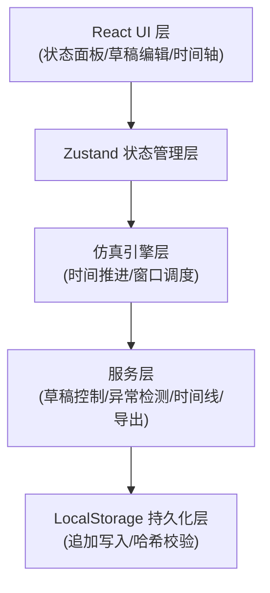
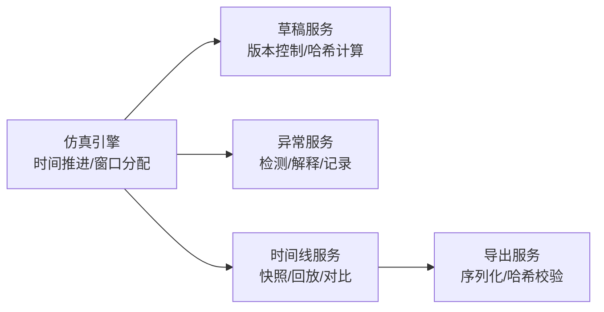

## 1. 架构设计



## 2. 技术描述

- **前端框架**：React@18 + TypeScript@5
- **构建工具**：Vite@5
- **状态管理**：Zustand@4（轻量级状态管理，支持时间旅行）
- **样式方案**：TailwindCSS@3 + 自定义 CSS 变量
- **字体**：JetBrains Mono + Noto Sans SC
- **数据持久化**：LocalStorage（加密存储，支持导入导出）
- **哈希校验**：crypto-js（SHA256）
- **图标**：Lucide React（纯线条图标）

## 3. 路由定义
| 路由 | 用途 |
|------|------|
| / | 仿真控制台（主页） |
| /drafts | 草稿版本中心 |
| /timeline | 时间线回看 |
| /anomalies | 异常中心 |
| /export | 导出中心 |

## 4. 核心数据类型定义

```typescript
// 队伍
interface Team {
  id: string;
  name: string;
  members: string[];
  registrationTime: number;
  submissionCount: number; // 提交次数，用于识别二次提交
}

// 材料
interface Material {
  type: 'param_draft' | 'team_notes' | 'result_chart' | 'boundary_doc';
  name: string;
  status: 'pending' | 'approved' | 'rejected';
  hasIssue: boolean;
  issueDesc?: string;
}

// 提交记录
interface Submission {
  id: string;
  teamId: string;
  teamName: string;
  materials: Material[];
  status: 'queued' | 'processing' | 'success' | 'failed';
  anomalies: AnomalyRecord[];
  windowId: string | null;
  startTime: number;
  endTime?: number;
  isResubmission: boolean; // 是否为二次提交
  originalSubmissionId?: string; // 关联原始提交
}

// 参数草稿
interface Draft {
  id: string;
  teamId: string;
  content: string;
  version: number;
  modifiedBy: string;
  modifiedAt: number;
  parentVersion?: number;
  changeSummary: string;
  hash: string; // 内容哈希
}

// 窗口
interface Window {
  id: string;
  name: string;
  status: 'idle' | 'busy' | 'paused';
  currentSubmissionId: string | null;
  queue: string[]; // submissionId 队列
}

// 异常记录
interface AnomalyRecord {
  id: string;
  type: 'missing_notes' | 'duplicate_chart' | 'boundary_case' | 'draft_modified' | 'resubmission';
  severity: 'info' | 'warning' | 'error';
  message: string;
  explanation: string;
  submissionId: string;
  teamId: string;
  timestamp: number;
  handled: boolean;
}

// 状态快照
interface StateSnapshot {
  id: string;
  timestamp: number;
  simulationTime: number;
  windows: Window[];
  submissions: Submission[];
  drafts: Draft[];
  anomalies: AnomalyRecord[];
  hash: string; // 整个快照的哈希
}

// 仿真配置
interface SimulationConfig {
  windowCount: number;
  processingTimeMs: number;
  autoDetectAnomalies: boolean;
  preserveHistory: boolean; // 保留历史不覆盖
}
```

## 5. 服务层架构



## 6. 关键设计决策

### 6.1 历史记录保护机制
- 所有写入操作采用追加模式，不修改已有记录
- 同一队伍二次提交时，设置 `isResubmission: true` 并关联 `originalSubmissionId`
- 状态快照哈希链：每个快照包含前一个快照的哈希，形成不可篡改链

### 6.2 异常检测规则
- **缺队员笔记**：materials 中缺少 type='team_notes' 或 hasIssue=true
- **重复结果图**：同一 teamId 下存在多个相同名称的 result_chart
- **边界情况**：提交时间在窗口关闭前 10 秒内、队伍人数超出范围等
- **草稿修改**：同一草稿版本号跳跃或修改人变更

### 6.3 导出一致性保证
- 导出文件包含：所有状态快照哈希链 + 完整草稿版本 + 异常记录 + 提交记录
- 导出文件末尾附加整体 SHA256 哈希校验
- 导出格式采用纯文本 + JSON，便于查阅和校验

## 7. 本地存储结构
```
/localStorage
  ├── queue_sim_teams          # 队伍信息（不可变，追加）
  ├── queue_sim_submissions    # 提交记录（不可变，追加）
  ├── queue_sim_drafts         # 草稿版本（不可变，追加）
  ├── queue_sim_anomalies      # 异常记录（不可变，追加）
  ├── queue_sim_snapshots      # 状态快照（不可变，追加）
  ├── queue_sim_config         # 仿真配置（可修改）
  └── queue_sim_current_user   # 当前教练身份
```
