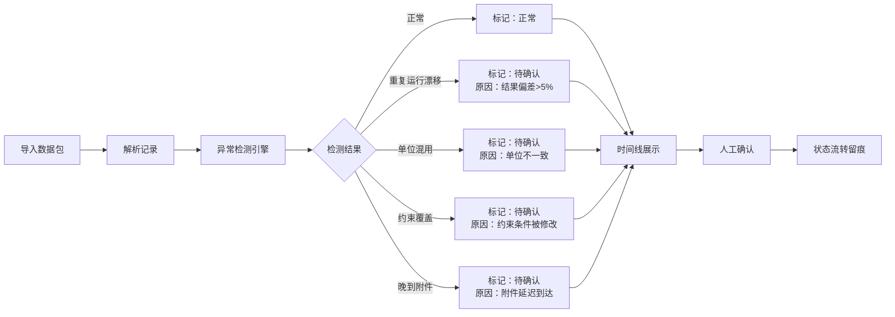

## 1. 产品概述
为竞赛教练设计的"工厂瓶颈识别"数据追踪工具，用于统一查看队员笔记、实验结果图和测试数据。核心解决竞赛数据零散、证据链断裂、异常结果混入等问题，帮助教练快速定位问题并追溯完整处理过程。

## 2. 核心功能

### 2.1 用户角色
| 角色 | 注册方式 | 核心权限 |
|------|----------|----------|
| 竞赛教练 | 无需注册，本地使用 | 查看所有记录、标注状态、人工确认、导出视图 |
| 队员 | 无需注册，本地录入 | 提交记录、添加笔记、上传附件 |

### 2.2 功能模块
1. **时间线主视图**：统一展示所有记录，按时间轴串联笔记、结果图、实验数据
2. **记录卡片**：展示来源、状态、修改历史、待处理原因
3. **数据包导入**：支持导入混合数据包（正常/晚到/重复/更正）
4. **异常检测**：自动识别结果漂移、单位混用、约束覆盖并标记待确认
5. **证据链面板**：串联队员笔记、人工确认、模型说明的完整证据链
6. **状态过滤器**：按状态（正常/待确认/已更正/重复）筛选记录

### 2.3 页面详情
| 页面名称 | 模块名称 | 功能描述 |
|----------|----------|----------|
| 主页面 | 顶部工具栏 | 数据包导入、状态筛选、视图切换 |
| 主页面 | 时间线区域 | 横向时间轴，节点按时间排列，支持缩放 |
| 主页面 | 记录卡片 | 展开显示来源、状态流转、修改人、证据链 |
| 主页面 | 详情侧栏 | 点击记录后展示完整数据、笔记、附件、异常原因 |
| 主页面 | 异常标记面板 | 列出所有待确认项及原因，支持批量处理 |

## 3. 核心流程
教练导入包含混合类型的数据包 → 系统自动解析并检测异常（重复/单位/漂移） → 异常记录自动标记为"待确认"并标注原因 → 教练在时间线中查看完整证据链 → 人工确认后标记为"已更正"或"正常" → 所有状态变更永久留痕可追溯。

## 4. 用户界面设计

### 4.1 设计风格
- **主色调**：工业蓝 `#1e3a5f` 作为主色，搭配灰色调 `#2d3748` 背景，突出数据严谨性
- **辅助色**：正常 `#38a169`、待确认 `#dd6b20`、异常 `#e53e3e`、已更正 `#3182ce`
- **字体**：标题使用 `JetBrains Mono` 等宽字体体现技术感，正文使用 `Inter` 保证可读性
- **布局**：顶部工具栏 + 左侧时间线 + 右侧详情面板的三栏结构，信息密度适中
- **交互**：悬停时卡片轻微上浮，状态变更有平滑过渡动画，时间线节点点击有脉冲反馈

### 4.2 页面设计概述
| 页面名称 | 模块名称 | UI 元素 |
|----------|----------|---------|
| 主页面 | 顶部工具栏 | 深色背景、按钮使用方角设计、图标使用线条风格 |
| 主页面 | 时间线 | 浅灰色时间轴、不同状态节点使用对应颜色圆点、虚线连接晚到记录 |
| 主页面 | 记录卡片 | 卡片式布局、左上角状态色标、右下角修改人信息、证据链使用缩进列表 |
| 主页面 | 详情侧栏 | 深色背景、数据表格使用斑马纹、异常原因使用红色高亮区块 |
| 主页面 | 异常面板 | 折叠式列表、每条显示异常类型图标、一键确认按钮 |

### 4.3 响应式
- 桌面端：三栏布局，时间线可横向滚动
- 平板端：上下布局，时间线在上，详情在下
- 移动端：卡片堆叠布局，支持左右滑动切换记录

### 4.4 设计原则
- 拒绝花哨装饰，所有视觉元素服务于信息传达
- 状态标识必须醒目但不刺眼，不同状态间差异明确
- 证据链展示使用清晰的层级缩进和连接线，避免混乱
