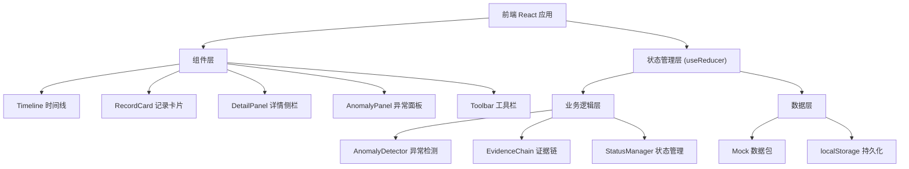
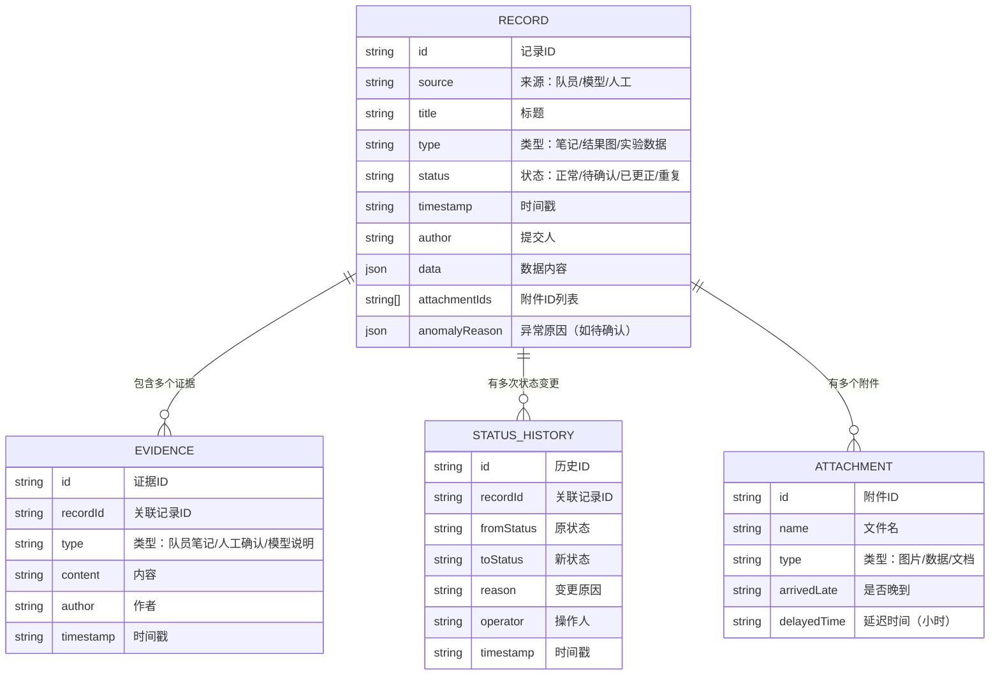

## 1. 架构设计


## 2. 技术描述
- **前端框架**：React@18 + TypeScript + Vite@5
- **样式方案**：TailwindCSS@3 + CSS 变量
- **状态管理**：React useReducer + Context（轻量方案，避免过度设计）
- **数据持久化**：localStorage 存储处理后的记录和状态变更
- **图表展示**：使用原生 Canvas 绘制简单结果趋势图（避免引入重型图表库）
- **图标**：使用 inline SVG 图标，无需额外图标库

## 3. 路由定义
| 路由 | 用途 |
|------|------|
| / | 主页面，包含时间线、记录卡片、详情侧栏 |

## 4. 数据模型

### 4.1 数据模型定义


### 4.2 核心类型定义
```typescript
type RecordStatus = 'normal' | 'pending' | 'corrected' | 'duplicate';
type RecordType = 'note' | 'result' | 'data';
type EvidenceType = 'note' | 'confirmation' | 'model';
type AnomalyType = 'drift' | 'unit_mismatch' | 'constraint_override' | 'late_attachment' | 'duplicate';

interface AnomalyReason {
  type: AnomalyType;
  description: string;
  details: Record<string, unknown>;
}

interface DataRecord {
  id: string;
  source: 'teammate' | 'model' | 'manual';
  title: string;
  type: RecordType;
  status: RecordStatus;
  timestamp: string;
  author: string;
  data: {
    value?: number;
    unit?: string;
    constraints?: Record<string, unknown>;
    runId?: string;
    [key: string]: unknown;
  };
  attachments: Attachment[];
  anomalyReason?: AnomalyReason;
  evidence: Evidence[];
  statusHistory: StatusChange[];
}

interface Evidence {
  id: string;
  type: EvidenceType;
  content: string;
  author: string;
  timestamp: string;
}

interface StatusChange {
  id: string;
  fromStatus: RecordStatus;
  toStatus: RecordStatus;
  reason: string;
  operator: string;
  timestamp: string;
}

interface Attachment {
  id: string;
  name: string;
  type: 'image' | 'data' | 'doc';
  arrivedLate: boolean;
  delayedHours?: number;
  url?: string;
}
```

## 5. 异常检测核心逻辑

### 5.1 重复运行结果漂移检测
- 相同 `runId` 的多次运行结果对比
- 偏差阈值：数值差异 > 5% 或相对误差 > 2σ
- 标记为 `pending`，原因标注漂移值和对比数据

### 5.2 单位混用检测
- 同类型数据（如产能、时间）的单位一致性检查
- 预定义单位组：`['pcs/h', '件/小时', 'units/hr']` 视为同一量纲
- 跨组单位出现标记为 `pending`

### 5.3 约束覆盖检测
- 记录中 `constraints` 字段变更历史比对
- 后续记录的约束条件与原始约束冲突时标记
- 记录被覆盖的约束项和新值

### 5.4 晚到附件检测
- 附件 `arrivedLate` 标记为 `true` 时自动标记记录
- 记录延迟到达时间，提醒教练注意时序合理性

## 6. 项目目录结构
```
src/
├── types/              # 类型定义
│   └── index.ts
├── data/               # Mock 数据包
│   ├── samplePacket.ts # 混合数据包
│   └── initialData.ts
├── logic/              # 业务逻辑
│   ├── anomalyDetector.ts
│   ├── evidenceChain.ts
│   └── statusManager.ts
├── components/         # UI 组件
│   ├── Timeline/
│   ├── RecordCard/
│   ├── DetailPanel/
│   ├── AnomalyPanel/
│   └── Toolbar/
├── hooks/              # 自定义 Hooks
│   └── useRecords.ts
├── store/              # 状态管理
│   └── RecordsContext.tsx
├── App.tsx
├── main.tsx
└── index.css
```
