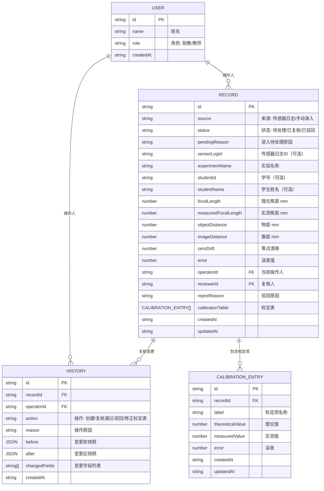

## 1. 架构设计

纯前端本地应用，无后端服务，所有数据通过 localStorage 持久化。

```mermaid
graph TD
    "浏览器" --> "React + TypeScript"
    "React + TypeScript" --> "Zustand Store"
    "Zustand Store" --> "localStorage 持久化"
    "React + TypeScript" --> "Three.js 3D 可视化"
    "React + TypeScript" --> "TailwindCSS UI"
    "Zustand Store" --> "记录模块"
    "Zustand Store" --> "历史模块"
    "Zustand Store" --> "用户模块"
    "Zustand Store" --> "导出模块"
```

## 2. 技术描述

- 前端：React@18 + TypeScript + Vite@5
- 状态管理：zustand@4 + immer 中间件
- 3D：three@0.160 + @react-three/fiber@8 + @react-three/drei@9
- 样式：tailwindcss@3 + postcss + autoprefixer
- 图标：lucide-react@0.294
- 路由：react-router-dom@6
- CSV解析：papaparse@5
- 数据持久化：localStorage（通过 zustand-persist 中间件）
- 无后端、无数据库

## 3. 路由定义

| Route | 页面 | Purpose |
|-------|------|---------|
| / | 重定向到 /import | 根路由重定向 |
| /import | 导入页 | 传感器日志导入与手动补录 |
| /review | 复核页 | 零点漂移检查与待处理审核 |
| /correction | 修正页 | 标定表编辑与修正 |
| /history | 历史页 | 变更追溯与前后对比 |
| /export | 导出页 | 实验批改表导出与一致性校验 |
| /visualization | 3D可视化 | 透镜成像光路示意 |

## 4. 数据模型

### 4.1 数据模型定义



### 4.2 Zustand Store 切片

- `userSlice`：当前操作人设置、用户列表管理
- `recordSlice`：记录的CRUD、状态流转（待处理→已复核→驳回）
- `historySlice`：历史记录写入、查询、前后对比
- `exportSlice`：一致性校验、导出文件生成

所有切片通过 persist 中间件自动同步到 localStorage。

## 5. 核心模块设计

### 5.1 导入模块

- 支持 CSV/JSON 拖拽上传，使用 papaparse 解析
- 导入预览：解析后展示前20条，确认后批量写入
- 自动标记：所有导入记录初始状态为"待处理"，来源为"传感器日志"，原因为"传感器日志导入，需复核零点漂移"
- 手动补录：表单录入，来源为"手动录入"

### 5.2 复核模块

- 零点漂移图：纯 Canvas 折线图（不引入额外图表库），以记录ID为横轴，零点漂移为纵轴
- 超限点：漂移绝对值 > 0.02mm 标红
- 审核操作：通过→更新状态为"已复核"并记录复核人；驳回→弹窗输入原因，更新状态为"已驳回"

### 5.3 修正模块

- 标定表编辑器：可编辑 Table，行内编辑
- 变更捕获：编辑后自动对比 before/after，写入 history 表
- 差异高亮：当前会话中修改过的单元格琥珀色背景

### 5.4 历史模块

- 时间线展示：按时间倒序排列所有变更
- 筛选器：按记录ID、操作人、时间范围、操作类型筛选
- 前后对比弹窗：展示完整记录快照对比，变更字段高亮

### 5.5 导出模块

- 一致性校验规则：
  1. 标定表所有项误差之和应等于记录总误差（±0.001容差）
  2. 已驳回记录不允许导出
  3. 必须有复核人
- 校验不通过项标红，提供"跳转修正"按钮
- 导出格式：CSV（用于Excel打开）、JSON（用于程序处理）

### 5.6 3D 可视化模块

- Three.js + @react-three/fiber 实现
- 凸透镜使用 LatheGeometry 生成
- 物距/焦距滑块实时更新像距（基于透镜公式 1/f = 1/u + 1/v）
- 显示理论像距与实测像距的误差标注
