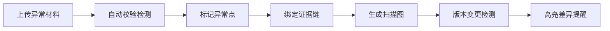

## 1. 产品概述

实验室助教异常数据管理系统，解决实验报告批改中异常照片追溯、单位换算校验、磁场扫描图版本追踪等痛点问题。
- 核心目标：降低人工核对错误率，建立可追溯的批改证据链
- 目标用户：实验室助教、任课教师、实验管理员

## 2. 核心功能

### 2.1 用户角色
| 角色 | 注册方式 | 核心权限 |
|------|----------|----------|
| 助教 | 工号注册 | 上传异常照片、批改意见、生成磁场扫描图 |
| 教师 | 工号注册 | 审核批改结果、查看版本历史、导出报告 |

### 2.2 功能模块
1. **异常照片管理页**：照片上传、标签分类、日志关联、批改意见绑定
2. **磁场扫描图工作台**：数据导入、异常点标记、结论追溯、版本对比
3. **单位换算校验器**：自动检测单位错误、零点漂移、采样缺口
4. **版本历史中心**：批改意见变更追踪、差异高亮、操作日志

### 2.3 页面详情
| 页面名称 | 模块名称 | 功能描述 |
|----------|----------|----------|
| 异常照片管理 | 照片上传区 | 拖拽上传、批量导入、自动识别时间戳 |
| 异常照片管理 | 标签分类器 | 单位错误/零点漂移/采样缺口/其他异常 |
| 异常照片管理 | 关联面板 | 绑定传感器日志、实验纸扫描件、微信群截图 |
| 磁场扫描图工作台 | 数据导入 | 支持 CSV/JSON 传感器数据导入 |
| 磁场扫描图工作台 | 异常点标记 | 可疑点标红、待确认标记、结论跳转 |
| 磁场扫描图工作台 | 证据追溯 | 点击数据点跳转至关联照片/意见 |
| 单位换算校验器 | 自动检测 | 识别常见单位错误、零点偏移、数据缺口 |
| 版本历史中心 | 变更对比 | 批改意见新旧版本对比、差异高亮显示 |
| 版本历史中心 | 操作日志 | 完整记录所有修改操作及操作者信息 |

## 3. 核心流程

助教上传异常照片及关联材料 → 系统自动检测单位换算等问题 → 助教在磁场扫描图标注异常点并绑定证据 → 生成可追溯的扫描图报告 → 后续批改意见变更自动高亮提示

## 4. 用户界面设计

### 4.1 设计风格
- **主色调**：科研蓝 (#165DFF) 作为主色，数据警示红 (#F53F3F) 标记异常，待确认黄 (#FF7D00) 标记可疑
- **按钮风格**：圆角 6px，轻微阴影，hover 状态有颜色深浅变化
- **字体**：标题使用 Inter SemiBold，正文使用 Inter Regular，数据表格使用等宽字体 JetBrains Mono
- **布局风格**：左右分栏布局，左侧导航 + 主工作区，数据密集型表格设计
- **图标风格**：使用 Ant Design Icons 线性图标，保持简洁专业

### 4.2 页面设计概述
| 页面名称 | 模块名称 | UI 元素 |
|----------|----------|---------|
| 异常照片管理 | 照片网格 | 卡片式布局、角标标签、悬停预览、点击放大 |
| 磁场扫描图工作台 | 图表区域 | Canvas 绘制、缩放平移、点选交互、 tooltip 详情 |
| 磁场扫描图工作台 | 侧边面板 | 证据列表、跳转链接、版本切换、备注输入 |
| 单位换算校验器 | 检测报告 | 进度条动画、分类统计、一键修复建议 |
| 版本历史中心 | 差异对比 | 分屏对比、删除线/高亮标记、时间线展示 |

### 4.3 响应式
- Desktop-first 设计，主工作区最小宽度 1200px
- 平板端自适应调整侧边栏宽度
- 移动端简化为列表视图，保留核心操作

### 4.4 数据可视化
- 磁场扫描图使用 Canvas 2D 绘制，支持高性能渲染
- 异常点使用不同颜色和大小区分严重程度
- 版本变更使用 diff 算法高亮文本差异
