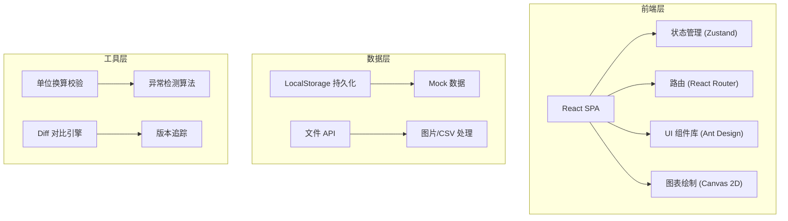
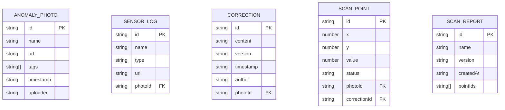

## 1. 架构设计



## 2. 技术描述

- **前端框架**: React@18 + TypeScript + Vite
- **UI 组件库**: Ant Design@5 + Tailwind CSS@3
- **状态管理**: Zustand
- **路由**: React Router@6
- **图表绘制**: Canvas 2D API (原生)
- **Diff 算法**: diff-match-patch
- **数据持久化**: LocalStorage + IndexedDB (图片存储)
- **Mock 数据**: 内置 JSON 模拟数据

## 3. 路由定义

| 路由 | 页面 | 用途 |
|------|------|------|
| / | 仪表盘 | 系统概览、快捷入口 |
| /photos | 异常照片管理 | 照片上传、标签、关联管理 |
| /scanner | 磁场扫描图工作台 | 数据导入、异常标记、证据追溯 |
| /validator | 单位换算校验器 | 自动检测、报告生成 |
| /versions | 版本历史中心 | 变更对比、操作日志 |

## 4. 数据模型

### 4.1 数据模型定义



### 4.2 TypeScript 类型定义

```typescript
// 异常照片
interface AnomalyPhoto {
  id: string;
  name: string;
  url: string;
  tags: PhotoTag[];
  timestamp: string;
  uploader: string;
  sensorLogs: SensorLog[];
  corrections: Correction[];
}

type PhotoTag = 'unit_error' | 'zero_drift' | 'sample_gap' | 'other';

// 传感器日志
interface SensorLog {
  id: string;
  name: string;
  type: 'csv' | 'image' | 'text';
  url: string;
}

// 批改意见
interface Correction {
  id: string;
  content: string;
  version: number;
  timestamp: string;
  author: string;
  isLatest: boolean;
}

// 扫描数据点
interface ScanPoint {
  id: string;
  x: number;
  y: number;
  value: number;
  status: 'normal' | 'anomaly' | 'pending' | 'excluded';
  linkedPhotoId?: string;
  linkedCorrectionId?: string;
}

// 扫描报告
interface ScanReport {
  id: string;
  name: string;
  version: number;
  createdAt: string;
  points: ScanPoint[];
  notes: string;
}

// 校验结果
interface ValidationResult {
  type: 'unit_error' | 'zero_drift' | 'sample_gap';
  severity: 'high' | 'medium' | 'low';
  description: string;
  location: { start: number; end: number };
  suggestion: string;
}
```

## 5. 核心算法模块

### 5.1 单位换算校验
- 检测常见单位错误 (mT/Gs 混淆、倍率错误)
- 零点漂移检测 (基线偏移算法)
- 采样缺口识别 (时间戳间隔分析)

### 5.2 版本 Diff 引擎
- 基于 diff-match-patch 的文本对比
- 差异高亮渲染 (新增/删除/修改)
- 版本回滚支持

### 5.3 磁场扫描图绘制
- Canvas 2D 高性能绘制
- 缩放平移交互
- 异常点热力图渲染
