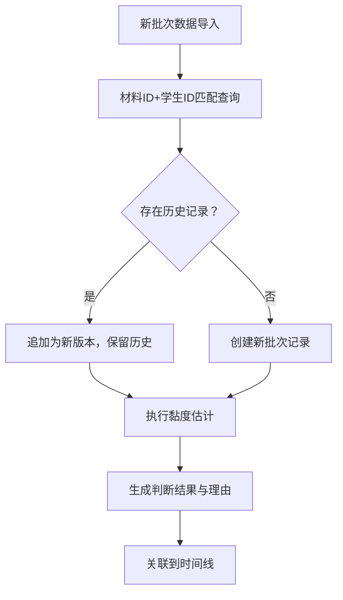

## 1. 产品概述

面向高校物理实验室的实验批改辅助工具，核心解决「液体黏度估计」实验的批改效率与数据溯源问题。将批改意见、传感器日志、实验记录统一到时间线视图，实现自动判断可解释、历史数据可追溯、批改证据可留存。

- 目标用户：实验室助教（主要使用者）、任课老师（查阅者）
- 核心价值：避免重复实验误判为新记录、自动判断留痕可解释、多源证据串联不丢失

## 2. 核心功能

### 2.1 用户角色

| 角色 | 登录方式 | 核心权限 |
|------|----------|----------|
| 助教 | 本地账号 | 实验批改、黏度估计、人工确认、批改表导出 |
| 任课老师 | 本地账号 | 查看批改结果、查阅判断理由、复核人工确认 |

### 2.2 功能模块

1. **实验记录列表页**：实验批次列表、状态筛选、快速搜索
2. **时间线详情页**：批改意见、传感器日志、实验记录统一时间线视图
3. **液体黏度估计模块**：自动计算、判断理由展示、历史版本追溯
4. **人工确认模块**：确认意见录入、确认历史留存
5. **实验批改表模块**：自动生成、证据关联、导出

### 2.3 页面详情

| 页面名称 | 模块名称 | 功能描述 |
|----------|----------|----------|
| 实验记录列表 | 批次列表 | 展示实验批次、学生信息、状态标签、操作入口 |
| 实验记录列表 | 筛选搜索 | 按状态/日期/学生ID筛选，支持关键词搜索 |
| 时间线详情 | 时间线视图 | 按时间顺序串联批改意见、传感器日志、实验记录 |
| 时间线详情 | 黏度估计卡片 | 展示计算结果、判断理由、历史版本、下一步建议 |
| 时间线详情 | 人工确认区 | 确认意见输入框、确认历史列表 |
| 时间线详情 | 批改表预览 | 关联所有证据的批改表，支持导出 |
| 黏度估计结果 | 理由详情 | 自动判断的完整推理链、阈值对比、异常标注 |

## 3. 核心流程

### 3.1 主流程

助教在实验记录列表选择一个批次 → 进入时间线详情页 → 系统自动执行液体黏度估计 → 展示判断结果与理由 → 助教查看传感器日志与实验记录 → 助教填写批改意见 → 如需人工确认则录入确认意见 → 系统生成实验批改表（关联所有证据）→ 提交完成

### 3.2 重复批次处理流程

### 3.3 边界情况处理

- **正常批改**：完整传感器日志 + 有效实验记录 → 正常计算与批改
- **缺传感器日志**：检测到日志缺失 → 标注异常 → 提示无法自动估计 → 需人工处理
- **重复实验记录**：同一材料ID+学生ID → 自动识别为重复 → 追加历史版本
- **边界值情况**：计算结果接近阈值 → 放大显示阈值对比 → 建议人工复核

## 4. 用户界面设计

### 4.1 设计风格

- 主色调：墨蓝 `#1e3a5f`（专业、稳重）
- 辅助色：墨绿 `#2d5a4a`（成功/正常）、琥珀 `#b45309`（警告/复核）、砖红 `#991b1b`（错误/异常）
- 字体：标题用 `Noto Serif SC`（学术感），正文用 `Noto Sans SC`（易读性）
- 布局：左侧导航 + 主内容区，卡片式模块，清晰分区
- 按钮：直角、细边框、悬停有轻微阴影，极简风格
- 图标：Lucide 线性图标，统一线宽

### 4.2 页面设计概览

| 页面名称 | 模块名称 | UI 元素 |
|----------|----------|---------|
| 实验记录列表 | 批次列表 | 卡片式列表，状态标签用色区分，时间戳右对齐 |
| 时间线详情 | 时间线 | 左侧时间轴 + 右侧事件卡片，不同类型事件用不同色条标识 |
| 时间线详情 | 黏度估计卡片 | 结果大字展示，理由用缩进列表，历史版本可折叠 |
| 时间线详情 | 批改表预览 | 表格形式，关联证据可点击跳转 |

### 4.3 响应式

桌面端优先（实验室使用场景），适配 1280px 以上屏幕。窄屏时时间线改为上下布局。

### 4.4 动效

- 时间线卡片进入：渐入 + 轻微上移，按时间顺序依次出现
- 黏度估计计算中：骨架屏 + 脉冲动画
- 状态变更：标签颜色渐变过渡
-  hover 效果：卡片轻微上浮 + 阴影加深
