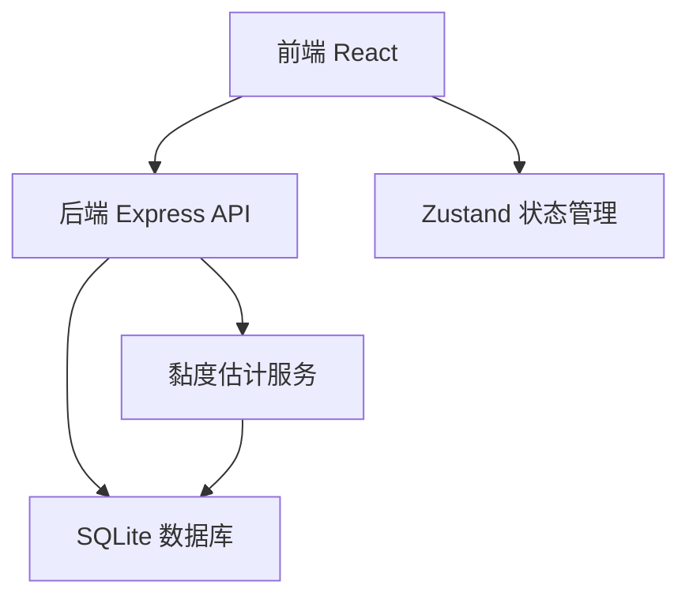
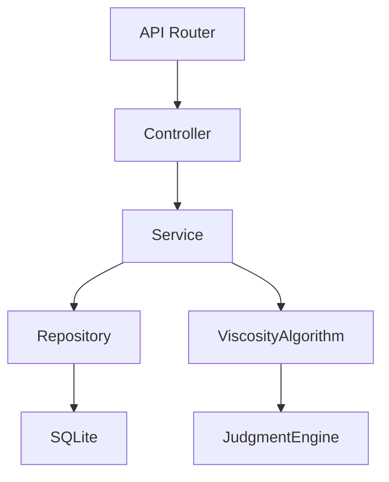
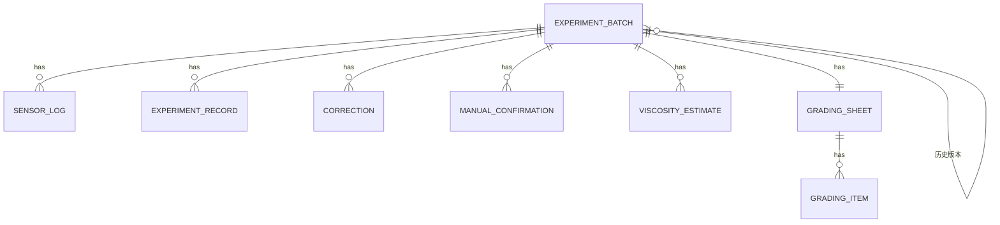

## 1. 架构设计



## 2. 技术描述

- 前端：React@18 + TypeScript + Vite + TailwindCSS@3 + Zustand + React Router
- 后端：Express@4 + TypeScript
- 数据库：SQLite（文件型，易部署，适合实验室单机使用）
- 初始化工具：vite-init
- 图标：lucide-react

## 3. 路由定义

| 路由 | 页面 | 用途 |
|------|------|------|
| `/` | 实验记录列表 | 批次列表、筛选搜索 |
| `/experiment/:id` | 时间线详情 | 时间线视图、黏度估计、批改意见、人工确认 |
| `/experiment/:id/grading` | 批改表预览 | 完整批改表、导出 |

## 4. API 定义

### 类型定义

```typescript
// 实验批次
interface ExperimentBatch {
  id: string;
  materialId: string;
  studentId: string;
  studentName: string;
  createdAt: string;
  status: 'pending' | 'processing' | 'completed' | 'needs_review';
  version: number;
  parentBatchId?: string;
}

// 传感器日志
interface SensorLog {
  id: string;
  batchId: string;
  timestamp: string;
  temperature: number;
  sphereDiameter: number;
  fallTime: number;
  fallDistance: number;
  rawData: Record<string, any>;
}

// 实验记录
interface ExperimentRecord {
  id: string;
  batchId: string;
  timestamp: string;
  type: 'submission' | 'revision' | 'note';
  content: string;
  author: string;
}

// 批改意见
interface Correction {
  id: string;
  batchId: string;
  timestamp: string;
  content: string;
  author: string;
  category: 'praise' | 'suggestion' | 'error' | 'deduction';
  points?: number;
}

// 人工确认
interface ManualConfirmation {
  id: string;
  batchId: string;
  timestamp: string;
  content: string;
  confirmer: string;
  relatedItemId?: string;
  relatedItemType?: 'viscosity_estimate' | 'correction' | 'sensor_log';
}

// 黏度估计结果
interface ViscosityEstimate {
  id: string;
  batchId: string;
  timestamp: string;
  viscosity: number;
  unit: string;
  judgment: 'pass' | 'fail' | 'borderline' | 'insufficient_data';
  judgmentReason: string;
  judgmentSteps: Array<{
    step: string;
    value: number;
    threshold: number;
    passed: boolean;
  }>;
  nextSteps: string[];
  rawCalculation: Record<string, any>;
  algorithmVersion: string;
}

// 实验批改表
interface GradingSheet {
  id: string;
  batchId: string;
  createdAt: string;
  totalScore: number;
  maxScore: number;
  items: Array<{
    name: string;
    score: number;
    maxScore: number;
    evidenceIds: string[];
    comment: string;
  }>;
  finalComment: string;
}

// 时间线事件（统一格式）
interface TimelineEvent {
  id: string;
  batchId: string;
  timestamp: string;
  type: 'sensor_log' | 'experiment_record' | 'correction' | 'manual_confirmation' | 'viscosity_estimate';
  data: SensorLog | ExperimentRecord | Correction | ManualConfirmation | ViscosityEstimate;
}
```

### 接口列表

| 方法 | 路径 | 描述 |
|------|------|------|
| GET | `/api/batches` | 获取实验批次列表 |
| GET | `/api/batches/:id` | 获取批次详情 |
| POST | `/api/batches` | 创建/导入新批次（自动检测重复） |
| GET | `/api/batches/:id/timeline` | 获取批次时间线 |
| GET | `/api/batches/:id/viscosity` | 获取黏度估计历史 |
| POST | `/api/batches/:id/viscosity` | 执行黏度估计 |
| POST | `/api/batches/:id/corrections` | 添加批改意见 |
| POST | `/api/batches/:id/confirmations` | 添加人工确认 |
| GET | `/api/batches/:id/grading` | 获取批改表 |
| POST | `/api/batches/:id/grading` | 生成批改表 |

## 5. 服务架构



## 6. 数据模型

### 6.1 ER 图



### 6.2 DDL

```sql
-- 实验批次表
CREATE TABLE experiment_batches (
  id TEXT PRIMARY KEY,
  material_id TEXT NOT NULL,
  student_id TEXT NOT NULL,
  student_name TEXT NOT NULL,
  created_at TEXT NOT NULL,
  status TEXT NOT NULL DEFAULT 'pending',
  version INTEGER NOT NULL DEFAULT 1,
  parent_batch_id TEXT,
  FOREIGN KEY (parent_batch_id) REFERENCES experiment_batches(id)
);

CREATE INDEX idx_batch_material_student ON experiment_batches(material_id, student_id);
CREATE INDEX idx_batch_status ON experiment_batches(status);
CREATE INDEX idx_batch_created_at ON experiment_batches(created_at);

-- 传感器日志表
CREATE TABLE sensor_logs (
  id TEXT PRIMARY KEY,
  batch_id TEXT NOT NULL,
  timestamp TEXT NOT NULL,
  temperature REAL,
  sphere_diameter REAL,
  fall_time REAL,
  fall_distance REAL,
  raw_data TEXT,
  FOREIGN KEY (batch_id) REFERENCES experiment_batches(id)
);

CREATE INDEX idx_sensor_log_batch ON sensor_logs(batch_id);
CREATE INDEX idx_sensor_log_timestamp ON sensor_logs(timestamp);

-- 实验记录表
CREATE TABLE experiment_records (
  id TEXT PRIMARY KEY,
  batch_id TEXT NOT NULL,
  timestamp TEXT NOT NULL,
  type TEXT NOT NULL,
  content TEXT NOT NULL,
  author TEXT NOT NULL,
  FOREIGN KEY (batch_id) REFERENCES experiment_batches(id)
);

-- 批改意见表
CREATE TABLE corrections (
  id TEXT PRIMARY KEY,
  batch_id TEXT NOT NULL,
  timestamp TEXT NOT NULL,
  content TEXT NOT NULL,
  author TEXT NOT NULL,
  category TEXT NOT NULL,
  points REAL,
  FOREIGN KEY (batch_id) REFERENCES experiment_batches(id)
);

-- 人工确认表
CREATE TABLE manual_confirmations (
  id TEXT PRIMARY KEY,
  batch_id TEXT NOT NULL,
  timestamp TEXT NOT NULL,
  content TEXT NOT NULL,
  confirmer TEXT NOT NULL,
  related_item_id TEXT,
  related_item_type TEXT,
  FOREIGN KEY (batch_id) REFERENCES experiment_batches(id)
);

-- 黏度估计结果表
CREATE TABLE viscosity_estimates (
  id TEXT PRIMARY KEY,
  batch_id TEXT NOT NULL,
  timestamp TEXT NOT NULL,
  viscosity REAL,
  unit TEXT NOT NULL DEFAULT 'mPa·s',
  judgment TEXT NOT NULL,
  judgment_reason TEXT NOT NULL,
  judgment_steps TEXT NOT NULL,
  next_steps TEXT NOT NULL,
  raw_calculation TEXT NOT NULL,
  algorithm_version TEXT NOT NULL,
  FOREIGN KEY (batch_id) REFERENCES experiment_batches(id)
);

-- 批改表
CREATE TABLE grading_sheets (
  id TEXT PRIMARY KEY,
  batch_id TEXT NOT NULL,
  created_at TEXT NOT NULL,
  total_score REAL NOT NULL,
  max_score REAL NOT NULL,
  items TEXT NOT NULL,
  final_comment TEXT,
  FOREIGN KEY (batch_id) REFERENCES experiment_batches(id)
);
```
