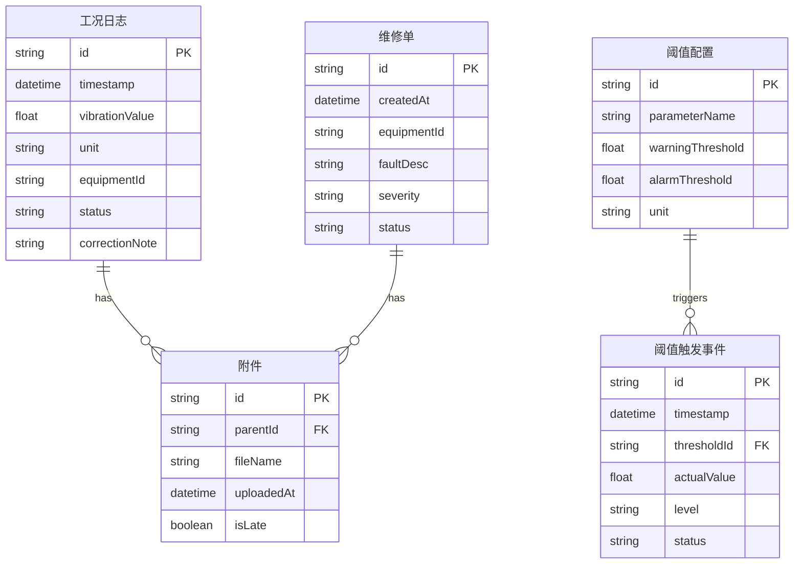

## 1. 架构设计

```mermaid
flowchart TB
    subgraph "前端层"
        "React + TypeScript"
        "Tailwind CSS"
        "Zustand 状态管理"
    end
    subgraph "数据层"
        "Mock 数据集（含正常/晚到/重复/更正）"
        "内存数据存储"
    end
    "前端层" --> "数据层"
```

纯前端应用，无需后端服务。数据通过内置 Mock 数据集模拟真实材料包，所有逻辑在浏览器内完成。

## 2. 技术说明

- 前端：React@18 + TypeScript + Tailwind CSS@3 + Vite
- 初始化工具：vite-init
- 后端：无
- 数据库：无，使用内存 + Mock 数据

## 3. 路由定义

| 路由 | 用途 |
|------|------|
| / | 巡检时间线主页面，展示工况日志、阈值、维修单同一线 |
| /import | 数据导入与校验页面 |
| /report | 巡检报告页面，已确认/待补/人工改过分类 + 处理口径 |

## 4. API 定义

无后端 API，使用前端 Mock 数据。

## 5. 服务器架构图

不适用

## 6. 数据模型

### 6.1 数据模型定义



### 6.2 核心类型定义

```typescript
type RecordStatus = "confirmed" | "pending" | "manual_corrected"

interface ConditionLog {
  id: string
  timestamp: string
  vibrationValue: number
  unit: string
  equipmentId: string
  status: RecordStatus
  correctionNote?: string
  attachments: Attachment[]
}

interface ThresholdConfig {
  id: string
  parameterName: string
  warningThreshold: number
  alarmThreshold: number
  unit: string
}

interface ThresholdEvent {
  id: string
  timestamp: string
  thresholdId: string
  actualValue: number
  level: "warning" | "alarm"
  status: RecordStatus
}

interface MaintenanceOrder {
  id: string
  createdAt: string
  equipmentId: string
  faultDesc: string
  severity: "minor" | "major" | "critical"
  status: RecordStatus
  attachments: Attachment[]
}

interface Attachment {
  id: string
  parentId: string
  fileName: string
  uploadedAt: string
  isLate: boolean
}

type TimelineEvent =
  | { type: "condition"; data: ConditionLog }
  | { type: "threshold"; data: ThresholdEvent }
  | { type: "maintenance"; data: MaintenanceOrder }
```
