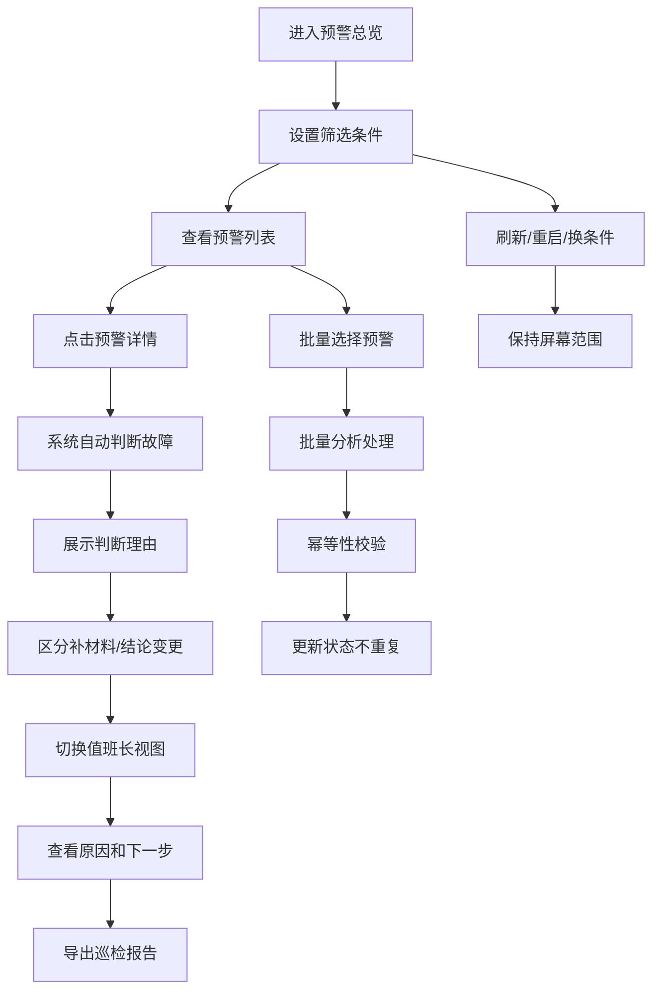

## 1. 产品概述
冷库热负荷预警系统，用于解决检修窗口前临时补材料、故障判断不透明、补材料与结论变更混淆等问题。目标用户包括设备组、当班维修工、值班长，通过自动判断、清晰展示、可追溯的操作记录，提升冷库设备运维效率和故障判断准确性。

## 2. 核心功能

### 2.1 用户角色
| 角色 | 注册方式 | 核心权限 |
|------|----------|----------|
| 维修工 | 工号登录 | 查看预警、查看判断理由、提交巡检记录 |
| 设备组 | 工号登录 | 查看预警、维护阈值表、批量处理 |
| 值班长 | 工号登录 | 查看预警概览、查看原因和下一步、导出巡检报告 |

### 2.2 功能模块
1. **预警总览页**：预警列表、筛选条件、批量操作、刷新重启
2. **预警详情页**：振动曲线图表、阈值表、故障判断结果、判断理由
3. **值班长视图**：原因汇总、下一步操作建议、导出报告
4. **操作历史页**：区分补材料和结论变更、操作时间线

### 2.3 页面详情
| 页面名称 | 模块名称 | 功能描述 |
|----------|----------|----------|
| 预警总览页 | 预警列表 | 展示所有预警，支持按时间、设备、状态筛选 |
| 预警总览页 | 批量处理 | 支持批量确认、批量分析，保证幂等性 |
| 预警总览页 | 操作栏 | 刷新、重启、切换筛选条件，保持屏幕范围 |
| 预警详情页 | 振动曲线 | 可交互图表，展示历史数据，标记手工改动点 |
| 预警详情页 | 阈值表对比 | 展示阈值标准与实际值对比，标记补材料记录 |
| 预警详情页 | 故障判断 | 自动判断故障复现顺序是否异常，给出明确理由 |
| 值班长视图 | 原因展示 | 用非技术语言说明故障原因，避免代码术语 |
| 值班长视图 | 下一步建议 | 明确列出需要执行的操作步骤 |
| 值班长视图 | 报告导出 | 导出内容与屏幕范围完全一致 |
| 操作历史页 | 时间线 | 区分阈值表早到、维修单晚补、振动曲线手工改动 |

## 3. 核心流程

用户在预警总览页查看设备预警，通过筛选条件定位目标预警。点击进入详情页，系统自动判断故障复现顺序是否异常，展示振动曲线与阈值表对比，明确标注哪些是补材料、哪些改了结论。值班长可切换到值班长视图，查看用通俗语言描述的原因和下一步操作建议。如需批量处理，可多选预警进行批量分析，系统保证重复运行不会产生重复数据。刷新、重启或更换筛选条件后，当前屏幕范围保持不变，导出的巡检报告与屏幕显示内容完全一致。

## 4. 用户界面设计

### 4.1 设计风格
- 主色调：冷蓝色系（#165DFF），体现冷库、工业监控的专业感
- 辅助色：橙色（#FF7D00）用于预警，绿色（#00B42A）用于正常，红色（#F53F3F）用于严重故障
- 中性色：深灰（#1D2129）背景，浅灰（#4E5969）文字，营造工业监控氛围
- 按钮风格：直角、带轻微阴影、hover时有颜色加深效果
- 字体：使用 JetBrains Mono 作为数据展示字体，Source Han Sans CN 作为正文字体
- 布局风格：左侧导航 + 顶部操作栏 + 主内容区，卡片式信息展示，数据密集型布局
- 图标：使用 lucide-react 图标，线条清晰，工业风格

### 4.2 页面设计概述
| 页面名称 | 模块名称 | UI 元素 |
|----------|----------|----------|
| 预警总览页 | 顶部操作栏 | 筛选器、刷新按钮、重启按钮、批量操作下拉 |
| 预警总览页 | 预警列表 | 数据表格，行悬停高亮，状态标签带颜色 |
| 预警详情页 | 振动曲线图 | 交互式折线图，支持缩放，异常点标记，手工改动标记 |
| 预警详情页 | 阈值表对比 | 两列对比布局，补材料行用灰色背景标注 |
| 预警详情页 | 判断理由卡片 | 蓝色边框，明确列出判断依据和结论 |
| 值班长视图 | 原因卡片 | 大字号标题，简洁描述，无技术术语 |
| 值班长视图 | 下一步列表 | 带序号的操作步骤，可勾选标记完成 |
| 操作历史页 | 时间线 | 垂直时间线，不同操作类型用不同颜色图标 |

### 4.3 响应性
- 桌面优先设计，主内容区最小宽度 1280px
- 平板端（768px-1280px）：导航折叠为图标，表格支持横向滚动
- 移动端（<768px）：卡片式布局，图表简化展示，优先展示关键数据

### 4.4 动效设计
- 页面加载：卡片依次淡入，延迟 50ms 递进
- 数据刷新：数字滚动动画，图表曲线绘制动画
- 状态变化：状态标签颜色渐变过渡
- 悬停效果：按钮和表格行有轻微上浮效果
- 批量处理：进度条线性动画，完成后有成功提示
