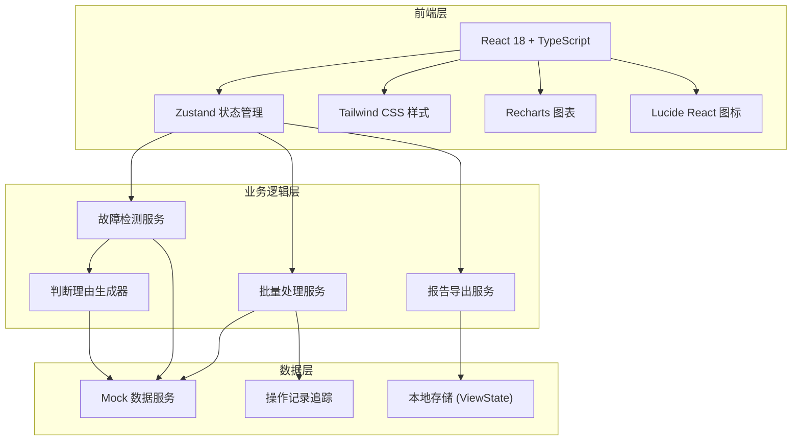
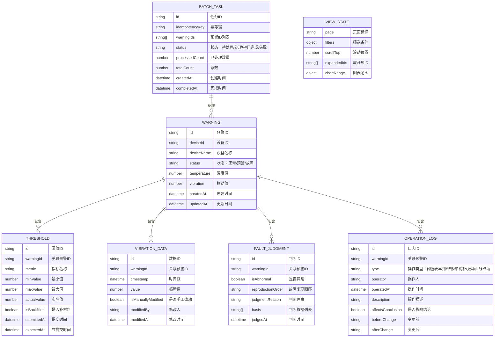

## 1. 架构设计



## 2. 技术描述
- 前端：React@18 + TypeScript@5 + Tailwind CSS@3 + Vite@5
- 状态管理：Zustand@4
- 图表库：Recharts@2
- 图标库：lucide-react@0.344
- 后端：使用 Mock 数据，纯前端实现
- 数据持久化：localStorage 存储视图状态和操作记录

## 3. 路由定义
| 路由 | 页面 | 用途 |
|------|------|------|
| / | 预警总览页 | 展示预警列表、筛选、批量操作 |
| /warning/:id | 预警详情页 | 振动曲线、阈值表、故障判断 |
| /warning/:id/foreman | 值班长视图 | 原因和下一步操作 |
| /history | 操作历史页 | 操作时间线、补材料与变更区分 |

## 4. 数据模型

### 4.1 核心数据模型



### 4.2 TypeScript 类型定义

```typescript
// 预警状态
export type WarningStatus = 'normal' | 'warning' | 'fault';

// 操作类型
export type OperationType = 'threshold_early' | 'repair_late' | 'vibration_modified';

// 批量任务状态
export type BatchStatus = 'pending' | 'processing' | 'completed' | 'failed';

// 预警信息
export interface Warning {
  id: string;
  deviceId: string;
  deviceName: string;
  status: WarningStatus;
  temperature: number;
  vibration: number;
  createdAt: string;
  updatedAt: string;
}

// 阈值记录
export interface Threshold {
  id: string;
  warningId: string;
  metric: string;
  minValue: number;
  maxValue: number;
  actualValue: number;
  isBackfilled: boolean;
  submittedAt: string;
  expectedAt: string;
}

// 振动数据
export interface VibrationData {
  id: string;
  warningId: string;
  timestamp: string;
  value: number;
  isManuallyModified: boolean;
  modifiedBy?: string;
  modifiedAt?: string;
}

// 故障判断结果
export interface FaultJudgment {
  id: string;
  warningId: string;
  isAbnormal: boolean;
  reproductionOrder: string;
  judgmentReason: string;
  basis: string[];
  judgedAt: string;
}

// 操作日志
export interface OperationLog {
  id: string;
  warningId: string;
  type: OperationType;
  operator: string;
  operatedAt: string;
  description: string;
  affectsConclusion: boolean;
  beforeChange?: string;
  afterChange?: string;
}

// 批量任务
export interface BatchTask {
  id: string;
  idempotencyKey: string;
  warningIds: string[];
  status: BatchStatus;
  processedCount: number;
  totalCount: number;
  createdAt: string;
  completedAt?: string;
}

// 视图状态
export interface ViewState {
  page: string;
  filters: Record<string, any>;
  scrollTop: number;
  expandedIds: string[];
  chartRange: {
    start: string;
    end: string;
  };
}

// 值班长视图数据
export interface ForemanViewData {
  warningId: string;
  deviceName: string;
  status: WarningStatus;
  plainReason: string;
  nextSteps: {
    id: string;
    order: number;
    description: string;
    completed: boolean;
  }[];
  riskLevel: 'low' | 'medium' | 'high';
}
```

## 5. 核心功能实现方案

### 5.1 故障判断逻辑
```typescript
// 判断故障复现顺序是否异常
// 1. 检查复现步骤的时间戳顺序
// 2. 检查阈值表提交时间是否早于振动数据时间
// 3. 检查维修单补填时间是否晚于故障发生时间
// 4. 生成判断理由，每条理由对应一条依据
```

### 5.2 批量处理幂等性
```typescript
// 使用 idempotencyKey 保证幂等
// 1. 每次批量操作生成唯一的幂等键（时间戳+随机数）
// 2. 执行前检查该幂等键是否已处理
// 3. 已处理则直接返回结果，不重复执行
// 4. 处理中则显示进度，不重复创建任务
```

### 5.3 屏幕范围保持
```typescript
// 刷新/重启/换筛选条件时
// 1. 保存当前滚动位置、筛选条件、展开状态
// 2. 操作完成后恢复到保存的状态
// 3. 导出报告时使用当前保存的视图状态作为导出范围
```

### 5.4 补材料与结论变更区分
```typescript
// 操作日志分类
// - 阈值表早到：isBackfilled=true, affectsConclusion=false
// - 维修单晚补：type=repair_late, affectsConclusion=false
// - 振动曲线手工改动：isManuallyModified=true, affectsConclusion=true
// 不同类型用不同颜色和图标区分
```

## 6. 目录结构

```
src/
├── components/
│   ├── layout/
│   │   ├── Sidebar.tsx
│   │   └── Header.tsx
│   ├── warning/
│   │   ├── WarningList.tsx
│   │   ├── WarningFilter.tsx
│   │   ├── VibrationChart.tsx
│   │   ├── ThresholdTable.tsx
│   │   ├── JudgmentCard.tsx
│   │   └── BatchToolbar.tsx
│   ├── foreman/
│   │   ├── ReasonCard.tsx
│   │   ├── NextStepsList.tsx
│   │   └── ExportButton.tsx
│   ├── history/
│   │   ├── OperationTimeline.tsx
│   │   └── OperationTypeBadge.tsx
│   └── common/
│       ├── StatusBadge.tsx
│       └── LoadingSpinner.tsx
├── pages/
│   ├── WarningOverview.tsx
│   ├── WarningDetail.tsx
│   ├── ForemanView.tsx
│   └── OperationHistory.tsx
├── store/
│   ├── useWarningStore.ts
│   ├── useViewStore.ts
│   └── useBatchStore.ts
├── services/
│   ├── faultDetection.ts
│   ├── batchProcess.ts
│   ├── reportExport.ts
│   └── mockData.ts
├── utils/
│   ├── idempotency.ts
│   ├── judgmentReason.ts
│   └── viewState.ts
├── types/
│   └── index.ts
├── App.tsx
├── main.tsx
└── index.css
```
