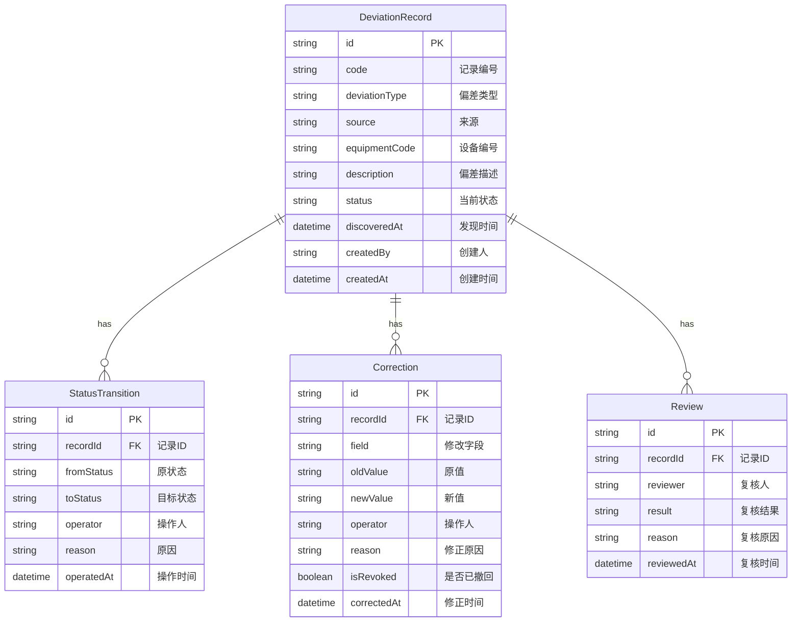

## 1. 架构设计

```mermaid
graph TB
    subgraph "前端层"
        "React 18 + Vite"
        "Zustand 状态管理"
        "React Router"
        "Tailwind CSS"
    end
    subgraph "数据层"
        "Mock 数据服务"
        "本地状态持久化"
    end
    "React 18 + Vite" --> "Zustand 状态管理"
    "Zustand 状态管理" --> "Mock 数据服务"
    "React 18 + Vite" --> "React Router"
```

纯前端架构，使用 Zustand + localStorage 模拟数据持久化，无需后端服务。

## 2. 技术说明

- 前端：React@18 + Tailwind CSS@3 + Vite
- 初始化工具：vite-init
- 后端：无（使用 Mock 数据）
- 数据库：无（使用 localStorage 持久化）
- 状态管理：Zustand
- 路由：React Router DOM v6
- 图标：lucide-react
- 类型系统：TypeScript

## 3. 路由定义

| 路由 | 用途 |
|------|------|
| / | 记录总览页：偏差记录列表、筛选搜索、统计卡片、批量操作 |
| /record/:id | 记录详情页：基本信息、状态流转、修正历史、复核区 |

## 4. 数据模型

### 4.1 数据模型定义



### 4.2 类型定义

```typescript
type DeviationType =
  | 'threshold_crossing'
  | 'fault_sequence_error'
  | 'alarm_duplicate_confirm'
  | 'normal_deviation'

type RecordStatus =
  | 'pending_confirmation'
  | 'pending_processing'
  | 'confirmed'
  | 'closed'

type RecordSource =
  | 'auto_collection'
  | 'inspection'
  | 'csv_import'
  | 'manual_entry'

interface DeviationRecord {
  id: string
  code: string
  deviationType: DeviationType
  source: RecordSource
  equipmentCode: string
  description: string
  status: RecordStatus
  discoveredAt: string
  createdBy: string
  createdAt: string
}

interface StatusTransition {
  id: string
  recordId: string
  fromStatus: RecordStatus | null
  toStatus: RecordStatus
  operator: string
  reason: string
  operatedAt: string
}

interface Correction {
  id: string
  recordId: string
  field: string
  oldValue: string
  newValue: string
  operator: string
  reason: string
  isRevoked: boolean
  correctedAt: string
}

interface Review {
  id: string
  recordId: string
  reviewer: string
  result: 'pass' | 'questioned'
  reason: string
  reviewedAt: string
}
```

### 4.3 业务逻辑规则

1. **异常类型自动判定**：`deviationType` 为 `threshold_crossing`、`fault_sequence_error`、`alarm_duplicate_confirm` 时，`status` 强制为 `pending_confirmation`，不可跳过复核直接标为 `confirmed`
2. **重复导入检测**：CSV 导入时按 `code` + `deviationType` + `discoveredAt` 三字段去重
3. **撤回修正**：`Correction.isRevoked` 置为 `true`，同时生成一条新的 `StatusTransition` 记录状态回退
4. **筛选后导出**：导出数据范围 = 当前筛选条件命中的记录集合，导出格式为 CSV，含修正历史
5. **复核原因必填**：争议记录从 `pending_confirmation` 流转到其他状态时，`Review.reason` 为必填项
