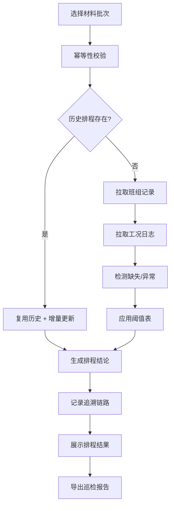

## 1. 产品概述

风洞试验排程系统，解决设备工程师接手试验时追溯难、重复排程、数据混乱等问题。核心用户为风洞试验设备工程师、班组记录员、质检人员。

产品核心价值：通过可追溯的排程机制、幂等性处理、混合场景支持，实现排程过程透明化、历史可查、交接顺畅。

## 2. 核心功能

### 2.1 用户角色
| 角色 | 登记方式 | 核心权限 |
|------|----------|----------|
| 设备工程师 | 工号登录 | 创建排程、查看追溯、导出报告 |
| 班组记录员 | 工号登录 | 录入班组记录、工况日志 |
| 质检人员 | 工号登录 | 查看排程历史、审核报告 |

### 2.2 功能模块
1. **排程总表页**：排程列表、状态筛选、批量操作、触发排程
2. **排程详情页**：排程结论、追溯链路、依据来源查看
3. **班组记录管理**：记录录入、修改历史、缺失标记
4. **工况日志管理**：日志录入、缺失检测、异常标注
5. **阈值表管理**：阈值配置、重复检测、版本管理
6. **巡检报告导出**：报告生成、预览、下载

### 2.3 页面详情
| 页面名称 | 模块名称 | 功能描述 |
|----------|----------|----------|
| 排程总表页 | 排程列表 | 展示所有排程记录，支持按状态、批次号筛选 |
| 排程总表页 | 触发排程 | 选择材料批次，执行排程算法，支持重复运行 |
| 排程总表页 | 批量操作 | 批量导出报告、批量标记状态 |
| 排程详情页 | 结论展示 | 展示排程结论、推荐试验时间、优先级 |
| 排程详情页 | 追溯链路 | 可视化展示排程依据来源，点击跳转至原始记录 |
| 排程详情页 | 依据来源 | 列出关联的班组记录、工况日志、阈值表条目 |
| 巡检报告页 | 报告预览 | 展示结构化的巡检报告，包含待办事项 |
| 巡检报告页 | 导出功能 | 导出为文本格式，支持下一班继续查看 |

## 3. 核心流程

用户选择材料批次 → 系统检查历史排程（幂等性校验）→ 拉取关联班组记录和工况日志 → 检测缺失数据和异常情况 → 应用阈值表进行排程计算 → 生成排程结论并记录追溯链路 → 展示排程结果 → 导出巡检报告。

## 4. 用户界面设计

### 4.1 设计风格
- **主色调**：工业蓝 (#1e40af)，代表专业可靠
- **辅助色**：警示橙 (#f59e0b) 标记异常，成功绿 (#10b981) 标记完成
- **按钮风格**：硬朗直角边框，轻微阴影，强调工业感
- **字体**：标题使用 "JetBrains Mono" 等宽字体，正文使用 "Inter"
- **布局风格**：左右分栏，左侧导航 + 右侧内容区，卡片式数据展示
- **图标风格**：线性图标，统一使用 Lucide React 图标库

### 4.2 页面设计概述
| 页面名称 | 模块名称 | UI 元素 |
|----------|----------|---------|
| 排程总表页 | 排程列表 | 数据表格、状态标签、批次号列、操作按钮、行悬停高亮 |
| 排程总表页 | 顶部工具栏 | 搜索框、筛选下拉、排程触发按钮、导出按钮 |
| 排程详情页 | 追溯链路 | 时间线组件、节点连线、可点击节点、高亮当前选中 |
| 排程详情页 | 依据面板 | 标签页切换（班组记录/工况日志/阈值表）、数据卡片 |
| 巡检报告页 | 报告内容 | 分块展示、待办清单、交接备注区、纯文本导出 |

### 4.3 响应性
- 桌面端优先设计，主内容区最小宽度 1200px
- 平板端自适应，表格支持横向滚动
- 移动端折叠导航，卡片堆叠展示

### 4.4 交互动效
- 页面加载：顶部进度条 + 内容淡入
- 排程触发：按钮加载态 + 进度指示器
- 追溯节点：悬停放大 + 高亮关联数据
- 状态变更：标签颜色平滑过渡
