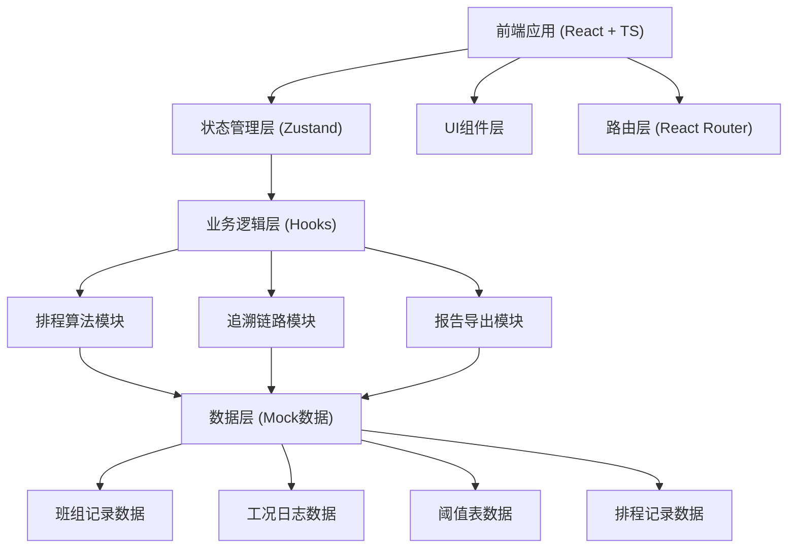
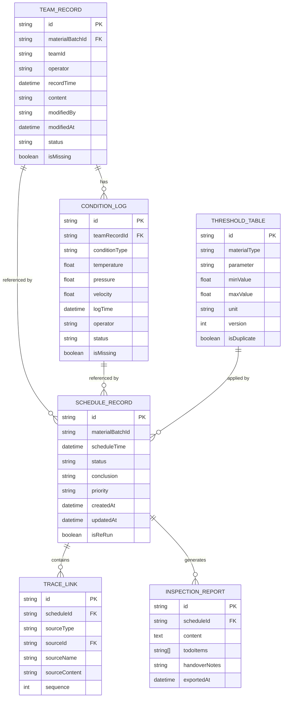

## 1. 架构设计



## 2. 技术描述

- **前端**：React@18 + TypeScript + Vite + tailwindcss@3
- **状态管理**：zustand
- **路由**：react-router-dom
- **图标**：lucide-react
- **后端**：无（纯前端，使用 Mock 数据演示）
- **数据持久化**：LocalStorage 存储排程历史

## 3. 路由定义

| 路由 | 用途 |
|------|------|
| /schedule | 排程总表页 |
| /schedule/:id | 排程详情页（含追溯链路） |
| /report/:id | 巡检报告页 |
| /team-records | 班组记录管理页 |
| /condition-logs | 工况日志管理页 |
| /thresholds | 阈值表管理页 |

## 4. 数据模型

### 4.1 数据模型定义



### 4.2 核心数据结构

```typescript
// 班组记录
interface TeamRecord {
  id: string;
  materialBatchId: string;
  teamId: string;
  operator: string;
  recordTime: Date;
  content: string;
  modifiedBy: string;
  modifiedAt: Date;
  status: 'normal' | 'warning' | 'error';
  isMissing: boolean;
  modificationHistory: ModificationLog[];
}

// 工况日志
interface ConditionLog {
  id: string;
  teamRecordId: string;
  conditionType: string;
  temperature: number;
  pressure: number;
  velocity: number;
  logTime: Date;
  operator: string;
  status: 'normal' | 'abnormal' | 'missing';
  isMissing: boolean;
}

// 阈值表
interface ThresholdTable {
  id: string;
  materialType: string;
  parameter: string;
  minValue: number;
  maxValue: number;
  unit: string;
  version: number;
  isDuplicate: boolean;
}

// 排程记录
interface ScheduleRecord {
  id: string;
  materialBatchId: string;
  scheduleTime: Date;
  status: 'pending' | 'scheduled' | 'completed' | 'failed' | 'warning';
  conclusion: string;
  priority: 'high' | 'medium' | 'low';
  createdAt: Date;
  updatedAt: Date;
  isReRun: boolean;
  originalScheduleId?: string;
  traceLinks: TraceLink[];
  warnings: ScheduleWarning[];
}

// 追溯链路
interface TraceLink {
  id: string;
  scheduleId: string;
  sourceType: 'team_record' | 'condition_log' | 'threshold';
  sourceId: string;
  sourceName: string;
  sourceContent: string;
  sequence: number;
  impact: 'positive' | 'negative' | 'neutral';
}

// 巡检报告
interface InspectionReport {
  id: string;
  scheduleId: string;
  content: string;
  todoItems: string[];
  handoverNotes: string;
  exportedAt: Date;
  nextShiftRemarks: string;
}
```

## 5. 核心模块设计

### 5.1 排程算法模块

核心函数：`runScheduling(materialBatchId: string): ScheduleRecord`

处理逻辑：
1. **幂等性校验**：检查该材料批次是否已有排程记录
2. **数据收集**：拉取关联的班组记录、工况日志、阈值表
3. **异常检测**：
   - 检测缺失的班组记录
   - 检测缺失的工况日志
   - 检测重复的阈值表
   - 检测边界情况（参数接近阈值）
4. **排程计算**：
   - 基于阈值表评估参数合规性
   - 计算优先级
   - 确定试验时间窗口
5. **追溯记录**：记录每一步决策的依据来源
6. **结果生成**：返回排程结论，保留历史版本

### 5.2 追溯链路模块

核心函数：`buildTraceLinks(schedule: ScheduleRecord, sources: DataSources): TraceLink[]`

处理逻辑：
1. 按时间顺序排列数据源
2. 标记每个数据源对排程结论的影响
3. 建立从结论到源数据的可点击链接
4. 记录修改历史，支持查看谁改过记录

### 5.3 报告导出模块

核心函数：`generateInspectionReport(schedule: ScheduleRecord): InspectionReport`

处理逻辑：
1. 结构化输出排程结论
2. 列出待处理事项（缺失数据、异常情况）
3. 记录交接备注
4. 导出为纯文本格式，便于下一班继续查看
