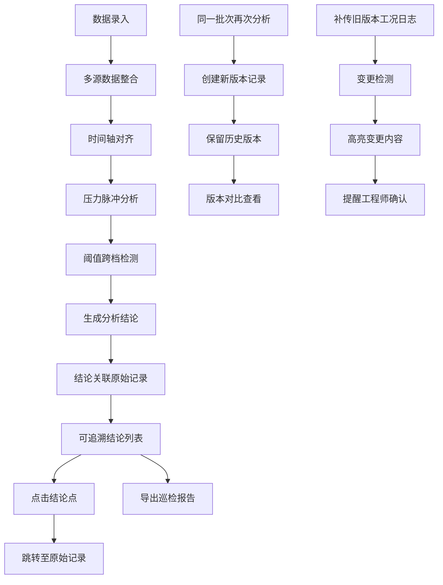

## 1. 产品概述

管线压力脉冲系统是面向设备工程师的工业数据分析平台，解决检修前多数据源整合困难、阈值跨档易遗漏、历史记录追溯难等核心痛点。系统通过自动化数据整合、脉冲分析、版本追溯和变更检测，帮助工程师快速做出准确判断，确保班组交接清晰可查。

- 核心价值：将工况日志、班组记录、维修单三类数据自动关联，形成完整证据链
- 目标用户：设备工程师、运维班组、检修团队
- 核心场景：检修前数据分析、班组交接、历史追溯、异常检测

## 2. 核心功能

### 2.1 用户角色

| 角色 | 登录方式 | 核心权限 |
|------|----------|----------|
| 设备工程师 | 工号登录 | 完整分析权限、报告导出、版本比对 |
| 班组操作员 | 工号登录 | 数据录入、记录查询、确认交接 |
| 管理员 | 工号登录 | 系统配置、用户管理、数据归档 |

### 2.2 功能模块

1. **数据看板**：压力脉冲总览、阈值告警、最新分析结果
2. **脉冲分析**：多源数据整合、压力波形分析、阈值跨档检测、结论追溯
3. **记录管理**：班组记录、工况日志、维修单的录入与查询
4. **历史追溯**：批次历史、版本对比、变更提醒
5. **报告导出**：巡检报告生成、交接记录导出

### 2.3 页面详情

| 页面名称 | 模块名称 | 功能描述 |
|---------|----------|----------|
| 数据看板 | 脉冲总览 | 实时压力波形、阈值告警高亮、最近分析批次列表 |
| 数据看板 | 快捷操作 | 一键发起分析、快速录入、报告导出入口 |
| 脉冲分析 | 数据源整合 | 自动关联工况日志、班组记录、维修单，时间轴对齐 |
| 脉冲分析 | 波形分析 | 压力脉冲波形展示、峰值检测、阈值跨档标记 |
| 脉冲分析 | 结论追溯 | 每个结论点可点击跳转至原始班组记录或工况日志 |
| 脉冲分析 | 阈值检测 | 自动识别跨档异常，高亮标记风险等级 |
| 记录管理 | 班组记录 | 录入/编辑/查询班组交接班记录 |
| 记录管理 | 工况日志 | 上传/补传/版本管理工况日志文件 |
| 记录管理 | 维修单 | 维修工单录入与关联 |
| 历史追溯 | 批次管理 | 同一批次材料多次分析记录保留，不覆盖历史 |
| 历史追溯 | 版本比对 | 补传旧版本日志时，自动检测并高亮变更内容 |
| 报告导出 | 巡检报告 | 生成结构化巡检报告，包含完整证据链链接 |
| 报告导出 | 交接记录 | 导出班组交接记录，便于下一班继续查询 |

## 3. 核心流程

**用户主流程描述：**
1. 工程师进入系统，在数据看板查看最新压力脉冲状态和告警
2. 发起新的脉冲分析，系统自动拉取对应时间范围的工况日志、班组记录和维修单
3. 系统完成分析后，展示压力波形图，标记所有阈值跨档点
4. 工程师点击任一结论点，系统直接跳转至对应的原始记录（班组记录条目或工况日志具体行）
5. 确认分析无误后，导出巡检报告，报告中包含所有结论点的追溯链接
6. 同一批次材料再次检测时，系统创建新的分析记录，历史记录完整保留可对比
7. 若补传旧版本工况日志，系统自动检测数据变更，高亮显示差异点并提醒工程师重新评估

## 4. 用户界面设计

### 4.1 设计风格

- **主色调**：深工业灰 `#1a1d23` 为背景，信号绿 `#00d4aa` 为正常状态，警戒橙 `#ff9500` 为预警，危险红 `#ff3b30` 为异常
- **辅助色**：科技蓝 `#0a84ff` 用于交互元素，数据紫 `#af52de` 用于版本标记
- **设计风格**：工业实用主义（Industrial Utilitarian），数据密集型界面，功能性优先
- **按钮风格**：方角矩形，实心填充，悬停时有细微发光效果，强调工业感
- **字体**：等宽字体 `JetBrains Mono` 用于数据展示，`Noto Sans SC` 用于中文文本
- **布局**：左侧导航 + 主内容区，卡片式模块，高密度信息展示
- **图标**：线性简约图标，使用工业设备、仪表、波形等元素

### 4.2 页面设计概述

| 页面名称 | 模块名称 | UI 元素 |
|---------|----------|---------|
| 数据看板 | 脉冲总览 | 全屏波形图背景，告警卡片悬浮，状态指示灯动效 |
| 数据看板 | 快捷操作 | 图标化快捷入口，悬停放大效果 |
| 脉冲分析 | 波形分析 | 交互式SVG波形图，可缩放平移，阈值线高亮，异常点闪烁 |
| 脉冲分析 | 结论追溯 | 时间轴布局，结论点可点击，点击后原始记录侧滑展开 |
| 记录管理 | 数据列表 | 斑马纹表格，行悬停高亮，状态标签颜色区分 |
| 历史追溯 | 版本对比 | 左右分栏对比布局，差异行高亮背景，变更连接线 |
| 报告导出 | 报告预览 | 纯文本结构化预览，无多余装饰，突出数据完整性 |

### 4.3 响应式

- Desktop-first 设计，适配 1920×1080 及以上分辨率
- 平板端自适应调整侧边栏宽度，保持数据可读性
- 移动端优化列表展示，波形图支持手势缩放
- 所有交互元素最小触控尺寸 44×44px

