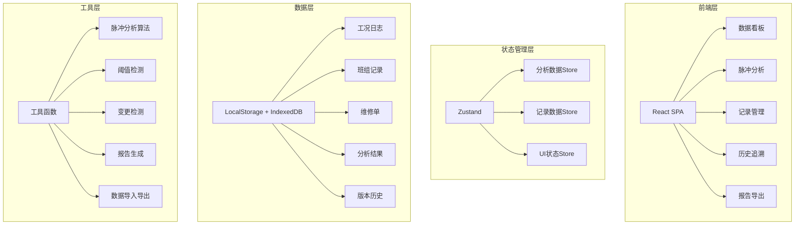
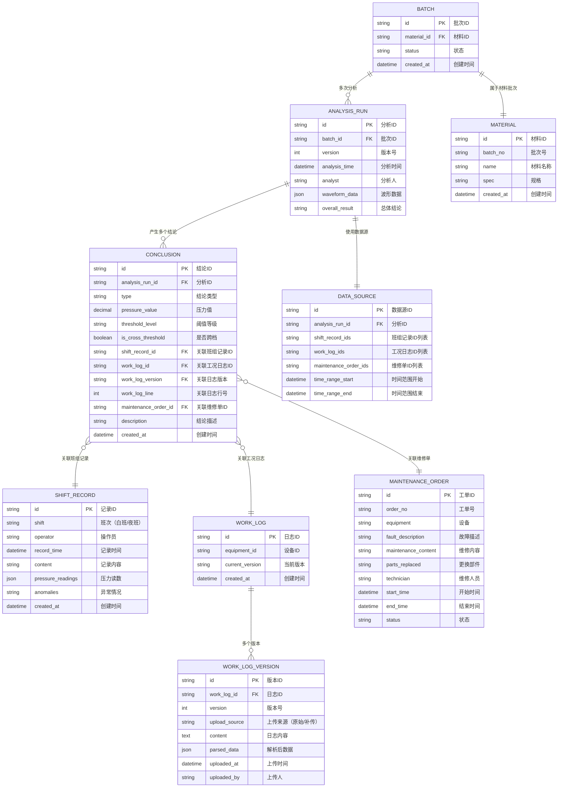

## 1. 架构设计



## 2. 技术描述

- **前端框架**: React@18 + TypeScript
- **构建工具**: Vite@5
- **样式方案**: TailwindCSS@3 + CSS Variables
- **状态管理**: Zustand
- **图表库**: Recharts（波形图）+ 自定义SVG交互
- **本地存储**: LocalStorage（配置）+ IndexedDB（大量历史数据）
- **后端**: 无后端，纯前端应用，数据本地持久化
- **数据库**: IndexedDB 作为本地文档数据库
- **图标**: Lucide React

## 3. 路由定义

| 路由 | 页面 | 功能 |
|------|------|------|
| `/` | 数据看板 | 压力脉冲总览、告警、快捷操作 |
| `/pulse-analysis` | 脉冲分析 | 波形分析、阈值检测、结论追溯 |
| `/records/shift` | 班组记录 | 班组交接班记录管理 |
| `/records/logs` | 工况日志 | 工况日志上传与版本管理 |
| `/records/maintenance` | 维修单 | 维修工单管理 |
| `/history` | 历史追溯 | 批次历史、版本对比 |
| `/export` | 报告导出 | 巡检报告生成与导出 |

## 4. 数据模型

### 4.1 数据模型定义



### 4.2 关键数据结构（TypeScript）

```typescript
// 压力脉冲数据点
interface PressureDataPoint {
  timestamp: number;
  pressure: number;
  temperature?: number;
  flowRate?: number;
}

// 阈值配置
interface ThresholdConfig {
  level: 'normal' | 'warning' | 'danger';
  min: number;
  max: number;
  color: string;
}

// 分析结论
interface AnalysisConclusion {
  id: string;
  timestamp: number;
  pressure: number;
  thresholdCrossed: boolean;
  thresholdLevel: 'normal' | 'warning' | 'danger';
  sourceType: 'shift_record' | 'work_log' | 'maintenance';
  sourceId: string;
  sourceVersion?: number;
  sourceLine?: number;
  description: string;
}

// 版本差异
interface VersionDiff {
  line: number;
  type: 'added' | 'removed' | 'modified';
  oldValue: string;
  newValue: string;
  pressureChange?: number;
  affectsConclusion: string[];
}
```

## 5. 核心算法

### 5.1 压力脉冲分析算法
- 滑动窗口峰值检测：窗口大小 50 个数据点，敏感度 0.8
- 阈值跨档判定：连续 3 个点超过阈值即标记为跨档
- 时间轴对齐：以班组交接班时间为基准对齐多源数据

### 5.2 变更检测算法
- 行级 diff：基于 Myers 差分算法
- 影响分析：检测变更行是否关联已存在的结论点
- 置信度评估：根据变更幅度评估对原有结论的影响程度

### 5.3 数据持久化
- IndexedDB 存储大量时序数据和历史版本
- LocalStorage 存储用户配置和当前会话状态
- 导入导出格式：JSON + CSV 双格式支持

