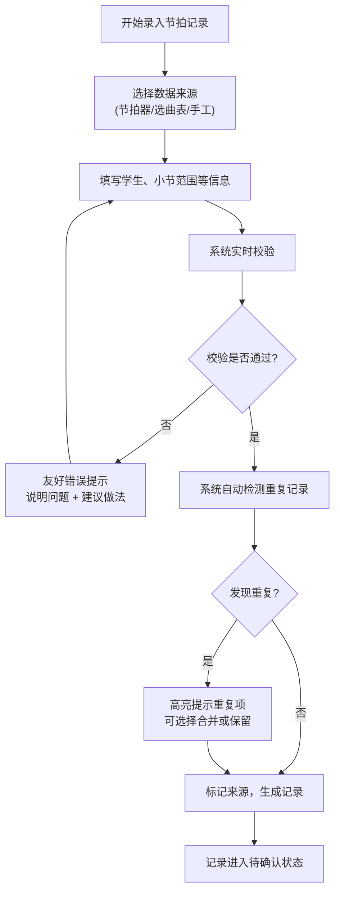
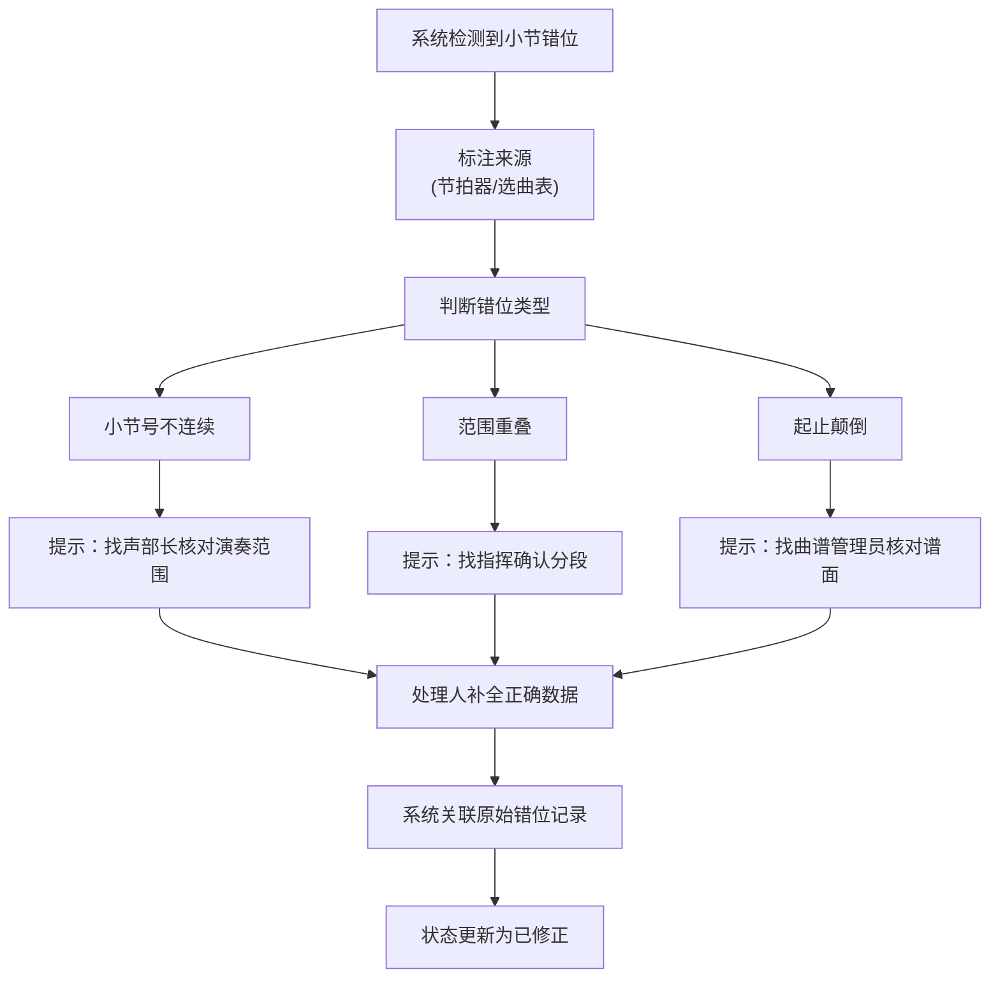

## 1. 产品概述

乐队走台节拍管理系统是为解决乐团排练中节拍记录混乱问题而设计的专业化管理工具。解决传统表格统计中同一学生重复统计靠人工备注、数据来源混杂、变更追溯困难等痛点，让一线演奏员和排练负责人都能高效、准确地完成节拍核对工作。

- 解决问题：表格统计混乱、人工备注易出错、数据来源混杂、变更无法追溯、错误提示不友好
- 目标用户：乐团演奏员、声部长、排练负责人、指挥
- 核心价值：让节拍核对从"靠人记"变成"系统管"，减少沟通成本，提高排练效率

## 2. 核心功能

### 2.1 用户角色

| 角色 | 说明 | 核心权限 |
|------|------|----------|
| 演奏员 | 一线演奏人员 | 录入个人节拍记录、查看本人统计、标记待补材料 |
| 声部长 | 各声部负责人 | 审核本声部记录、处理小节错位、确认节拍数据 |
| 排练负责人 | 指挥或排练统筹 | 查看全团统计、生成排练小结、审批人工修改 |
| 管理员 | 系统维护人员 | 配置基础数据、管理用户权限 |

### 2.2 功能模块

1. **节拍记录列表页**：多来源数据整合、状态标记、学生重复检测
2. **记录详情页**：完整变更历史、数据来源标注、人工修改留痕
3. **排练小结页**：已确认/待补/人工修改分类统计、处理口径说明
4. **小节错位处理页**：错位来源识别、处理责任人提示、补全流程引导
5. **数据录入页**：节拍器记录导入、选曲表关联、曲谱版本标记

### 2.3 页面详情

| 页面名称 | 模块名称 | 功能描述 |
|---------|----------|----------|
| 节拍记录列表 | 数据筛选区 | 按声部、学生、日期、状态、来源多维度筛选 |
| 节拍记录列表 | 记录表格 | 展示节拍编号、学生姓名、声部、小节范围、来源、状态、操作 |
| 节拍记录列表 | 重复检测提示 | 高亮同一学生同一时间段的重复记录，显示冲突详情 |
| 节拍记录列表 | 批量操作 | 批量确认、批量标记待补、批量分配处理人 |
| 记录详情 | 基本信息区 | 展示记录的完整字段，用不同颜色区分数据来源 |
| 记录详情 | 变更时间线 | 按时间顺序展示所有修改操作，区分系统自动处理和人工修改 |
| 记录详情 | 来源追溯区 | 明确标注数据来自节拍器/选曲表/手工录入，附原始数据快照 |
| 排练小结 | 统计概览 | 饼图展示已确认/待补/人工修改的占比 |
| 排练小结 | 分类列表 | 分三个标签页展示三类记录，每条附带处理口径说明 |
| 排练小结 | 导出功能 | 导出带处理口径的PDF报告供排练负责人使用 |
| 小节错位处理 | 错位检测列表 | 自动检测小节号不连续、范围重叠、起止颠倒等问题 |
| 小节错位处理 | 来源标注 | 每条错位记录标注"来自节拍器"或"来自选曲表" |
| 小节错位处理 | 处理引导 | 根据错位类型提示下一步找谁补（声部长/指挥/曲谱管理员） |
| 数据录入 | 多源导入 | 支持节拍器日志导入、选曲表Excel导入、手动录入 |
| 数据录入 | 实时校验 | 录入时即时检测重复、错位、缺失等问题，用友好语言提示 |

## 3. 核心流程

### 3.1 数据录入与校验流程

演奏员/声部长录入节拍记录 → 系统实时校验（重复检测/小节错位/必填项）→ 友好提示问题及修改建议 → 修正后提交 → 系统按来源分类标记 → 进入待确认状态

### 3.2 小节错位处理流程

系统自动检测小节错位 → 标注错位来源 → 推送给相关处理人 → 处理人确认或转派 → 补全正确数据 → 系统自动关联原始记录 → 更新状态

### 3.3 排练小结生成流程

排练负责人选择排练日期 → 系统自动统计三类记录 → 生成处理口径说明 → 可人工调整备注 → 导出PDF报告

## 4. 用户界面设计

### 4.1 设计风格

- **主色调**：深海军蓝 (#0A2463) - 代表专业、稳重，符合乐团气质
- **辅助色**：琥珀金 (#D4A574) - 用于强调、状态标记，增添艺术感
- **成功色**：森林绿 (#2D6A4F) - 已确认状态
- **警告色**：珊瑚橙 (#E07A5F) - 待补、错位状态
- **人工修改色**：薰衣草紫 (#9F86C0) - 人工改过的记录
- **字体**：标题用 Noto Serif SC（宋体风格，典雅），正文用 Noto Sans SC（清晰易读）
- **按钮风格**：微圆角 (6px)、轻微阴影、悬停时有细腻的色彩过渡
- **布局风格**：卡片式布局，留白充足，表格使用斑马纹提升可读性
- **图标风格**：线性图标，线条粗细 1.5px，音乐主题（音符、节拍器、谱号等）

### 4.2 页面设计概述

| 页面名称 | 模块名称 | UI元素 |
|---------|----------|--------|
| 节拍记录列表 | 顶部筛选区 | 标签式筛选器、搜索框、日期选择器、来源筛选按钮组 |
| 节拍记录列表 | 数据表格 | 固定表头、可排序列、状态标签使用不同背景色、重复记录红框高亮 |
| 节拍记录列表 | 底部操作栏 | 显示选中数量、批量操作按钮、分页器 |
| 记录详情 | 顶部状态条 | 大字号状态标签、来源标记、变更次数 |
| 记录详情 | 时间线区域 | 左侧垂直线、节点用不同形状区分系统/人工操作、时间戳右对齐 |
| 排练小结 | 统计卡片 | 三个大卡片分别展示已确认/待补/人工修改数量，配对应颜色和图标 |
| 排练小结 | 处理口径区 | 引用框样式，浅灰背景，前置"口径："标签 |
| 小节错位处理 | 错位卡片 | 卡片头部显示来源标签（节拍器用蓝色、选曲表用橙色），主体显示错位描述和处理建议 |
| 数据录入 | 表单区域 | 分组字段、必填项红星标记、错误提示显示在字段下方，用暖黄色背景突出 |
| 数据录入 | 侧边提示 | 悬浮的"小贴士"卡片，显示当前字段的填写规范 |

### 4.3 响应式设计

- 桌面端（1200px+）：完整功能，侧边导航+主内容区
- 平板端（768px-1199px）：顶部折叠导航，表格可横向滚动
- 移动端（<768px）：卡片式列表展示，筛选功能折叠收起

### 4.4 动效设计

- 页面加载：卡片依次淡入（staggered fade-in），间隔 80ms
- 状态变更：状态标签颜色变化时有 300ms 渐变过渡
- 错误提示：从字段下方滑入，带轻微的弹跳效果
- 表格行悬停：背景色浅蓝渐变，行高轻微增加
- 时间线滚动：节点依次点亮动画

## 5. 错误提示设计规范

### 5.1 核心原则

- **不说术语**：不说"字段student_id不能为空"，要说"请选择这位记录属于哪位同学"
- **给出建议**：不仅说"错了"，还要说"怎么做才对"
- **区分严重程度**：错误用红色、警告用橙色、提示用蓝色
- **定位明确**：表单错误直接在对应字段下方显示，列表错误在行内高亮

### 5.2 典型错误提示示例

| 场景 | 错误提示内容 |
|------|-------------|
| 同一学生同一时间段重复录入 | "⚠️ 这位同学在这个时间段已经有一条记录了哦。你可以看看两条是不是说的同一件事，然后合并成一条，或者都保留。" |
| 小节号起止颠倒（如 50-30） | "🤔 小节号写反啦，应该是从小的到大的。试试改成 30-50？" |
| 小节范围与其他记录重叠 | "👀 这个小节范围和王小明的那条重叠了。如果是分谱不同，记得在备注里说明一下哦。" |
| 节拍器记录导入格式错误 | "📋 这个节拍器日志的格式不太对。检查一下第3行，应该是'小节号-速度'这样的格式。" |
| 必填字段为空 | "🎯 这里需要填一下哦，不然大家不知道这条记录是给谁记的。" |
| 小节号不连续 | "⏸️ 第45小节之后直接跳到52了，中间差了几小节。是休息了吗？找声部长核对一下？" |
