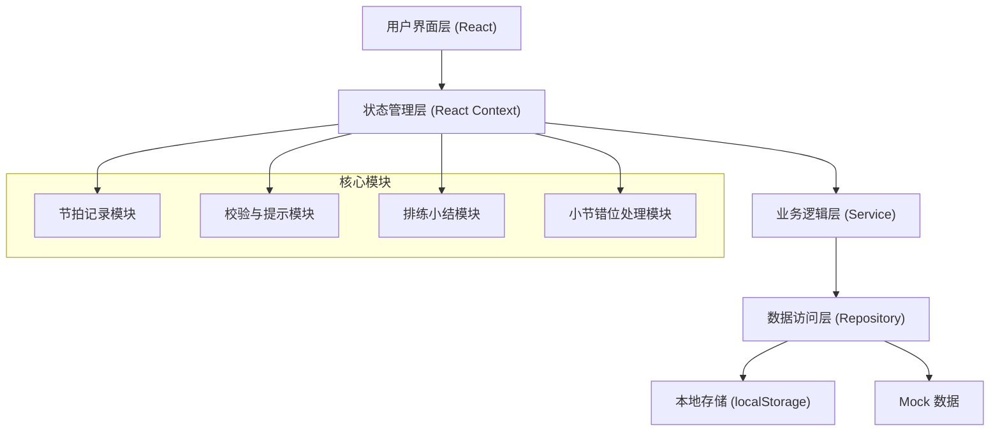
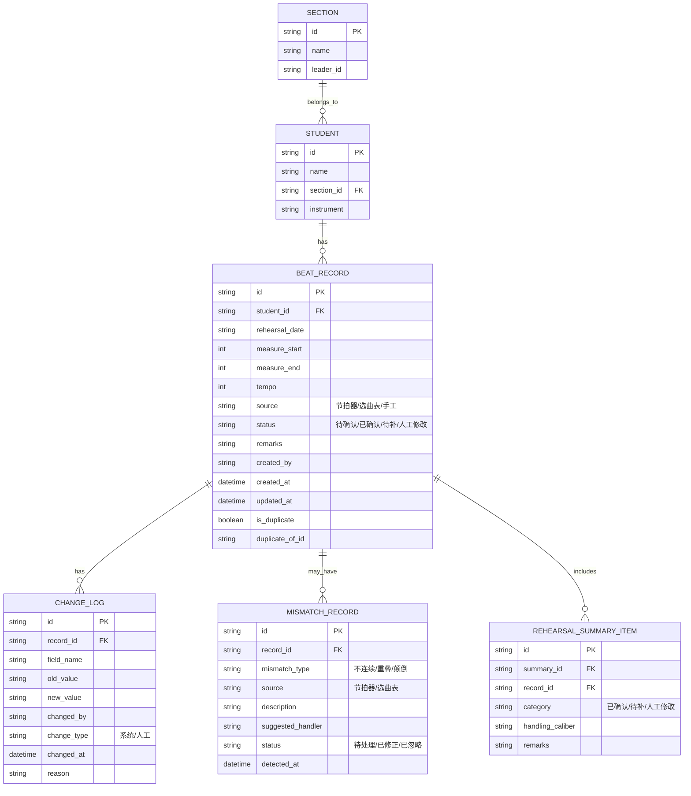

## 1. 架构设计

本系统采用纯前端架构，使用 React + TypeScript + Vite 构建，数据使用本地 Mock 数据 + localStorage 持久化。架构设计注重可扩展性，为后续接入后端服务预留接口。



## 2. 技术描述

- **前端框架**：React@18 + TypeScript@5
- **构建工具**：Vite@5
- **样式方案**：TailwindCSS@3 + CSS Variables
- **路由管理**：React Router@6
- **状态管理**：React Context + useReducer
- **图表库**：Recharts（用于排练小结统计图表）
- **图标库**：Lucide React（线性图标，符合设计风格）
- **日期处理**：date-fns
- **数据持久化**：localStorage（用于演示）
- **初始化工具**：npm create vite@latest

## 3. 路由定义

| 路由路径 | 页面名称 | 功能说明 |
|---------|----------|----------|
| `/` | 节拍记录列表页 | 查看、筛选、操作所有节拍记录 |
| `/records/:id` | 记录详情页 | 查看单条记录完整信息和变更历史 |
| `/records/new` | 数据录入页 | 新增节拍记录，支持多来源录入 |
| `/summary` | 排练小结页 | 分类统计、处理口径、导出报告 |
| `/mismatch` | 小节错位处理页 | 检测、查看、处理小节错位问题 |

## 4. 数据模型

### 4.1 实体关系图



### 4.2 类型定义

```typescript
// 数据源枚举
export enum DataSource {
  METRONOME = 'metronome',    // 节拍器
  MUSIC_SHEET = 'musicSheet', // 选曲表
  MANUAL = 'manual',          // 手工录入
}

// 记录状态枚举
export enum RecordStatus {
  PENDING = 'pending',       // 待确认
  CONFIRMED = 'confirmed',   // 已确认
  TO_FILL = 'toFill',        // 待补
  MANUAL_EDITED = 'manualEdited', // 人工修改
}

// 错位类型枚举
export enum MismatchType {
  DISCONTINUOUS = 'discontinuous', // 不连续
  OVERLAP = 'overlap',             // 重叠
  REVERSED = 'reversed',           // 颠倒
}

// 变更类型枚举
export enum ChangeType {
  SYSTEM = 'system', // 系统自动
  MANUAL = 'manual', // 人工操作
}

// 学生信息
export interface Student {
  id: string;
  name: string;
  sectionId: string;
  instrument: string;
}

// 声部信息
export interface Section {
  id: string;
  name: string;
  leaderId: string;
}

// 节拍记录
export interface BeatRecord {
  id: string;
  studentId: string;
  rehearsalDate: string;
  measureStart: number;
  measureEnd: number;
  tempo: number;
  source: DataSource;
  status: RecordStatus;
  remarks: string;
  createdBy: string;
  createdAt: string;
  updatedAt: string;
  isDuplicate: boolean;
  duplicateOfId?: string;
}

// 变更日志
export interface ChangeLog {
  id: string;
  recordId: string;
  fieldName: string;
  oldValue: string;
  newValue: string;
  changedBy: string;
  changeType: ChangeType;
  changedAt: string;
  reason: string;
}

// 错位记录
export interface MismatchRecord {
  id: string;
  recordId: string;
  mismatchType: MismatchType;
  source: DataSource;
  description: string;
  suggestedHandler: string;
  status: 'pending' | 'fixed' | 'ignored';
  detectedAt: string;
}

// 排练小结项
export interface SummaryItem {
  id: string;
  recordId: string;
  category: RecordStatus;
  handlingCaliber: string;
  remarks: string;
}

// 校验结果
export interface ValidationResult {
  isValid: boolean;
  errors: FriendlyError[];
  warnings: FriendlyError[];
}

// 友好错误
export interface FriendlyError {
  id: string;
  level: 'error' | 'warning' | 'info';
  message: string;
  suggestion: string;
  field?: string;
  relatedRecordId?: string;
}
```

## 5. 核心模块设计

### 5.1 校验与提示模块 (ValidationService)

负责所有数据校验逻辑，将技术错误转换为友好的人类语言提示。

```typescript
class ValidationService {
  // 校验单条记录
  validateRecord(record: BeatRecord, allRecords: BeatRecord[]): ValidationResult
  
  // 检测重复记录
  detectDuplicates(record: BeatRecord, allRecords: BeatRecord[]): FriendlyError[]
  
  // 检测小节错位
  detectMismatch(record: BeatRecord): MismatchRecord | null
  
  // 生成友好错误消息
  generateFriendlyMessage(errorCode: string, context: any): FriendlyError
  
  // 生成处理建议
  generateSuggestion(errorType: string, context: any): string
}
```

### 5.2 友好错误消息映射表

| 错误码 | 友好消息模板 | 建议模板 |
|--------|-------------|---------|
| DUPLICATE_STUDENT_TIME | "⚠️ {studentName} 在 {date} {time} 已经有一条记录了哦。" | "你可以看看两条是不是说的同一件事，然后合并成一条，或者都保留。" |
| MEASURE_REVERSED | "🤔 小节号写反啦，{start}-{end} 应该是从小的到大的。" | "试试改成 {end}-{start}？" |
| MEASURE_OVERLAP | "👀 这个小节范围 {start}-{end} 和 {otherStudent} 的那条重叠了。" | "如果是分谱不同，记得在备注里说明一下哦。" |
| MEASURE_DISCONTINUOUS | "⏸️ 第 {prevEnd} 小节之后直接跳到 {nextStart} 了，中间差了 {gap} 小节。" | "是休息了吗？找声部长核对一下？" |
| IMPORT_FORMAT_ERROR | "📋 这个节拍器日志的格式不太对，第 {line} 行有问题。" | "检查一下，应该是'小节号-速度'这样的格式。" |
| FIELD_REQUIRED | "🎯 {fieldName} 需要填一下哦。" | "不然大家不知道这条记录是给谁记的。" |
| INVALID_TEMPO | "⚡ 速度 {tempo} 有点奇怪呢。" | "一般乐曲速度在 40-200 之间，是不是写错啦？" |

### 5.3 排练小结模块 (SummaryService)

```typescript
class SummaryService {
  // 生成排练小结
  generateSummary(date: string, records: BeatRecord[]): RehearsalSummary
  
  // 分类记录
  categorizeRecords(records: BeatRecord[]): {
    confirmed: BeatRecord[],
    toFill: BeatRecord[],
    manualEdited: BeatRecord[]
  }
  
  // 生成处理口径
  generateHandlingCaliber(record: BeatRecord, changeLogs: ChangeLog[]): string
  
  // 导出PDF报告
  exportToPDF(summary: RehearsalSummary): Blob
}
```

## 6. 项目目录结构

```
src/
├── assets/              # 静态资源
├── components/          # 公共组件
│   ├── layout/         # 布局组件
│   ├── ui/             # 基础UI组件（按钮、卡片、表单等）
│   └── features/       # 业务组件
├── contexts/           # React Context
│   ├── RecordContext.tsx
│   └── ToastContext.tsx
├── hooks/              # 自定义 Hooks
│   ├── useValidation.ts
│   ├── useMismatchDetection.ts
│   └── useToast.ts
├── pages/              # 页面组件
│   ├── RecordList.tsx
│   ├── RecordDetail.tsx
│   ├── RecordForm.tsx
│   ├── RehearsalSummary.tsx
│   └── MismatchHandler.tsx
├── services/           # 业务逻辑层
│   ├── RecordService.ts
│   ├── ValidationService.ts
│   ├── SummaryService.ts
│   └── MismatchService.ts
├── repositories/       # 数据访问层
│   ├── LocalStorageRepository.ts
│   └── MockDataRepository.ts
├── types/              # TypeScript 类型定义
│   └── index.ts
├── utils/              # 工具函数
│   ├── friendlyMessages.ts
│   ├── dateUtils.ts
│   └── mockData.ts
├── styles/             # 全局样式
│   ├── index.css
│   └── variables.css
├── router/             # 路由配置
│   └── index.tsx
├── App.tsx
└── main.tsx
```

## 7. 核心功能技术实现要点

### 7.1 重复检测算法

```typescript
function detectDuplicates(newRecord: BeatRecord, allRecords: BeatRecord[]): FriendlyError[] {
  return allRecords
    .filter(r => r.id !== newRecord.id)
    .filter(r => r.studentId === newRecord.studentId)
    .filter(r => r.rehearsalDate === newRecord.rehearsalDate)
    .filter(r => {
      const overlap = 
        (newRecord.measureStart <= r.measureEnd && newRecord.measureEnd >= r.measureStart);
      return overlap;
    })
    .map(r => ({
      id: `dup-${r.id}`,
      level: 'warning',
      message: `⚠️ 这位同学的记录和已有记录（小节 ${r.measureStart}-${r.measureEnd}）有重叠`,
      suggestion: '确认是否为同一段演奏，可选择合并或备注说明差异',
      relatedRecordId: r.id
    }));
}
```

### 7.2 小节错位检测

```typescript
function detectMismatch(record: BeatRecord): MismatchRecord | null {
  // 检测颠倒
  if (record.measureStart > record.measureEnd) {
    return {
      id: `mismatch-${record.id}`,
      recordId: record.id,
      mismatchType: MismatchType.REVERSED,
      source: record.source,
      description: `小节号 ${record.measureStart}-${record.measureEnd} 写反了`,
      suggestedHandler: '声部长',
      status: 'pending',
      detectedAt: new Date().toISOString()
    };
  }
  
  // 检测不连续（需要上下文）...
  
  return null;
}
```

### 7.3 状态管理设计

使用 React Context + useReducer 管理全局状态，包含：
- 节拍记录列表
- 当前筛选条件
- 校验结果
- 错位记录列表
- Toast 通知队列
