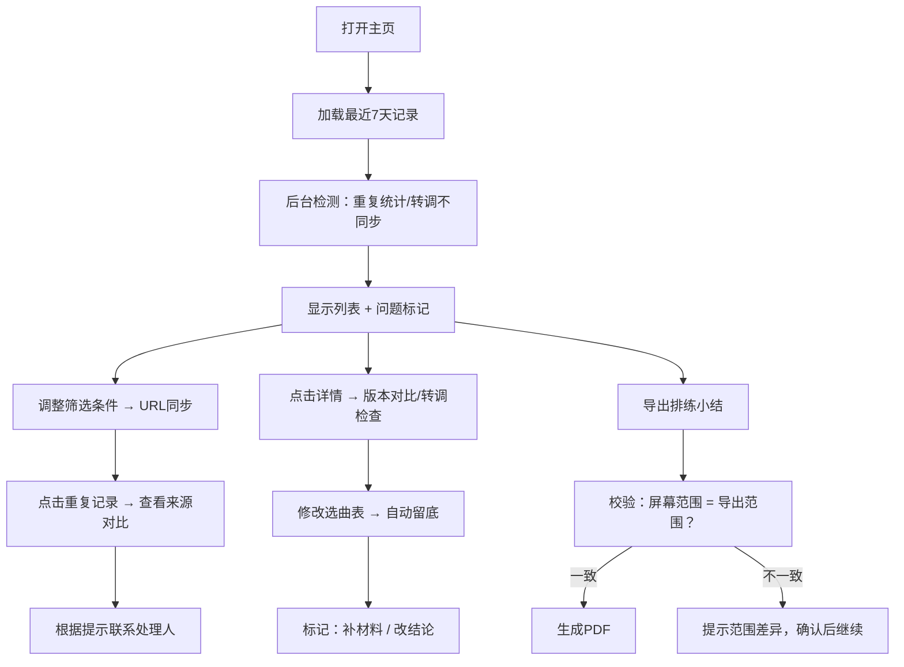

## 1. 产品概述

编曲素材归档系统是面向音乐教育机构的教学素材管理工具，解决节拍器记录、选曲表、曲谱PDF三类数据混杂、转调不同步、重复统计等核心痛点。一线老师和教务人员可通过系统清晰区分"补材料"与"改结论"，确保排练小结导出与屏幕视图一致，让素材归档成为日常可用的高效工具。

## 2. 核心功能

### 2.1 用户角色

| 角色 | 注册方式 | 核心权限 |
|------|----------|----------|
| 任课老师 | 工号登录 | 录入/编辑素材、标记数据来源、导出排练小结 |
| 教务管理员 | 工号登录 | 审核变动、处理重复统计、查看全部归档记录 |
| 教研主管 | 工号登录 | 查看历史版本、追踪转调变更记录 |

### 2.2 功能模块

1. **素材归档主页**：筛选面板、归档列表、数据来源统计、重复记录提示
2. **素材详情页**：版本留底对比、转调同步状态、操作历史溯源
3. **排练小结导出**：预览当前筛选范围、确认导出内容、生成PDF报告
4. **重复记录处理**：来源对比视图、冲突字段高亮、下一步处理人指引
5. **系统设置**：数据来源规则配置、错误提示风格偏好

### 2.3 页面详情

| 页面名称 | 模块名称 | 功能描述 |
|---------|---------|---------|
| 素材归档主页 | 智能筛选面板 | 按学生、日期、数据来源、转调状态筛选，状态实时URL持久化 |
| 素材归档主页 | 数据来源标记 | 每条记录显示来源标签：节拍器记录/选曲表/曲谱PDF/混合来源 |
| 素材归档主页 | 变动类型区分 | 用颜色和图标区分"补材料"（灰色）与"改结论"（红色带警告） |
| 素材归档主页 | 重复统计预警 | 同一学生同一曲目重复时高亮显示，点击展开来源对比 |
| 素材详情页 | 版本留底对比 | 选曲表每次修改自动留底，可对比任意两个版本差异 |
| 素材详情页 | 转调同步检查 | 三来源转调值比对，不一致时显示具体哪个来源缺失 |
| 素材详情页 | 操作历史 | 显示每一步操作人、时间、改动内容，区分补录与修改 |
| 排练小结导出 | 范围一致性校验 | 导出前校验当前筛选条件与屏幕显示范围是否一致 |
| 重复记录处理 | 来源追溯弹窗 | 显示重复记录各自来源、录入时间、录入人，标注需联系谁补全 |
| 全局 | 人性化错误提示 | 所有错误使用业务语言，标注问题位置和处理建议 |

## 3. 核心流程

用户进入主页，系统自动加载最近7天归档记录。用户可通过筛选条件调整视图，筛选条件实时同步到URL，刷新或重新打开页面可恢复。系统在后台检测重复记录和转调不同步问题，在列表中用醒目标记提示。用户点击重复记录可查看双来源对比，根据提示联系相关人员补全。导出排练小结前，系统自动校验当前筛选范围与即将导出内容是否一致，不一致时给出明确提示。所有选曲表修改自动留底，曲谱PDF改动需人工标记"改结论"。

## 4. 用户界面设计

### 4.1 设计风格

- **主色调**：深靛蓝 #1e3a5f（专业、稳重），配暖琥珀色 #d97706（警告、改结论标记）
- **辅助色**：薄荷绿 #059669（正常同步）、珊瑚红 #dc2626（错误）、石板灰 #64748b（补材料）
- **按钮风格**：圆角8px，悬停时轻微上浮+阴影，主按钮使用渐变背景
- **字体**：标题使用思源宋体（人文感），正文使用思源黑体（可读性）
- **布局风格**：左侧固定筛选面板 + 右侧卡片式列表，问题记录卡片边框高亮
- **图标风格**：线性图标，来源标记使用不同形状徽章：节拍器=圆形、选曲表=方形、曲谱PDF=三角形

### 4.2 页面设计概述

| 页面名称 | 模块名称 | UI元素 |
|---------|---------|---------|
| 素材归档主页 | 筛选面板 | 折叠式筛选组，每个条件显示当前选中值，一键重置按钮 |
| 素材归档主页 | 归档列表 | 卡片式布局，每张卡片顶部显示来源徽章和变动类型色条 |
| 素材归档主页 | 统计概览 | 顶部指标卡：今日新增、待处理重复、转调未同步、补材料数量 |
| 素材详情页 | 版本对比 | 左右分栏对比，差异行黄色高亮，新增内容绿色下划线，删除内容红色删除线 |
| 重复记录弹窗 | 来源对比 | 时间线布局，显示两条记录的录入时序，冲突字段并排对比 |
| 排练小结导出 | 预览页 | 缩略图网格显示将导出的页面，底部显示导出范围摘要 |

### 4.3 响应式

桌面端优先（1280px以上），平板端（768-1279px）筛选面板改为顶部可展开抽屉，移动端（768px以下）卡片单列布局，筛选条件改为底部弹出层。所有触控目标最小44x44px。

### 4.4 动效设计

- 页面加载：筛选面板从左滑入，列表卡片依次淡入（stagger 80ms）
- 错误提示：从顶部滑入，轻微抖动吸引注意，3秒后自动收起
- 重复记录展开：高度平滑过渡，箭头旋转180度
- 导出进度：环形进度条，完成时显示对勾动画
