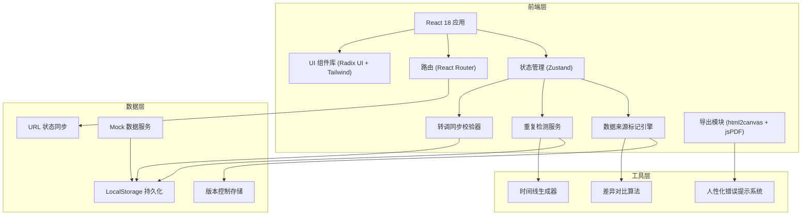
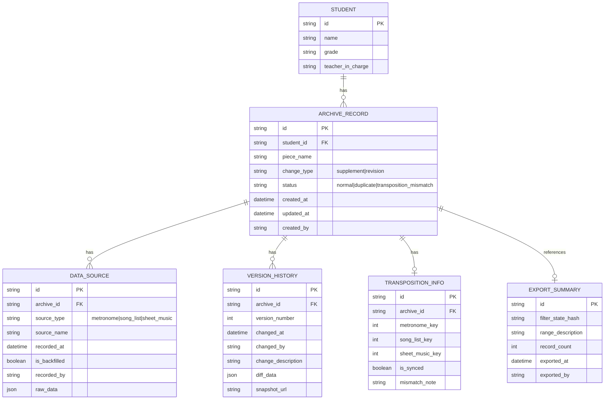

## 1. 架构设计



## 2. 技术描述

- **前端**：React 18 + TypeScript + Vite
- **样式**：Tailwind CSS 3 + CSS 变量主题系统
- **状态管理**：Zustand（轻量级，支持持久化中间件）
- **路由**：React Router v6（含URL状态同步）
- **UI组件**：Radix UI（无障碍组件）+ Lucide React（图标）
- **导出**：html2canvas + jsPDF（客户端PDF生成）
- **数据存储**：LocalStorage + URL SearchParams（筛选状态）
- **开发工具**：TypeScript严格模式 + ESLint + Prettier

## 3. 路由定义

| 路由 | 用途 |
|-----|-----|
| / | 素材归档主页（列表+筛选） |
| /archive/:id | 素材详情页（版本对比+转调检查） |
| /export | 排练小结导出预览页 |
| /duplicates | 重复记录集中处理页 |
| /settings | 系统设置页 |

## 4. 数据模型

### 4.1 数据模型定义



### 4.2 TypeScript 类型定义

```typescript
// 数据来源类型
type SourceType = 'metronome' | 'song_list' | 'sheet_music';
type ChangeType = 'supplement' | 'revision';
type RecordStatus = 'normal' | 'duplicate' | 'transposition_mismatch';

interface Student {
  id: string;
  name: string;
  grade: string;
  teacherInCharge: string;
}

interface DataSource {
  id: string;
  archiveId: string;
  sourceType: SourceType;
  sourceName: string;
  recordedAt: Date;
  isBackfilled: boolean;
  recordedBy: string;
  rawData: Record<string, any>;
}

interface TranspositionInfo {
  id: string;
  archiveId: string;
  metronomeKey?: number;
  songListKey?: number;
  sheetMusicKey?: number;
  isSynced: boolean;
  mismatchNote?: string;
}

interface VersionHistory {
  id: string;
  archiveId: string;
  versionNumber: number;
  changedAt: Date;
  changedBy: string;
  changeDescription: string;
  diffData: Record<string, any>;
  snapshotUrl?: string;
}

interface ArchiveRecord {
  id: string;
  studentId: string;
  student: Student;
  pieceName: string;
  changeType: ChangeType;
  status: RecordStatus;
  sources: DataSource[];
  transposition?: TranspositionInfo;
  versions: VersionHistory[];
  createdAt: Date;
  updatedAt: Date;
  createdBy: string;
  duplicateInfo?: {
    duplicateWithId: string;
    conflictFields: string[];
    suggestedHandler: string;
  };
}

interface FilterState {
  studentId?: string;
  dateRange?: [Date, Date];
  sourceTypes?: SourceType[];
  changeTypes?: ChangeType[];
  statuses?: RecordStatus[];
  page: number;
  pageSize: number;
}
```

## 5. 核心模块设计

### 5.1 重复检测服务 (DuplicateDetector)

```typescript
interface DuplicateResult {
  record1: ArchiveRecord;
  record2: ArchiveRecord;
  conflictFields: string[];
  sourceComparison: {
    record1Sources: SourceType[];
    record2Sources: SourceType[];
    timeGap: number; // 分钟
  };
  suggestedHandler: string; // 处理人姓名
  suggestedAction: string; // 处理建议
}

class DuplicateDetector {
  detect(records: ArchiveRecord[]): DuplicateResult[];
  getSourceDescription(sourceType: SourceType): string;
  getHandlerName(record: ArchiveRecord): string;
}
```

### 5.2 转调同步校验器 (TranspositionValidator)

```typescript
interface TranspositionValidationResult {
  isSynced: boolean;
  mismatchedSources: SourceType[];
  expectedKey: number;
  actualValues: Record<SourceType, number | undefined>;
  humanMessage: string;
}

class TranspositionValidator {
  validate(record: ArchiveRecord): TranspositionValidationResult;
  getHumanReadableKey(key: number): string; // 数字转调名：1=C, 2=D...
}
```

### 5.3 人性化错误提示系统 (HumanErrorHandler)

```typescript
interface ErrorContext {
  fieldName?: string;
  userAction?: string;
  recordId?: string;
}

class HumanErrorHandler {
  static translate(error: Error, context?: ErrorContext): {
    title: string;
    message: string;
    suggestion: string;
    severity: 'info' | 'warning' | 'error';
  };
  
  // 预设错误映射
  private static errorMap: Record<string, (ctx?: ErrorContext) => string> = {
    'TRANSPOSITION_MISMATCH': () => '三个数据源的转调值不一致',
    'DUPLICATE_RECORD': (ctx) => `该学生的《${ctx?.fieldName}》已有记录`,
    'VERSION_SAVE_FAILED': () => '版本留底失败',
  };
}
```

### 5.4 URL状态同步 (UrlStateSync)

```typescript
class UrlStateSync {
  static serialize(filterState: FilterState): string;
  static deserialize(searchParams: string): FilterState;
  static syncToUrl(filterState: FilterState): void;
  static syncFromUrl(): FilterState;
  static getStateHash(filterState: FilterState): string; // 用于导出范围校验
}
```

## 6. 性能优化

- 重复检测使用防抖（500ms），避免频繁计算
- 版本对比使用虚拟滚动，长列表性能优化
- 列表数据分页加载，每页20条
- 筛选状态URL压缩编码，避免过长URL
- LocalStorage数据分片存储，超过100条自动归档旧数据
