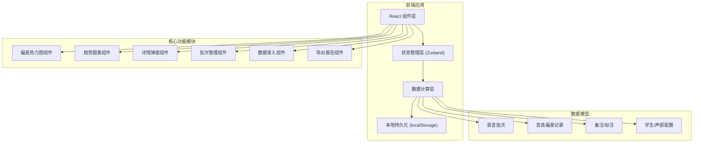
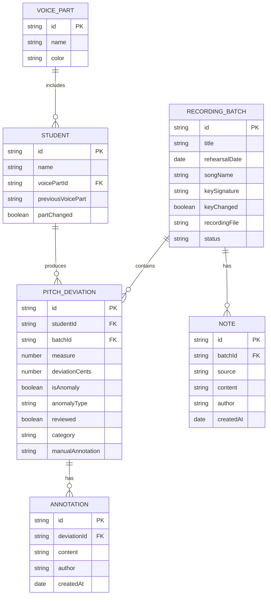

## 1. 架构设计



---

## 2. 技术描述

- **前端框架**：React@18 + TypeScript
- **构建工具**：Vite@5
- **样式方案**：TailwindCSS@3
- **状态管理**：Zustand（轻量级，适合本地数据管理）
- **图表库**：Recharts（React生态，支持折线图、热力图）
- **图标**：Lucide React
- **数据持久化**：localStorage（无后端，纯前端应用）
- **导出方案**：html2canvas + jsPDF（导出PDF小报）

---

## 3. 路由定义

| 路由 | 页面用途 |
|------|----------|
| `/` | 主页面 - 音准趋势小报（含热力图、趋势图、统计卡片） |

> 注：单页应用，使用状态切换而非路由切换各功能模块

---

## 4. 数据模型

### 4.1 数据模型定义



### 4.2 TypeScript 类型定义

```typescript
// 声部类型
interface VoicePart {
  id: string;
  name: 'soprano' | 'alto' | 'tenor' | 'bass';
  displayName: string;
  color: string;
}

// 学生类型
interface Student {
  id: string;
  name: string;
  voicePartId: string;
  previousVoicePart?: string;
  partChanged?: boolean;
}

// 录音批次类型
interface RecordingBatch {
  id: string;
  title: string;
  rehearsalDate: string;
  songName: string;
  keySignature: string;
  keyChanged?: boolean;
  previousKey?: string;
  recordingFileName?: string;
  totalMeasures: number;
  missingMeasures?: number[];
  notes?: Note[];
}

// 声部长备注类型
interface Note {
  id: string;
  batchId: string;
  source: 'monitor' | 'teacher' | 'selection';
  content: string;
  author: string;
  createdAt: string;
  relatedMeasure?: number;
  relatedStudentId?: string;
}

// 音高偏差类型
interface PitchDeviation {
  id: string;
  studentId: string;
  batchId: string;
  measure: number;
  deviationCents: number;
  isAnomaly: boolean;
  anomalyType?: 'key_change' | 'part_change' | 'missing_measure' | 'manual';
  anomalyReason?: string;
  reviewed: boolean;
  category?: 'persistent' | 'occasional' | 'unreviewed';
  manualAnnotation?: string;
  createdAt: string;
  updatedAt: string;
}

// 应用状态类型
interface AppState {
  batches: RecordingBatch[];
  students: Student[];
  voiceParts: VoicePart[];
  deviations: PitchDeviation[];
  notes: Note[];
  selectedBatchId: string | null;
  selectedDeviationId: string | null;
  filters: {
    voicePartId: string | null;
    category: string | null;
    showAnomaliesOnly: boolean;
  };
}
```

### 4.3 核心计算逻辑

#### 异常数据识别规则
1. **转调标记**：批次 `keyChanged = true` 时，该批次所有偏差默认标记异常，不参与声部平均值
2. **换声部标记**：学生 `partChanged = true` 时，该学生在变更后前3次排练数据标记异常
3. **缺拍标记**：批次 `missingMeasures` 中包含的小节，所有学生该小节偏差标记异常
4. **手动标记**：老师可手动将任意偏差标记为异常

#### 偏差分类规则
1. **持续跑偏**：同一学生同一小节，连续3次排练偏差 > 50音分
2. **偶发失误**：单次偏差 > 50音分，但前后2次正常
3. **未复核**：偏差 > 30音分且 `reviewed = false`

#### 统计计算规则
- 声部平均值 = Σ(非异常偏差) / 非异常偏差数量
- 总体趋势 = 各声部平均值按人数加权

---

## 5. 组件结构

```
src/
├── components/
│   ├── Layout/
│   │   ├── Header.tsx          # 顶部导航
│   │   ├── Sidebar.tsx         # 批次管理侧边栏
│   │   └── Timeline.tsx        # 排练时间线
│   ├── Dashboard/
│   │   ├── TrendChart.tsx      # 趋势折线图
│   │   ├── Heatmap.tsx         # 偏差热力图
│   │   └── StatCards.tsx       # 分类统计卡片
│   ├── DeviationDetail/
│   │   ├── DetailModal.tsx     # 详情弹窗
│   │   ├── Traceability.tsx    # 溯源信息
│   │   ├── HistoryChart.tsx    # 历史对比图
│   │   └── AnomalyBadge.tsx    # 异常标记
│   ├── DataEntry/
│   │   ├── EntryPanel.tsx      # 数据录入面板
│   │   └── QuickEntryTable.tsx # 快速录入表格
│   └── Export/
│       └── ExportButton.tsx    # 导出按钮
├── store/
│   └── useAppStore.ts          # Zustand 状态管理
├── types/
│   └── index.ts                # 类型定义
├── utils/
│   ├── calculations.ts         # 计算逻辑
│   ├── classification.ts       # 分类逻辑
│   └── export.ts               # 导出逻辑
├── data/
│   └── mockData.ts             # Mock 演示数据
├── App.tsx
├── main.tsx
└── index.css
```

---

## 6. Mock 数据规划

为演示功能，预置以下测试数据：
- 4个声部（S/A/T/B），每声部3-4名学生，共14名学生
- 5次排练录音批次（含1次转调、1次学生换声部、1次缺拍）
- 每批次16小节，每学生每小节有偏差数据
- 3条声部长备注、2条选曲变更记录
- 预置若干持续跑偏、偶发失误、未复核的偏差案例
