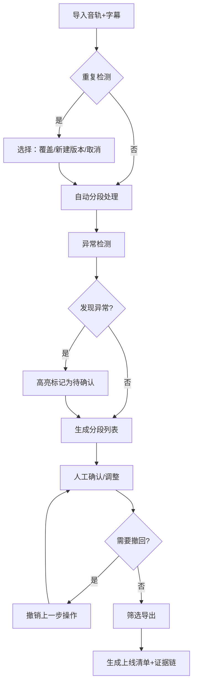

## 1. 产品概述

面向播客一线剪辑师的音轨分段工作工具，解决重复导入、撤回修正、筛选导出等日常操作的一致性问题，将原始音轨、人工确认、上线清单完整串联，确保核心证据可追溯。

- **核心问题**：剪辑师日常处理音轨时，时间轴漂移、静音段误删、导出漏素材等问题难以发现
- **目标用户**：播客一线剪辑师、内容审核人员
- **产品价值**：宁可标为"待确认"也不输出有疑问的结果，确保音频分段质量可控

## 2. 核心功能

### 2.1 用户角色

| 角色 | 登录方式 | 核心权限 |
|------|----------|----------|
| 剪辑师 | 本地账号 | 导入音轨、分段确认、撤回修正、导出清单 |
| 审核员 | 本地账号 | 查看分段记录、导出完整证据链 |

### 2.2 功能模块

1. **音轨导入区**：拖拽上传、重复检测、字幕草稿匹配
2. **分段工作台**：时间轴可视化、分段标记、异常高亮、人工确认
3. **历史记录区**：操作日志、撤回功能、版本对比
4. **导出中心**：筛选条件、导出预览、证据清单生成

### 2.3 页面详情

| 页面名称 | 模块名称 | 功能描述 |
|----------|----------|----------|
| 主工作台 | 拖拽上传区 | 支持音频文件+字幕文件批量拖拽，自动检测重复导入 |
| 主工作台 | 时间轴分段 | 可视化波形显示，自动检测静音段并标记，支持手动调整 |
| 主工作台 | 异常告警区 | 实时显示时间轴漂移、静音段异常、素材缺失等可疑项 |
| 主工作台 | 确认操作栏 | 单条确认、批量确认、撤回上一步、标记待确认 |
| 导出页面 | 筛选面板 | 按状态（已确认/待确认/已废弃）、时间范围、标签筛选 |
| 导出页面 | 导出预览 | 预览即将导出的分段清单和关联素材列表 |
| 导出页面 | 证据链导出 | 导出包含原始音轨信息、操作日志、确认记录的完整清单 |
| 历史记录 | 操作日志 | 完整记录所有导入、修改、确认、撤回操作 |
| 历史记录 | 版本对比 | 对比同一音轨的不同分段版本差异 |

## 3. 核心流程

### 3.1 主工作流程

剪辑师日常工作流程：
1. 拖拽原始音轨 + 字幕草稿到上传区
2. 系统自动检测重复导入，若已存在则提示选择"覆盖"或"新建版本"
3. 自动分段并检测异常（静音段、时间轴漂移等）
4. 剪辑师逐条检查确认，可疑项可标记"待确认"
5. 发现错误可随时撤回上一步操作
6. 筛选需要导出的分段，生成上线清单
7. 导出时自动附带完整证据链记录

## 4. 用户界面设计

### 4.1 设计风格

- **主色调**：深灰蓝 (#1e293b) 为背景，突出专业性和长时间使用的舒适度
- **强调色**：琥珀橙 (#f59e0b) 用于标记"待确认"，翠绿 (#10b981) 用于"已确认"，玫红 (#ef4444) 用于异常告警
- **按钮风格**：圆角 6px，扁平化设计，hover 时有轻微亮度变化
- **字体**：系统无衬线字体，确保跨平台一致性，字号 13-14px 为主
- **布局风格**：三栏布局（左侧素材库 + 中间时间轴 + 右侧详情），紧凑高效
- **图标风格**：简约线条图标，避免花哨装饰

### 4.2 页面设计概述

| 页面名称 | 模块名称 | UI 元素 |
|----------|----------|---------|
| 主工作台 | 上传区 | 虚线边框拖拽区域，文件图标，状态标签 |
| 主工作台 | 时间轴 | 波形图背景，分段色块，异常标记点，时间刻度 |
| 主工作台 | 分段列表 | 表格布局，状态徽章，操作按钮，行悬浮效果 |
| 主工作台 | 错误提示 | 顶部横幅，大字号提示文字，"查看详情"链接 |
| 导出页面 | 筛选器 | 标签式筛选，日期选择器，搜索框 |
| 导出页面 | 导出预览 | 卡片式预览清单，素材数量统计，导出按钮 |

### 4.3 响应式

- 桌面端优先设计，最低支持 1280px 宽度
- 三栏布局在小屏幕下自动折叠为可展开侧边栏
- 时间轴支持鼠标滚轮缩放和拖拽平移

### 4.4 人性化错误提示设计原则

1. **不说技术术语**：不说"字段校验失败"，说"这个分段的开始时间好像填错了，再检查一下？"
2. **给出解决方案**：不只是说"有问题"，要说"这两段时间重叠了，可以拖动调整一下位置"
3. **语气友好**：使用"哎呀"、"提醒一下"、"帮你发现"等口语化表达
4. **避免惊吓**：普通警告不用红色警报样式，用柔和的提示色
5. **可操作**：每个错误提示旁边都有"快速修复"或"查看详情"按钮
