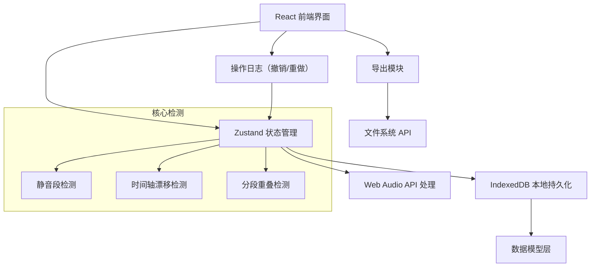
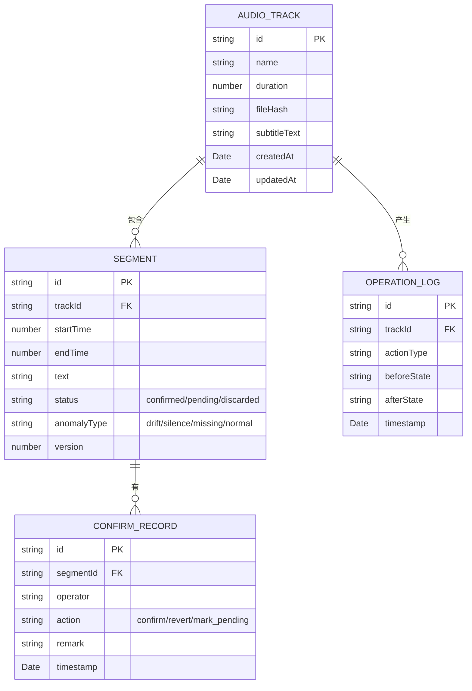

## 1. 架构设计

## 2. 技术描述

- **前端框架**：React@18 + TypeScript + Vite
- **状态管理**：Zustand（轻量级，支持时间旅行便于撤回操作）
- **样式方案**：TailwindCSS@3
- **音频处理**：Web Audio API + wavesurfer.js（波形可视化）
- **本地存储**：IndexedDB（dexie.js 封装，持久化大量分段数据）
- **导出格式**：JSON / CSV / Markdown（支持多种上线清单格式）
- **后端**：无后端设计，纯前端本地运行，数据全部存储在浏览器本地

## 3. 路由定义

| 路由 | 页面用途 |
|------|----------|
| / | 主工作台 - 音轨导入、分段处理、人工确认 |
| /export | 导出中心 - 筛选、预览、导出上线清单 |
| /history | 历史记录 - 操作日志、版本对比 |
| /settings | 设置页面 - 导入导出配置、异常检测参数 |

## 4. 核心数据模型

### 4.1 数据模型定义

### 4.2 异常检测规则

| 异常类型 | 检测规则 | 处理方式 |
|----------|----------|----------|
| 时间轴漂移 | 前后两段间隔 > 500ms 或 < 50ms | 标记为 pending，提示"间隔异常" |
| 静音段误删 | 静音段时长 > 3s 但未被分段 | 自动补充分段并标记为 pending |
| 分段重叠 | 两段时间区间存在交集 | 强制标记为 pending，不允许导出 |
| 素材缺失 | 分段文本为空且时长 < 2s | 标记为 pending，提示"可能漏标注" |

## 5. 核心模块设计

### 5.1 重复导入检测模块

- 使用文件内容 hash 检测完全相同的文件
- 相同文件名不同内容，提示"发现同名文件，建议创建新版本"
- 导入时自动对比已有分段，支持增量导入

### 5.2 撤回/修正模块

- 基于 Command 模式实现操作栈
- 每步操作（添加/删除/修改分段、确认状态）都可撤销
- 支持最多 50 步历史撤回
- 撤回记录写入操作日志，确保可追溯

### 5.3 导出一致性保证

- 导出前二次校验：检查所有待导出分段的状态
- "待确认"状态的分段默认不导出，需手动勾选
- 导出文件包含：分段清单 + 操作日志摘要 + 异常项说明
- 生成唯一导出编号，便于后续追溯

### 5.4 错误提示模块

- 统一的错误提示组件
- 内置错误消息映射表，将技术错误转为用户友好的提示
- 支持"快速修复"按钮自动处理常见问题
- 所有错误同时记录到本地日志，方便技术支持排查
