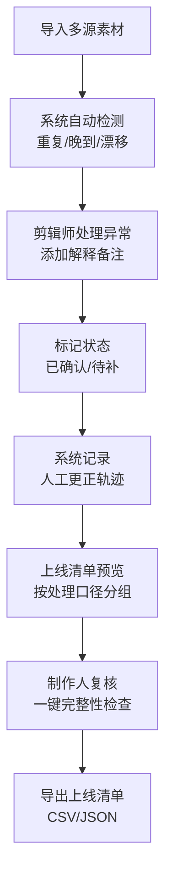

## 1. 产品概述
播客剪辑时间轴工具，面向播客剪辑师和制作人，解决多源素材（嘉宾名单、剪辑点、广告口播）在同一条时间轴上的协同查看问题。参考"短视频配乐授权"工作流设计，以实用为核心，强调状态可追溯、异常可解释、导出一致。

目标用户：播客剪辑师、内容制作人
核心价值：将分散的剪辑素材整合到统一时间轴，减少人工核对成本，提升上线清单的准确性。

## 2. 核心功能

### 2.1 用户角色
| 角色 | 注册方式 | 核心权限 |
|------|----------|----------|
| 剪辑师 | 无需注册 | 导入素材、查看时间轴、标记异常、导出上线清单 |
| 制作人 | 无需注册 | 复核上线清单、查看处理口径、确认最终导出 |

### 2.2 功能模块
1. **时间轴主页面**：统一时间轴展示（嘉宾、剪辑点、广告口播同线）、状态标记、漂移检测
2. **素材导入面板**：支持多类型数据导入（正常记录、晚到附件、重复项、人工更正）
3. **异常管理面板**：异常解释、重复项合并、人工更正记录
4. **上线清单导出**：按处理口径分类导出（已确认/待补/人工更正）

### 2.3 页面详情
| 页面名称 | 模块名称 | 功能描述 |
|----------|----------|----------|
| 时间轴主页面 | 统一时间轴 | 三轨叠加展示（嘉宾轨、剪辑点轨、广告口播轨），支持缩放、悬停详情、状态颜色标识 |
| 时间轴主页面 | 状态回看 | 历史版本切换、修改记录追溯、每一步操作的时间戳和操作人 |
| 时间轴主页面 | 漂移检测 | 自动检测相邻时间点的异常间隔，高亮标记时间轴漂移区域 |
| 素材导入面板 | 数据导入 | 支持粘贴/上传CSV/JSON，自动识别数据类型，处理晚到附件（延迟标记）、重复项（去重建议） |
| 异常管理面板 | 异常解释 | 每条异常记录可添加解释备注，支持标记"已解决/待处理" |
| 异常管理面板 | 人工更正 | 记录所有人工修改，保留原值和新值，支持撤销 |
| 上线清单导出 | 清单预览 | 按"已确认/待补/人工更正"三类分组展示，每组带处理口径说明 |
| 上线清单导出 | 复核导出 | 导出前一键复核（检查未闭合异常、缺失字段），支持CSV/JSON导出 |

## 3. 核心流程
用户导入多源素材 → 系统自动检测异常（重复、晚到、漂移） → 剪辑师处理异常并添加解释 → 标记状态（已确认/待补） → 系统自动记录人工更正 → 进入上线清单预览 → 制作人复核（一键检查完整性） → 导出最终清单

## 4. 用户界面设计

### 4.1 设计风格
** brutalist/raw 粗粝实用风格 **
- 主色调：深灰（#1a1a1a）背景 + 米白（#f5f1e8）文字，拒绝花哨
- 辅助色：
  - 已确认：墨绿（#2d5a4a）
  - 待补：赭红（#8b4513）
  - 人工更正：靛蓝（#3b4a8b）
  - 异常/漂移：橘红（#c2410c）
- 按钮风格：直角、细边框、无圆角、hover状态为底色反转
- 字体：等宽字体（JetBrains Mono）用于时间码和数据展示，搭配无衬线字体（Noto Sans SC）用于说明文字
- 布局：满屏网格布局，时间轴占70%宽度，右侧面板占30%，强调信息密度
- 图标：极简线条图标（lucide），不使用emoji

### 4.2 页面设计概述
| 页面名称 | 模块名称 | UI元素 |
|----------|----------|--------|
| 时间轴主页面 | 统一时间轴 | 三轨水平叠加时间轴，每轨用不同边框样式区分，时间刻度精确到秒，悬停显示详情卡片 |
| 时间轴主页面 | 状态回看 | 左侧版本时间线，可点击切换历史快照，差异部分用底色高亮 |
| 素材导入面板 | 数据导入 | 大文本输入框+拖拽区域，导入后立即显示检测结果统计（正常X条，异常Y条） |
| 异常管理面板 | 异常列表 | 表格布局，每行显示异常类型、原始值、建议处理、操作按钮，支持批量处理 |
| 上线清单导出 | 清单预览 | 三栏卡片布局，每栏顶部是处理口径说明，下方是对应记录列表 |

### 4.3 响应式
- Desktop-first设计，最小支持宽度1280px
- 移动端降级为列表视图，时间轴转为垂直排列
- 触摸操作优化：双击放大时间轴，双指缩放

### 4.4 动效设计
- 页面加载：数据逐行淡入（staggered reveal），时间轴从左到右逐步绘制
- 异常标记：新检测到的异常有轻微脉冲动画（pulse）
- 状态切换：颜色过渡动画（300ms ease）
- 导出：进度条线性动画，完成后有确认反馈
