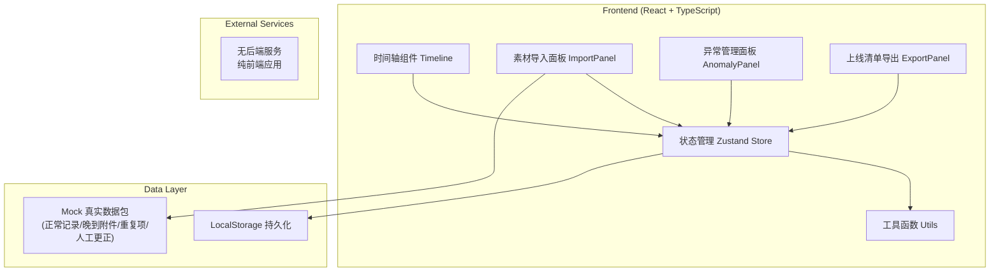
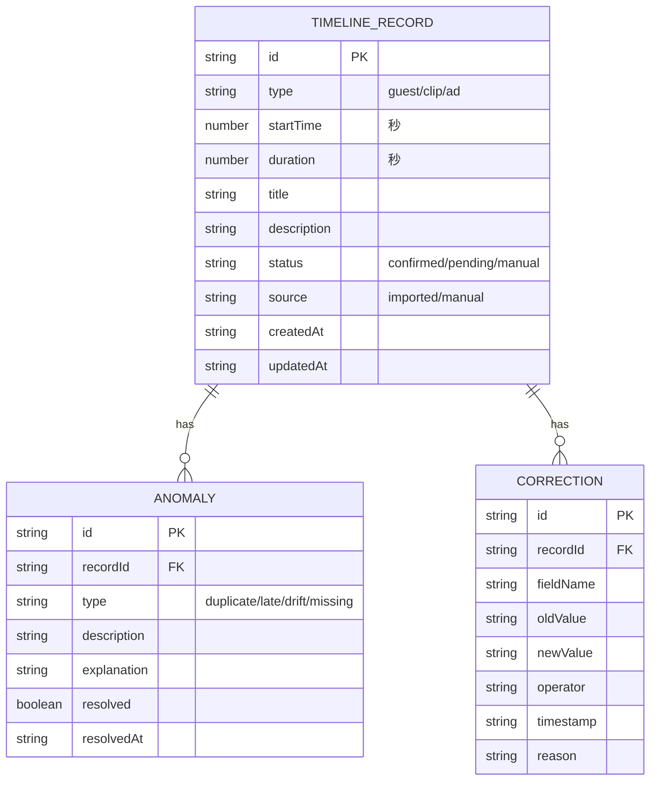

## 1. 架构设计



## 2. 技术描述
- **Frontend**: React@18 + TypeScript + Vite
- **样式**: TailwindCSS@3 + CSS Variables（自定义设计token）
- **状态管理**: Zustand（轻量、可追溯、支持时间旅行调试）
- **图标**: Lucide React
- **后端**: 无（纯前端应用，数据存储在LocalStorage）
- **初始化工具**: vite-init
- **数据**: 内置Mock数据包，模拟真实工作场景（包含正常记录、晚到附件、重复项、人工更正）

## 3. 路由定义
| Route | 页面/组件 | 用途 |
|-------|-----------|------|
| / | TimelinePage | 主页面：统一时间轴 + 右侧面板切换 |
| /export | ExportPage | 上线清单预览与导出页面 |

## 4. 数据模型

### 4.1 数据实体定义



### 4.2 核心TypeScript类型定义

```typescript
// 时间轴记录类型
export type RecordType = 'guest' | 'clip' | 'ad';
export type RecordStatus = 'confirmed' | 'pending' | 'manual';
export type AnomalyType = 'duplicate' | 'late' | 'drift' | 'missing';

export interface TimelineRecord {
  id: string;
  type: RecordType;
  startTime: number;
  duration: number;
  title: string;
  description: string;
  status: RecordStatus;
  source: 'imported' | 'manual';
  createdAt: string;
  updatedAt: string;
  meta?: Record<string, any>;
}

export interface Anomaly {
  id: string;
  recordId: string;
  type: AnomalyType;
  description: string;
  explanation?: string;
  resolved: boolean;
  resolvedAt?: string;
}

export interface Correction {
  id: string;
  recordId: string;
  fieldName: string;
  oldValue: string;
  newValue: string;
  operator: string;
  timestamp: string;
  reason: string;
}

export interface VersionSnapshot {
  id: string;
  timestamp: string;
  records: TimelineRecord[];
  anomalies: Anomaly[];
  description: string;
}

// 导出清单格式
export interface ExportItem {
  record: TimelineRecord;
  anomalies: Anomaly[];
  corrections: Correction[];
  handlingNote: string;
}

export interface ExportManifest {
  exportTime: string;
  operator: string;
  confirmed: ExportItem[];
  pending: ExportItem[];
  manual: ExportItem[];
  summary: {
    total: number;
    confirmedCount: number;
    pendingCount: number;
    manualCount: number;
    unresolvedAnomalies: number;
  };
}
```

### 4.3 Mock 真实数据包结构

内置测试数据包，模拟真实工作场景：

```typescript
// 正常记录 (12条)
// 晚到附件 (3条 - 标记为late，导入时间晚于预期)
// 重复项 (2组 - 内容相近，时间重叠)
// 人工更正 (4条 - 记录原值和修改后的值)
```

## 5. 核心算法

### 5.1 重复项检测
- 基于时间重叠度（>80%）+ 标题相似度（编辑距离<3）判定重复
- 返回去重建议，保留最新或手动选择

### 5.2 时间轴漂移检测
- 计算相邻记录间隔的标准差
- 间隔偏离均值±2σ标记为漂移区域
- 高亮显示漂移区间，给出调整建议

### 5.3 导出一致性检查
- 导出前自动扫描：
  1. 未解决的异常数量
  2. 待补记录的缺失字段
  3. 人工更正的完整性说明
  4. 时间轴总时长是否匹配

## 6. 项目结构

```
src/
├── components/
│   ├── timeline/
│   │   ├── Timeline.tsx          # 主时间轴组件
│   │   ├── TimelineTrack.tsx     # 单轨道组件
│   │   ├── TimelineItem.tsx      # 时间轴条目
│   │   └── TimelineRuler.tsx     # 时间刻度
│   ├── panels/
│   │   ├── ImportPanel.tsx       # 素材导入
│   │   ├── AnomalyPanel.tsx      # 异常管理
│   │   └── HistoryPanel.tsx      # 状态回看
│   ├── export/
│   │   ├── ExportPreview.tsx     # 清单预览
│   │   └── ExportCard.tsx        # 分类卡片
│   └── common/
│       ├── Button.tsx
│       ├── Badge.tsx
│       └── Table.tsx
├── hooks/
│   ├── useTimeline.ts            # 时间轴操作逻辑
│   ├── useAnomalyDetection.ts    # 异常检测
│   └── useExport.ts              # 导出逻辑
├── store/
│   └── useTimelineStore.ts       # Zustand状态管理
├── utils/
│   ├── time.ts                   # 时间格式化
│   ├── detection.ts              # 检测算法
│   └── export.ts                 # 导出工具
├── data/
│   └── mockData.ts               # 真实场景数据包
├── types/
│   └── index.ts                  # 类型定义
├── pages/
│   ├── TimelinePage.tsx
│   └── ExportPage.tsx
└── App.tsx
```
