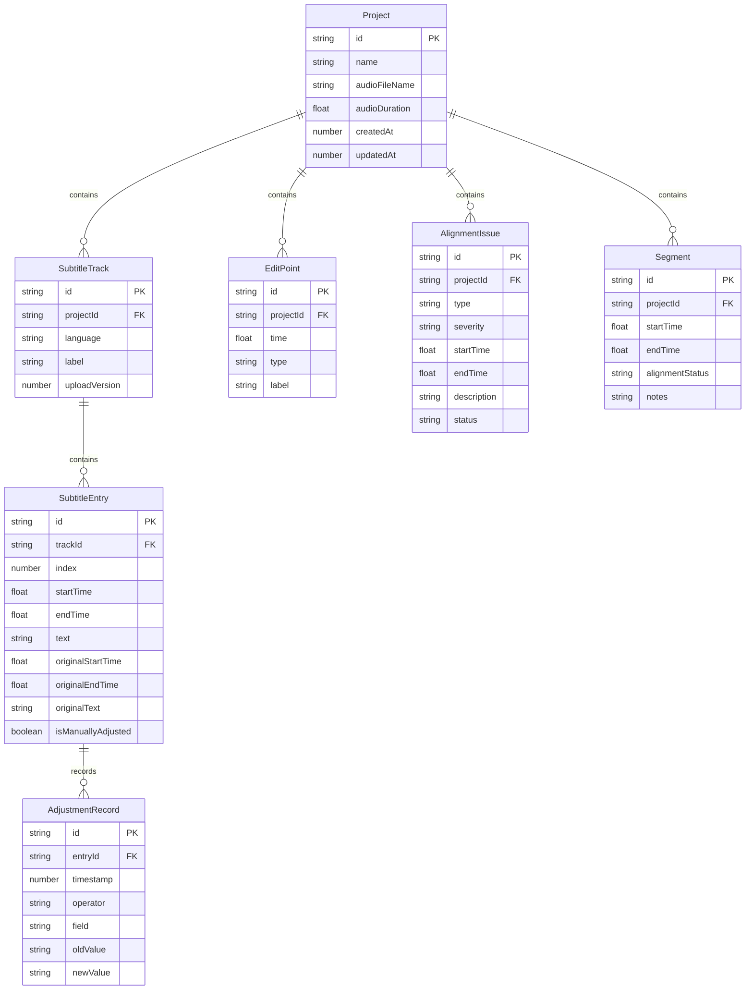

## 1. 架构设计

```mermaid
graph TB
    subgraph "前端层"
        "React 应用" --> "状态管理 Zustand"
        "React 应用" --> "时间线引擎"
        "React 应用" --> "对齐检测引擎"
        "React 应用" --> "级联更新引擎"
    end

    subgraph "数据层"
        "状态管理 Zustand" --> "本地存储 IndexedDB"
        "状态管理 Zustand" --> "项目数据模型"
    end

    subgraph "外部服务"
        "字幕文件解析" --> "SRT/VTT 解析器"
        "音频处理" --> "Web Audio API"
        "文件导出" --> "SRT/VTT 生成器"
    end

    "时间线引擎" --> "Web Audio API"
    "对齐检测引擎" --> "项目数据模型"
    "级联更新引擎" --> "项目数据模型"
```

## 2. 技术说明

- **前端框架**：React@18 + TypeScript + Vite
- **样式方案**：Tailwind CSS@3
- **初始化工具**：Vite (react-ts 模板)
- **状态管理**：Zustand（轻量、无 boilerplate）
- **音频处理**：Web Audio API + WaveSurfer.js（波形渲染与播放控制）
- **时间线渲染**：Canvas 自绘（高性能多轨道渲染）
- **字幕解析**：自实现 SRT/VTT 解析器
- **本地存储**：IndexedDB（via idb 库，存储项目与校正历史）
- **后端**：无（纯前端应用，数据存储在浏览器本地）
- **数据库**：无服务端数据库，使用 IndexedDB 作为客户端持久化

## 3. 路由定义

| 路由 | 用途 |
|------|------|
| `/` | 首页/项目列表，展示已有项目和新建入口 |
| `/project/:id` | 时间线工作台，多轨时间线编辑主界面 |
| `/project/:id/checklist` | 制作人清单，对齐状态总览与片段明细 |
| `/project/:id/export` | 导出与历史，外包导出与校正历史查看 |

## 4. API 定义

无后端 API。前端使用 Zustand store + IndexedDB 进行数据管理。

### 4.1 核心 TypeScript 类型

```typescript
interface Project {
  id: string
  name: string
  audioFile: AudioFileInfo
  createdAt: number
  updatedAt: number
}

interface AudioFileInfo {
  name: string
  duration: number
  fileHash: string
}

interface SubtitleTrack {
  id: string
  projectId: string
  language: 'zh' | 'en' | string
  label: string
  entries: SubtitleEntry[]
  uploadVersion: number
}

interface SubtitleEntry {
  id: string
  trackId: string
  index: number
  startTime: number
  endTime: number
  text: string
  originalStartTime: number
  originalEndTime: number
  originalText: string
  isManuallyAdjusted: boolean
  adjustmentHistory: AdjustmentRecord[]
}

interface AdjustmentRecord {
  id: string
  entryId: string
  timestamp: number
  operator: string
  field: 'startTime' | 'endTime' | 'text'
  oldValue: string | number
  newValue: string | number
}

interface EditPoint {
  id: string
  projectId: string
  time: number
  type: 'cut' | 'ad' | 'transition'
  label: string
  color: string
}

interface AlignmentIssue {
  id: string
  projectId: string
  type: 'silent_deletion' | 'timeline_drift' | 'missing_line'
  severity: 'error' | 'warning' | 'info'
  startTime: number
  endTime: number
  description: string
  affectedTrackIds: string[]
  status: 'open' | 'resolved' | 'dismissed'
  resolution?: string
  resolvedBy?: string
  resolvedAt?: number
}

interface Segment {
  id: string
  projectId: string
  startTime: number
  endTime: number
  alignmentStatus: 'aligned' | 'needs_review' | 'has_issue'
  notes: string
  reviewedBy?: string
}
```

## 5. 服务器架构

无服务器架构。纯前端 SPA 应用。

## 6. 数据模型

### 6.1 数据模型定义



### 6.2 IndexedDB 存储

使用 idb 库管理 IndexedDB：

- **projects** 存储：项目元数据
- **tracks** 存储：字幕轨道数据
- **entries** 存储：字幕条目（索引：trackId, projectId）
- **editPoints** 存储：剪辑点与广告口播标记（索引：projectId）
- **issues** 存储：对齐问题（索引：projectId, status）
- **segments** 存储：片段对齐状态（索引：projectId）
- **adjustments** 存储：校正历史记录（索引：entryId, timestamp）
