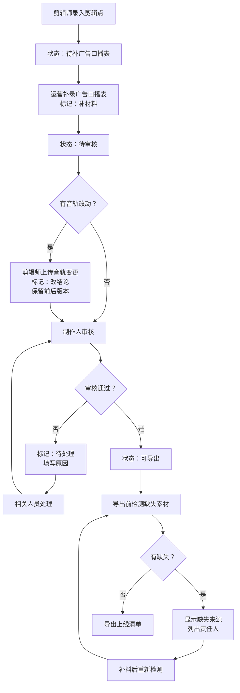

## 1. 产品概述

播客嘉宾片段管理系统，解决剪辑点早到、广告口播表晚补、原始音轨手工改动等场景下的记录混乱问题。每条记录清晰展示来源、状态、变更历史，明确区分"补材料"与"改结论"，避免上线清单与明细各说各话。

- **目标用户**：播客制作人、剪辑师、运营人员
- **核心价值**：让每条嘉宾片段的来龙去脉一目了然，减少沟通成本，避免上线事故

## 2. 核心功能

### 2.1 用户角色

| 角色 | 注册方式 | 核心权限 |
|------|----------|----------|
| 剪辑师 | 内部账号 | 创建剪辑点记录、上传原始音轨变更 |
| 运营 | 内部账号 | 补录广告口播表、导出清单审核 |
| 制作人 | 内部账号 | 查看全量记录、审批待处理项、导出上线清单 |
| 管理员 | 内部账号 | 角色管理、配置维护 |

### 2.2 功能模块

1. **片段列表页**：记录列表、状态筛选、来源筛选、快捷搜索
2. **片段详情页**：来源信息、当前状态、变更历史、待处理原因、素材清单
3. **新建/编辑页**：录入剪辑点、补录广告口播表、记录音轨改动
4. **导出清单页**：生成上线清单、检测缺失素材、明确补料责任人

### 2.3 页面详情

| 页面名称 | 模块名称 | 功能描述 |
|----------|----------|----------|
| 片段列表页 | 筛选区 | 按状态/来源/时间/责任人筛选，支持关键词搜索 |
| 片段列表页 | 列表区 | 卡片式展示，显示标题、来源标签、状态徽章、最新操作人、待处理原因摘要 |
| 片段列表页 | 操作栏 | 新建记录、批量导出、批量状态变更 |
| 片段详情页 | 信息概览 | 显示基本信息、来源链（剪辑点→口播表→音轨） |
| 片段详情页 | 状态流转 | 状态变更按钮，必填变更原因 |
| 片段详情页 | 变更历史 | 时间线展示，每次变更显示操作人、时间、变更内容、变更类型（补材料/改结论） |
| 片段详情页 | 素材清单 | 列出所有关联素材，标记缺失项，标注缺失来源（剪辑点/广告口播表），显示补料责任人 |
| 新建/编辑页 | 基础信息 | 标题、嘉宾、播客期数、时长 |
| 新建/编辑页 | 来源录入 | 选择来源类型（剪辑点/广告口播表/原始音轨），上传附件或填写内容 |
| 新建/编辑页 | 变更类型 | 明确标记本次操作是"补材料"还是"改结论" |
| 新建/编辑页 | 待处理原因 | 状态变更为待处理时必填原因 |
| 导出清单页 | 清单生成 | 选择记录生成上线清单 |
| 导出清单页 | 缺失检测 | 自动检测缺失素材，分组显示来源，列出需联系的责任人 |
| 导出清单页 | 导出操作 | 导出完整清单（含缺失说明和责任人） |

## 3. 核心流程

### 主流程描述
剪辑师先录入剪辑点（来源：剪辑点）→ 运营后续补录广告口播表（来源：广告口播表，标记为"补材料"）→ 如遇音轨改动，剪辑师上传变更记录（标记为"改结论"，保留前后版本）→ 制作人审核，如有问题标记为"待处理"并填写原因 → 导出上线清单前系统自动检测缺失素材，明确来源和责任人 → 确认无误后导出

## 4. 用户界面设计

### 4.1 设计风格

**设计方向**：编辑室风格 - 专业、克制、有质感的工具类产品

- **主色调**：深琥珀色 `#8B4513`（代表录音室、专业感）
- **辅助色**：墨绿 `#2F4F4F`（审核通过）、橙红 `#CD5C5C`（待处理/缺失）、暖灰 `#D2B48C`（补材料）、深蓝 `#4682B4`（改结论）
- **中性色**：炭黑 `#1C1C1C`、深灰 `#3D3D3D`、中灰 `#6B6B6B`、浅灰 `#E8E4DE`、米白 `#FAF7F2`
- **按钮样式**：微立体边框，悬停时轻微浮起，按下时凹陷
- **字体**：标题用 "Noto Serif SC"（衬线，专业感），正文用 "Noto Sans SC"（无衬线，易读性）
- **布局**：左侧导航 + 右侧内容区，卡片式列表，时间线式详情
- **图标**：Lucide 线性图标，配合状态用彩色小圆点标记
- **质感**：轻微纸质纹理背景，卡片间有细微阴影层次

### 4.2 页面设计概览

| 页面名称 | 模块名称 | UI 元素 |
|----------|----------|----------|
| 片段列表页 | 筛选区 | 横向排列的筛选标签，下拉选择器，搜索框带放大镜图标 |
| 片段列表页 | 列表卡片 | 左侧彩色竖条标记状态，右上角来源徽章，右下角状态徽章，悬停显示操作按钮 |
| 片段列表页 | 操作栏 | 左侧标题 + 新建按钮（琥珀色主按钮），右侧批量操作按钮 |
| 片段详情页 | 信息概览 | 标题区大号字体，来源链用箭头连接的标签组，状态用大号彩色徽章 |
| 片段详情页 | 变更历史 | 左侧时间线（彩色节点），右侧变更卡片，不同变更类型用不同底色区分 |
| 片段详情页 | 素材清单 | 表格形式，缺失行标红，最后一列显示"联系：XXX"按钮 |
| 新建/编辑页 | 表单区 | 分区表单，来源类型用单选卡片，变更类型用开关选择 |
| 导出清单页 | 检测结果 | 分组展示缺失项，每组头部显示来源类型和责任人数，可展开查看明细 |

### 4.3 响应性

- Desktop-first 设计，主内容区最小宽度 1024px
- 平板端（768-1024px）：左侧导航收起为图标，筛选区改为两行
- 移动端（<768px）：底部标签栏导航，列表改为单列全屏卡片

### 4.4 动效设计

- 页面加载：顶部进度条 + 内容区淡入
- 列表筛选：卡片淡出后重新排列淡入
- 状态变更：状态徽章颜色过渡动画（0.3s）
- 时间线：滚动时节点逐个点亮（延迟 0.1s）
- 悬停效果：卡片轻微上浮（transform: translateY(-2px)），阴影加深
- 错误提示：红色边框抖动动画（0.2s × 2）
