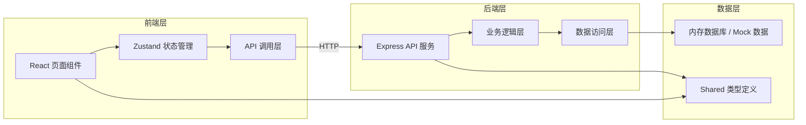
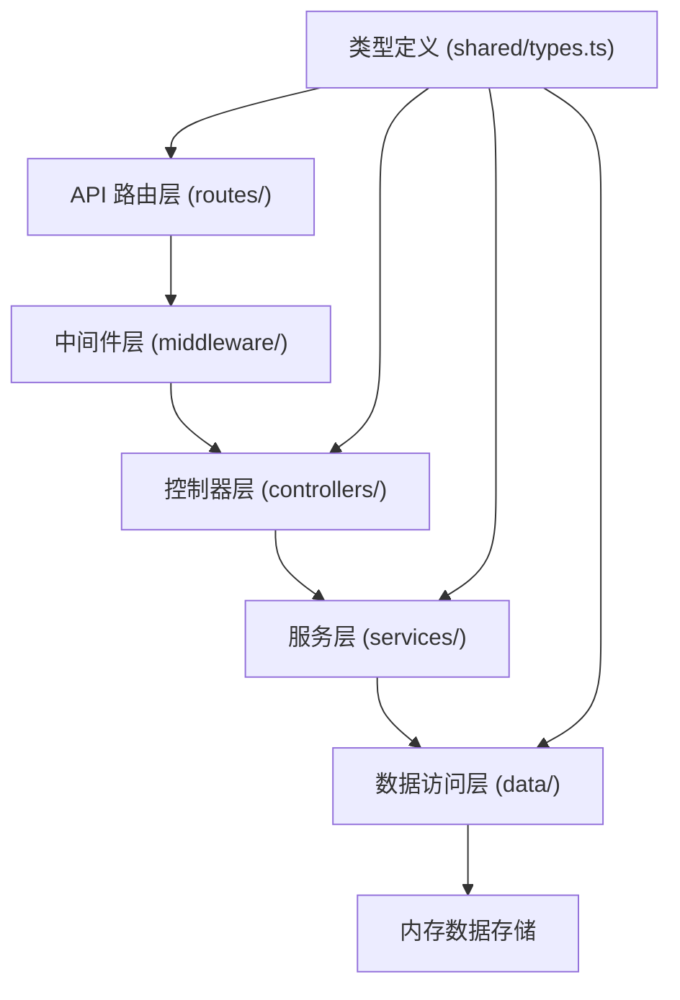
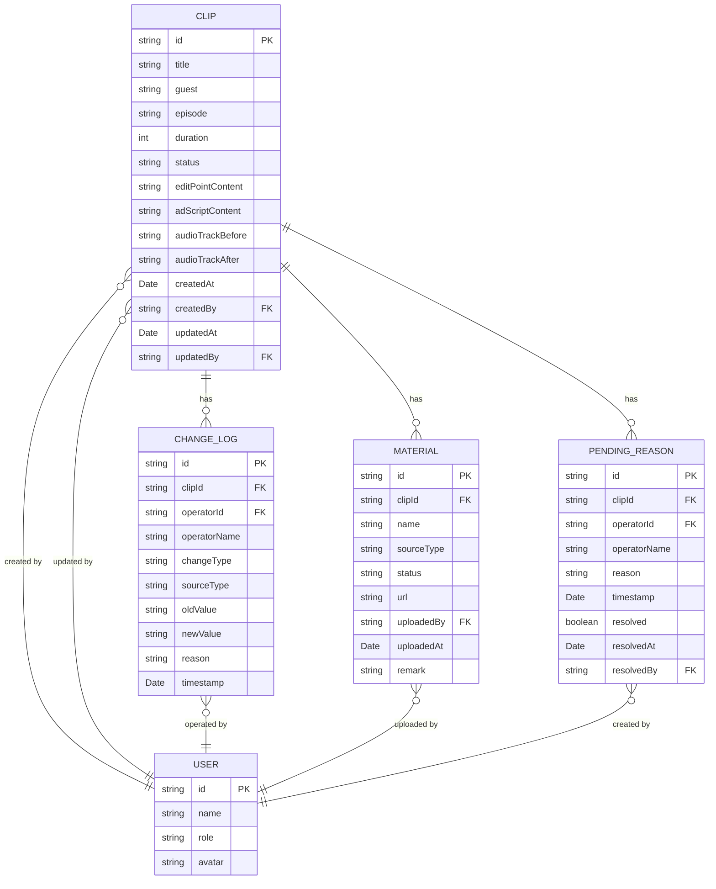

## 1. 架构设计



## 2. 技术描述

- **前端**：React@18 + TypeScript + Vite + React Router DOM@6 + TailwindCSS@3 + Zustand + Lucide React
- **后端**：Express@4 + TypeScript + CORS
- **数据库**：内存存储（开发阶段使用 Mock 数据，便于演示）
- **初始化工具**：vite-init
- **包管理器**：npm

## 3. 路由定义

| 路由 | 页面 | 用途 |
|------|------|------|
| `/` | 片段列表页 | 展示所有记录，支持筛选搜索 |
| `/clip/:id` | 片段详情页 | 查看单条记录详情、变更历史、素材清单 |
| `/clip/new` | 新建片段页 | 创建新的剪辑点记录 |
| `/clip/:id/edit` | 编辑片段页 | 补录广告口播表、记录音轨改动 |
| `/export` | 导出清单页 | 生成上线清单、检测缺失素材 |

## 4. API 定义

### 4.1 类型定义

```typescript
// 来源类型
type SourceType = 'edit_point' | 'ad_script' | 'audio_track';

// 变更类型
type ChangeType = 'material_only' | 'conclusion_change';

// 状态枚举
type ClipStatus = 'pending_ad_script' | 'pending_review' | 'pending' | 'ready' | 'archived';

// 用户角色
type UserRole = 'editor' | 'operator' | 'producer' | 'admin';

// 用户
interface User {
  id: string;
  name: string;
  role: UserRole;
  avatar?: string;
}

// 素材项
interface Material {
  id: string;
  clipId: string;
  name: string;
  sourceType: SourceType;
  status: 'available' | 'missing';
  url?: string;
  uploadedBy?: string;
  uploadedAt?: Date;
  remark?: string;
}

// 变更记录
interface ChangeLog {
  id: string;
  clipId: string;
  operatorId: string;
  operatorName: string;
  changeType: ChangeType;
  sourceType: SourceType;
  oldValue?: string;
  newValue?: string;
  reason?: string;
  timestamp: Date;
}

// 待处理原因
interface PendingReason {
  id: string;
  clipId: string;
  operatorId: string;
  operatorName: string;
  reason: string;
  timestamp: Date;
  resolved?: boolean;
  resolvedAt?: Date;
  resolvedBy?: string;
}

// 嘉宾片段
interface Clip {
  id: string;
  title: string;
  guest: string;
  episode: string;
  duration: number; // 秒
  status: ClipStatus;
  createdBy: string;
  createdAt: Date;
  updatedBy: string;
  updatedAt: Date;
  editPointContent?: string;
  adScriptContent?: string;
  audioTrackBefore?: string;
  audioTrackAfter?: string;
  pendingReasons: PendingReason[];
  changeLogs: ChangeLog[];
  materials: Material[];
}

// 导出缺失项
interface ExportMissingItem {
  materialId: string;
  materialName: string;
  sourceType: SourceType;
  responsiblePerson: User;
}

// 导出清单
interface ExportManifest {
  id: string;
  clipIds: string[];
  generatedAt: Date;
  generatedBy: string;
  missingItems: ExportMissingItem[];
  canExport: boolean;
}
```

### 4.2 接口定义

| 方法 | 路径 | 描述 | 请求体 | 响应 |
|------|------|------|--------|------|
| GET | `/api/clips` | 获取片段列表 | 可选 query: status, sourceType, keyword | `Clip[]` |
| GET | `/api/clips/:id` | 获取单条片段 | - | `Clip` |
| POST | `/api/clips` | 创建新片段 | `{ title, guest, episode, duration, editPointContent }` | `Clip` |
| PUT | `/api/clips/:id` | 更新片段 | `Partial<Clip> & { changeType: ChangeType, reason?: string }` | `Clip` |
| PATCH | `/api/clips/:id/status` | 变更状态 | `{ status: ClipStatus, reason?: string, operatorId: string }` | `Clip` |
| GET | `/api/clips/:id/changelogs` | 获取变更历史 | - | `ChangeLog[]` |
| GET | `/api/clips/:id/materials` | 获取素材清单 | - | `Material[]` |
| POST | `/api/clips/:id/materials` | 添加素材 | `{ name, sourceType, url? }` | `Material` |
| GET | `/api/export/check` | 检测缺失素材 | query: `clipIds` | `ExportManifest` |
| POST | `/api/export` | 导出清单 | `{ clipIds: string[] }` | `{ url: string, manifest: ExportManifest }` |
| GET | `/api/users` | 获取用户列表 | - | `User[]` |

## 5. 服务端架构



- **路由层**：定义 API 端点，参数校验
- **中间件层**：CORS、日志、错误处理
- **控制器层**：请求处理，响应格式化
- **服务层**：业务逻辑，状态机流转，变更记录生成
- **数据访问层**：CRUD 操作，数据持久化

## 6. 数据模型

### 6.1 ER 图



### 6.2 状态机规则

| 当前状态 | 可转换到 | 触发条件 | 必填项 |
|----------|----------|----------|--------|
| `pending_ad_script` | `pending_review` | 补录广告口播表完成 | `adScriptContent`, `changeType` |
| `pending_review` | `pending` | 制作人审核不通过 | `reason`（待处理原因） |
| `pending_review` | `ready` | 制作人审核通过 | - |
| `pending_review` | `pending_review` | 音轨改动 | `audioTrackBefore`, `audioTrackAfter`, `changeType='conclusion_change'` |
| `pending` | `pending_review` | 待处理问题已解决 | - |
| `ready` | `archived` | 已导出上线 | - |
| 任意状态 | `pending` | 标记问题 | `reason`（待处理原因） |

### 6.3 初始 Mock 数据

系统预置以下演示数据，覆盖用户描述的典型场景：

1. **剪辑点早到**：片段 A，状态 `pending_ad_script`，有剪辑点内容，无广告口播表
2. **广告口播表晚补**：片段 B，状态 `pending_review`，变更历史显示先有剪辑点，后补录口播表（`changeType='material_only'`）
3. **原始音轨手工改动**：片段 C，状态 `pending_review`，变更历史显示音轨改动（`changeType='conclusion_change'`），保留 `audioTrackBefore` 和 `audioTrackAfter`
4. **待处理记录**：片段 D，状态 `pending`，有 `pendingReasons` 记录
5. **缺失素材混合**：片段 E，部分素材来自剪辑点缺失，部分来自广告口播表缺失
