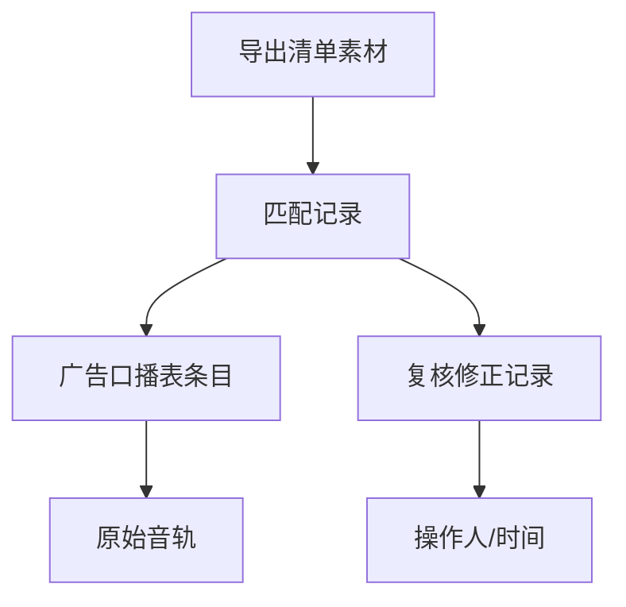

## 1. 产品概述

环境音素材检索系统，解决播客剪辑流程中环境音素材管理混乱、溯源困难、导出遗漏等问题。支持素材导入、智能匹配、人工复核、批量修正、操作历史追溯和清单导出全流程闭环。

- **核心痛点**：导出清单漏素材、原始音轨无留底、素材来源无法追溯、重复操作导致数据冗余
- **目标用户**：播客剪辑师、音频后期制作人员、内容运营团队
- **产品价值**：建立可追溯的素材管理链，确保每一条导出素材都能回溯到广告口播表和原始音轨，提升剪辑效率和数据准确性

## 2. 核心功能

### 2.1 用户角色

| 角色 | 注册方式 | 核心权限 |
|------|----------|----------|
| 剪辑师 | 本地账号 | 导入素材、检索匹配、复核修正、导出清单 |
| 管理员 | 本地账号 | 全功能权限、数据管理、历史审计 |

### 2.2 功能模块

1. **素材检索页**：多条件筛选、批量操作、检索结果列表、溯源跳转
2. **导入管理页**：原始音轨导入、广告口播表导入、环境音素材批量导入、导入进度与日志
3. **复核修正页**：匹配结果复核、人工调整关联、批量修正、幂等校验
4. **历史追溯页**：操作日志、版本对比、变更记录、溯源链路查看
5. **导出管理页**：上线清单导出、导出记录、导出内容预览、数据一致性校验

### 2.3 页面详情

| 页面名称 | 模块名称 | 功能描述 |
|----------|----------|----------|
| 素材检索页 | 筛选面板 | 支持按音轨编号、广告批次、素材类型、时间范围、状态等多条件筛选 |
| 素材检索页 | 结果列表 | 分页展示素材信息，支持批量选择、列排序、自定义显示列 |
| 素材检索页 | 溯源面板 | 点击素材可查看完整溯源链路：原始音轨 → 广告口播 → 匹配素材 |
| 导入管理页 | 原始音轨导入 | 支持Excel/CSV导入，自动去重，记录导入批次和时间戳 |
| 导入管理页 | 广告口播导入 | 关联音轨编号，支持版本管理，保留历史版本 |
| 导入管理页 | 环境音素材导入 | 批量上传，自动提取元数据，幂等处理避免重复 |
| 复核修正页 | 匹配结果列表 | 展示自动匹配结果，标注匹配置信度 |
| 复核修正页 | 人工修正 | 支持重新关联、调整匹配关系、添加备注 |
| 复核修正页 | 批量操作 | 批量确认、批量驳回、批量重新匹配 |
| 历史追溯页 | 操作日志 | 记录所有数据变更，支持按操作人、时间、类型筛选 |
| 历史追溯页 | 溯源链路图 | 可视化展示素材从原始音轨到导出的完整链路 |
| 导出管理页 | 清单导出 | 导出当前筛选结果，包含溯源ID、格式支持Excel/CSV |
| 导出管理页 | 一致性校验 | 导出前自动校验屏幕显示与导出数据一致性 |

## 3. 核心流程

### 3.1 素材检索与导出流程

用户导入原始音轨和广告口播表 → 系统自动匹配环境音素材 → 人工复核修正 → 筛选目标素材 → 溯源验证 → 导出上线清单 → 导出记录留档

### 3.2 素材溯源流程

点击素材记录 → 加载溯源链路 → 展示原始音轨信息 → 跳转广告口播表详情 → 查看匹配历史 → 支持一键回溯到任意节点

## 4. 用户界面设计

### 4.1 设计风格

- **主色调**：深靛蓝 #1E3A5F（专业、可靠）
- **辅助色**：琥珀橙 #F59E0B（警示、操作）、翡翠绿 #10B981（通过、成功）
- **中性色**：冷灰系列 #1F2937 / #4B5563 / #9CA3AF / #E5E7EB
- **按钮风格**：微圆角（6px），2px边框，悬停时轻微上浮阴影
- **字体**：标题使用 Noto Sans SC 700，正文使用 Inter 400/500/600
- **布局风格**：顶部导航 + 左侧筛选 + 主内容区卡片式布局，数据表格使用斑马纹提升可读性
- **图标风格**：线性图标，统一2px描边，16px/20px两种尺寸

### 4.2 页面设计概述

| 页面名称 | 模块名称 | UI 元素 |
|----------|----------|----------|
| 素材检索页 | 顶部导航 | Logo、系统名称、全局搜索、用户菜单、历史记录入口 |
| 素材检索页 | 左侧筛选面板 | 折叠式筛选组，每个筛选项带计数徽章，重置按钮 |
| 素材检索页 | 主内容区 | 操作工具栏（批量操作、导出、刷新）、数据表格、分页器 |
| 素材检索页 | 溯源弹窗 | 时间线式溯源链路，可跳转详情，卡片悬停高亮 |
| 导入管理页 | 上传区域 | 拖拽上传区，格式说明，模板下载按钮 |
| 导入管理页 | 导入记录 | 批次卡片，状态标签，进度条，错误详情链接 |
| 复核修正页 | 匹配列表 | 每行带置信度进度条，快速操作按钮（通过/驳回/调整） |
| 复核修正页 | 修正面板 | 左右分栏对比原始音轨和素材，支持拖拽重新关联 |
| 历史追溯页 | 时间轴 | 垂直时间轴，彩色标识操作类型，展开查看详情 |
| 导出管理页 | 导出预览 | 导出数据快照，数量统计，一致性检查结果 |
| 导出管理页 | 导出记录 | 列表展示，支持重新下载、查看导出时的筛选条件 |

### 4.3 响应式设计

- 桌面端优先（1280px+），三栏布局
- 平板端（768px-1279px）：左侧筛选可折叠，表格支持水平滚动
- 移动端（<768px）：简化布局，仅保留核心检索和查看功能，表格转为卡片式展示

### 4.4 交互与动效

- 页面加载：骨架屏 + 淡入动画（300ms ease-out）
- 筛选变更：数据区域平滑过渡（200ms opacity transition）
- 溯源弹窗：从底部滑入 + 背景模糊（backdrop-filter: blur(8px)）
- 操作反馈：按钮点击缩放（scale: 0.97），成功操作顶部通知滑入
- 表格行：悬停背景色渐变，选中行左侧彩色边框标识
