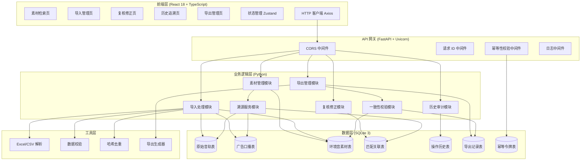
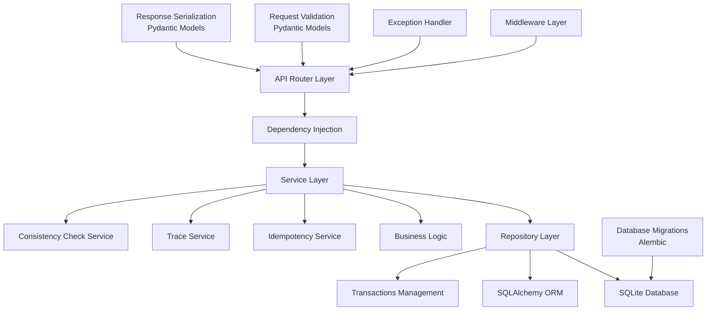
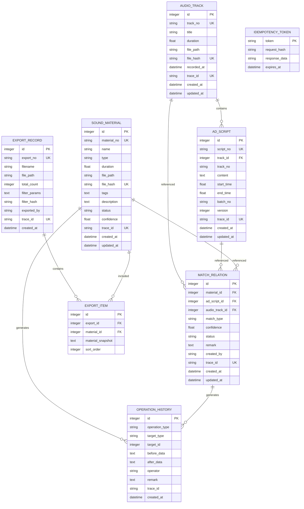

## 1. 架构设计



## 2. 技术描述

### 2.1 后端技术栈
- **Web 框架**: FastAPI 0.109.x + Uvicorn 0.27.x (ASGI 异步服务器)
- **数据库**: SQLite 3 (本地文件存储，无需额外服务)
- **ORM**: SQLAlchemy 2.0.x (类型安全，异步支持)
- **数据校验**: Pydantic 2.5.x (请求/响应模型校验)
- **文件处理**: pandas 2.1.x + openpyxl 3.1.x (Excel/CSV 导入导出)
- **幂等性实现**: 客户端请求 ID + 服务端幂等令牌 + 唯一约束
- **Python 版本**: 3.11+

### 2.2 前端技术栈
- **框架**: React 18 + TypeScript 5.3
- **构建工具**: Vite 5.0
- **路由**: React Router v6
- **状态管理**: Zustand 4.5
- **UI 组件库**: 自定义组件 + TailwindCSS 3.4
- **HTTP 客户端**: Axios 1.6
- **图标**: Lucide React
- **表格组件**: TanStack Table 8.11
- **日期处理**: date-fns 3.3

### 2.3 关键技术决策
1. **SQLite 选型理由**: 本地部署零配置，单文件便于备份迁移，满足中小规模数据量需求
2. **FastAPI 选型理由**: 自动生成 OpenAPI 文档，类型安全，高性能，开发效率高
3. **幂等性设计**: 三层保障 - 客户端幂等键、数据库唯一约束、业务去重逻辑
4. **溯源设计**: 每张业务表保留 trace_id 字段，关联表记录完整链路，支持递归查询

## 3. 后端路由定义

| Method | Route | 模块 | 功能描述 | 幂等要求 |
|--------|-------|------|----------|----------|
| GET | `/api/v1/audio-tracks` | 素材管理 | 获取原始音轨列表（支持筛选、分页） | 否 |
| GET | `/api/v1/audio-tracks/{id}` | 素材管理 | 获取原始音轨详情 | 否 |
| POST | `/api/v1/audio-tracks/import` | 导入管理 | 批量导入原始音轨 | 是 |
| GET | `/api/v1/ad-scripts` | 素材管理 | 获取广告口播表列表 | 否 |
| GET | `/api/v1/ad-scripts/{id}` | 素材管理 | 获取广告口播表详情 | 否 |
| POST | `/api/v1/ad-scripts/import` | 导入管理 | 批量导入广告口播表 | 是 |
| GET | `/api/v1/sound-materials` | 素材管理 | 获取环境音素材列表（支持多条件筛选） | 否 |
| GET | `/api/v1/sound-materials/{id}` | 素材管理 | 获取环境音素材详情 | 否 |
| POST | `/api/v1/sound-materials/import` | 导入管理 | 批量导入环境音素材 | 是 |
| GET | `/api/v1/matches` | 复核修正 | 获取匹配结果列表 | 否 |
| POST | `/api/v1/matches/auto-match` | 复核修正 | 执行自动匹配 | 是 |
| PUT | `/api/v1/matches/{id}` | 复核修正 | 更新匹配关系（人工修正） | 是 |
| POST | `/api/v1/matches/batch-confirm` | 复核修正 | 批量确认匹配结果 | 是 |
| POST | `/api/v1/matches/batch-reject` | 复核修正 | 批量驳回匹配结果 | 是 |
| GET | `/api/v1/sound-materials/{id}/trace` | 溯源服务 | 获取素材完整溯源链路 | 否 |
| GET | `/api/v1/history` | 历史审计 | 获取操作历史列表 | 否 |
| GET | `/api/v1/history/{id}` | 历史审计 | 获取操作历史详情 | 否 |
| POST | `/api/v1/export/preview` | 导出管理 | 导出预览（含一致性校验） | 否 |
| POST | `/api/v1/export` | 导出管理 | 导出上线清单 | 是 |
| GET | `/api/v1/export/records` | 导出管理 | 获取导出记录列表 | 否 |
| GET | `/api/v1/export/records/{id}/download` | 导出管理 | 下载历史导出文件 | 否 |
| GET | `/api/v1/import/batches` | 导入管理 | 获取导入批次列表 | 否 |
| GET | `/api/v1/import/batches/{id}` | 导入管理 | 获取导入批次详情（含错误日志） | 否 |
| GET | `/api/v1/health` | 系统 | 健康检查 | 否 |

## 4. API 数据模型定义

```typescript
// 基础响应结构
interface ApiResponse<T> {
  code: number;
  message: string;
  data: T;
  request_id: string;
  timestamp: string;
}

interface PaginatedResponse<T> {
  items: T[];
  total: number;
  page: number;
  page_size: number;
  total_pages: number;
}

// 原始音轨
interface AudioTrack {
  id: number;
  track_no: string;
  title: string;
  duration: number;
  file_path: string;
  file_hash: string;
  recorded_at: string;
  created_at: string;
  updated_at: string;
  trace_id: string;
}

// 广告口播表
interface AdScript {
  id: number;
  script_no: string;
  track_id: number;
  track_no: string;
  content: string;
  start_time: number;
  end_time: number;
  batch_no: string;
  version: number;
  created_at: string;
  updated_at: string;
  trace_id: string;
}

// 环境音素材
interface SoundMaterial {
  id: number;
  material_no: string;
  name: string;
  type: string;
  duration: number;
  file_path: string;
  file_hash: string;
  tags: string[];
  description: string;
  status: 'pending' | 'matched' | 'confirmed' | 'rejected';
  confidence: number;
  created_at: string;
  updated_at: string;
  trace_id: string;
}

// 匹配关联
interface MatchRelation {
  id: number;
  material_id: number;
  ad_script_id: number;
  audio_track_id: number;
  match_type: 'auto' | 'manual';
  confidence: number;
  status: 'pending' | 'confirmed' | 'rejected';
  remark: string;
  created_by: string;
  created_at: string;
  updated_at: string;
  trace_id: string;
}

// 溯源链路
interface TraceLink {
  level: number;
  type: 'audio_track' | 'ad_script' | 'material' | 'match' | 'export';
  id: number;
  no: string;
  name: string;
  timestamp: string;
  operator: string;
}

interface TraceChain {
  material_id: number;
  links: TraceLink[];
  export_records: ExportRecord[];
}

// 操作历史
interface OperationHistory {
  id: number;
  operation_type: 'import' | 'match' | 'confirm' | 'reject' | 'update' | 'export';
  target_type: string;
  target_id: number;
  before_data: Record<string, any>;
  after_data: Record<string, any>;
  operator: string;
  remark: string;
  created_at: string;
  trace_id: string;
}

// 导出相关
interface ExportPreviewRequest {
  filter_params: Record<string, any>;
  columns: string[];
}

interface ConsistencyCheckResult {
  passed: boolean;
  screen_count: number;
  export_count: number;
  mismatch_details: string[];
}

interface ExportPreviewResponse {
  data: SoundMaterial[];
  total_count: number;
  consistency_check: ConsistencyCheckResult;
  filter_hash: string;
}

interface ExportRecord {
  id: number;
  export_no: string;
  filename: string;
  file_path: string;
  total_count: number;
  filter_params: Record<string, any>;
  filter_hash: string;
  exported_by: string;
  created_at: string;
}

// 幂等请求头
interface IdempotentHeaders {
  'X-Idempotency-Key': string;
  'X-Request-ID'?: string;
}

// 筛选参数
interface MaterialFilter {
  track_no?: string;
  batch_no?: string;
  material_type?: string;
  status?: string;
  start_date?: string;
  end_date?: string;
  search_keyword?: string;
  page?: number;
  page_size?: number;
  sort_by?: string;
  sort_order?: 'asc' | 'desc';
}
```

## 5. 服务端分层架构



**分层职责：**
1. **API Router Layer**: 路由定义、请求参数绑定、响应格式化
2. **Middleware Layer**: CORS、请求ID生成、日志记录、幂等性校验
3. **Service Layer**: 业务逻辑编排、事务控制、幂等处理、溯源计算
4. **Repository Layer**: 数据访问封装、SQL 构建、缓存管理
5. **Model Layer**: SQLAlchemy ORM 模型定义、数据库约束

## 6. 数据模型

### 6.1 实体关系图



### 6.2 数据库 DDL

```sql
-- 启用 WAL 模式提升并发性能
PRAGMA journal_mode = WAL;
PRAGMA foreign_keys = ON;

-- 原始音轨表
CREATE TABLE IF NOT EXISTS audio_tracks (
    id INTEGER PRIMARY KEY AUTOINCREMENT,
    track_no VARCHAR(64) NOT NULL UNIQUE,
    title VARCHAR(255) NOT NULL,
    duration REAL NOT NULL DEFAULT 0,
    file_path VARCHAR(512),
    file_hash VARCHAR(64) NOT NULL UNIQUE,
    recorded_at TIMESTAMP,
    trace_id VARCHAR(64) NOT NULL UNIQUE,
    created_at TIMESTAMP NOT NULL DEFAULT CURRENT_TIMESTAMP,
    updated_at TIMESTAMP NOT NULL DEFAULT CURRENT_TIMESTAMP,
    INDEX idx_track_no (track_no),
    INDEX idx_recorded_at (recorded_at),
    INDEX idx_trace_id (trace_id)
);

-- 广告口播表
CREATE TABLE IF NOT EXISTS ad_scripts (
    id INTEGER PRIMARY KEY AUTOINCREMENT,
    script_no VARCHAR(64) NOT NULL UNIQUE,
    track_id INTEGER NOT NULL REFERENCES audio_tracks(id),
    track_no VARCHAR(64) NOT NULL,
    content TEXT NOT NULL,
    start_time REAL NOT NULL DEFAULT 0,
    end_time REAL NOT NULL DEFAULT 0,
    batch_no VARCHAR(64) NOT NULL,
    version INTEGER NOT NULL DEFAULT 1,
    trace_id VARCHAR(64) NOT NULL UNIQUE,
    created_at TIMESTAMP NOT NULL DEFAULT CURRENT_TIMESTAMP,
    updated_at TIMESTAMP NOT NULL DEFAULT CURRENT_TIMESTAMP,
    INDEX idx_script_no (script_no),
    INDEX idx_track_id (track_id),
    INDEX idx_batch_no (batch_no),
    INDEX idx_trace_id (trace_id)
);

-- 环境音素材表
CREATE TABLE IF NOT EXISTS sound_materials (
    id INTEGER PRIMARY KEY AUTOINCREMENT,
    material_no VARCHAR(64) NOT NULL UNIQUE,
    name VARCHAR(255) NOT NULL,
    type VARCHAR(32) NOT NULL,
    duration REAL NOT NULL DEFAULT 0,
    file_path VARCHAR(512),
    file_hash VARCHAR(64) NOT NULL UNIQUE,
    tags TEXT,
    description TEXT,
    status VARCHAR(16) NOT NULL DEFAULT 'pending',
    confidence REAL,
    trace_id VARCHAR(64) NOT NULL UNIQUE,
    created_at TIMESTAMP NOT NULL DEFAULT CURRENT_TIMESTAMP,
    updated_at TIMESTAMP NOT NULL DEFAULT CURRENT_TIMESTAMP,
    INDEX idx_material_no (material_no),
    INDEX idx_type (type),
    INDEX idx_status (status),
    INDEX idx_trace_id (trace_id)
);

-- 匹配关联表
CREATE TABLE IF NOT EXISTS match_relations (
    id INTEGER PRIMARY KEY AUTOINCREMENT,
    material_id INTEGER NOT NULL REFERENCES sound_materials(id),
    ad_script_id INTEGER NOT NULL REFERENCES ad_scripts(id),
    audio_track_id INTEGER NOT NULL REFERENCES audio_tracks(id),
    match_type VARCHAR(16) NOT NULL DEFAULT 'auto',
    confidence REAL,
    status VARCHAR(16) NOT NULL DEFAULT 'pending',
    remark TEXT,
    created_by VARCHAR(64) NOT NULL DEFAULT 'system',
    trace_id VARCHAR(64) NOT NULL UNIQUE,
    created_at TIMESTAMP NOT NULL DEFAULT CURRENT_TIMESTAMP,
    updated_at TIMESTAMP NOT NULL DEFAULT CURRENT_TIMESTAMP,
    UNIQUE(material_id, ad_script_id),
    INDEX idx_material_id (material_id),
    INDEX idx_ad_script_id (ad_script_id),
    INDEX idx_status (status),
    INDEX idx_trace_id (trace_id)
);

-- 操作历史表
CREATE TABLE IF NOT EXISTS operation_history (
    id INTEGER PRIMARY KEY AUTOINCREMENT,
    operation_type VARCHAR(32) NOT NULL,
    target_type VARCHAR(32) NOT NULL,
    target_id INTEGER NOT NULL,
    before_data TEXT,
    after_data TEXT,
    operator VARCHAR(64) NOT NULL,
    remark TEXT,
    trace_id VARCHAR(64),
    created_at TIMESTAMP NOT NULL DEFAULT CURRENT_TIMESTAMP,
    INDEX idx_operation_type (operation_type),
    INDEX idx_target (target_type, target_id),
    INDEX idx_operator (operator),
    INDEX idx_trace_id (trace_id),
    INDEX idx_created_at (created_at)
);

-- 导出记录表
CREATE TABLE IF NOT EXISTS export_records (
    id INTEGER PRIMARY KEY AUTOINCREMENT,
    export_no VARCHAR(64) NOT NULL UNIQUE,
    filename VARCHAR(255) NOT NULL,
    file_path VARCHAR(512) NOT NULL,
    total_count INTEGER NOT NULL DEFAULT 0,
    filter_params TEXT,
    filter_hash VARCHAR(64) NOT NULL,
    exported_by VARCHAR(64) NOT NULL,
    trace_id VARCHAR(64) NOT NULL UNIQUE,
    created_at TIMESTAMP NOT NULL DEFAULT CURRENT_TIMESTAMP,
    INDEX idx_export_no (export_no),
    INDEX idx_filter_hash (filter_hash),
    INDEX idx_trace_id (trace_id),
    INDEX idx_created_at (created_at)
);

-- 导出明细表
CREATE TABLE IF NOT EXISTS export_items (
    id INTEGER PRIMARY KEY AUTOINCREMENT,
    export_id INTEGER NOT NULL REFERENCES export_records(id),
    material_id INTEGER NOT NULL REFERENCES sound_materials(id),
    material_snapshot TEXT,
    sort_order INTEGER NOT NULL DEFAULT 0,
    INDEX idx_export_id (export_id),
    INDEX idx_material_id (material_id)
);

-- 幂等令牌表
CREATE TABLE IF NOT EXISTS idempotency_tokens (
    token VARCHAR(64) PRIMARY KEY,
    request_hash VARCHAR(64) NOT NULL,
    response_data TEXT,
    expires_at TIMESTAMP NOT NULL,
    created_at TIMESTAMP NOT NULL DEFAULT CURRENT_TIMESTAMP,
    INDEX idx_expires_at (expires_at)
);

-- 导入批次表
CREATE TABLE IF NOT EXISTS import_batches (
    id INTEGER PRIMARY KEY AUTOINCREMENT,
    batch_no VARCHAR(64) NOT NULL UNIQUE,
    import_type VARCHAR(32) NOT NULL,
    filename VARCHAR(255) NOT NULL,
    total_count INTEGER NOT NULL DEFAULT 0,
    success_count INTEGER NOT NULL DEFAULT 0,
    failed_count INTEGER NOT NULL DEFAULT 0,
    skipped_count INTEGER NOT NULL DEFAULT 0,
    error_log TEXT,
    status VARCHAR(16) NOT NULL DEFAULT 'processing',
    imported_by VARCHAR(64) NOT NULL,
    created_at TIMESTAMP NOT NULL DEFAULT CURRENT_TIMESTAMP,
    finished_at TIMESTAMP,
    INDEX idx_batch_no (batch_no),
    INDEX idx_import_type (import_type),
    INDEX idx_status (status)
);

-- 触发器：自动更新 updated_at
CREATE TRIGGER IF NOT EXISTS update_audio_tracks_updated_at 
AFTER UPDATE ON audio_tracks
FOR EACH ROW BEGIN
    UPDATE audio_tracks SET updated_at = CURRENT_TIMESTAMP WHERE id = OLD.id;
END;

CREATE TRIGGER IF NOT EXISTS update_ad_scripts_updated_at 
AFTER UPDATE ON ad_scripts
FOR EACH ROW BEGIN
    UPDATE ad_scripts SET updated_at = CURRENT_TIMESTAMP WHERE id = OLD.id;
END;

CREATE TRIGGER IF NOT EXISTS update_sound_materials_updated_at 
AFTER UPDATE ON sound_materials
FOR EACH ROW BEGIN
    UPDATE sound_materials SET updated_at = CURRENT_TIMESTAMP WHERE id = OLD.id;
END;

CREATE TRIGGER IF NOT EXISTS update_match_relations_updated_at 
AFTER UPDATE ON match_relations
FOR EACH ROW BEGIN
    UPDATE match_relations SET updated_at = CURRENT_TIMESTAMP WHERE id = OLD.id;
END;
```

### 6.3 关键设计说明

**幂等性保障三层机制：**
1. **客户端层**: 每个写操作请求携带 `X-Idempotency-Key`（UUID v4），相同操作重复使用相同 Key
2. **中间件层**: 校验幂等令牌，已处理请求直接返回缓存响应
3. **数据库层**: 业务唯一约束（file_hash、track_no、material_no 等）+ 重复数据检测逻辑

**溯源设计：**
1. 每张业务表包含 `trace_id` 字段（ULID 格式，包含时间戳和随机性）
2. 所有关联操作在 `match_relations` 表中记录完整关联关系
3. 通过 `trace_id` 可以在 `operation_history` 表中回溯所有变更
4. 溯源接口递归查询构建完整链路：`导出记录 → 匹配关系 → 广告口播 → 原始音轨`

**数据一致性保障：**
1. 导出前计算当前筛选条件的哈希值 `filter_hash`
2. 对比屏幕显示数量与后端查询数量，不一致时阻断导出
3. 导出时记录 `filter_hash` 和 `filter_params` 快照
4. 重新下载时根据 `filter_hash` 验证导出内容与历史筛选条件一致性
