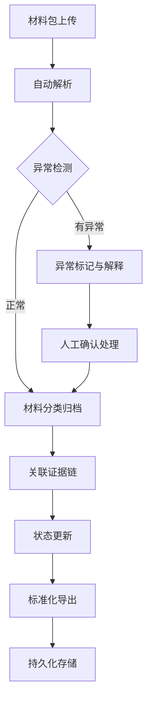

## 1. 产品概述

雕塑运输交接系统是为画廊助理设计的实用工具，用于处理雕塑作品运输过程中的材料交接、状态追踪和证据管理。系统处理真实工作场景中的复杂情况：正常记录、晚到附件、重复项、人工更正、缺件等异常情况。

- 目标用户：画廊助理（非评审人员）
- 解决问题：分散材料管理、状态追踪困难、证据易丢失、异常情况无记录
- 核心价值：工作流标准化、状态可追溯、异常可解释、导出一致性

## 2. 核心功能

### 2.1 用户角色

| 角色 | 注册方式 | 核心权限 |
|------|----------|----------|
| 画廊助理 | 本地使用 | 材料上传、状态管理、人工确认、导出 |

### 2.2 功能模块

1. **交接工作台**：材料上传包处理、实时状态面板、异常告警
2. **材料管理**：展墙图、保险单、布展清单、附件管理
3. **状态回看**：时间线视图、操作历史、状态变更记录
4. **异常解释**：异常分类、原因标注、处理记录
5. **人工确认**：确认记录、签名、关联证据
6. **导出中心**：标准化导出、格式一致、审计追踪

### 2.3 页面详情

| 页面名称 | 模块名称 | 功能描述 |
|----------|----------|----------|
| 交接工作台 | 材料上传区 | 拖拽上传材料包，支持混合文件类型 |
| 交接工作台 | 状态面板 | 实时显示交接进度、待办项、异常数量 |
| 交接工作台 | 快速操作 | 人工确认、标记异常、补充材料 |
| 材料管理 | 展墙图管理 | 上传、预览、关联布展清单 |
| 材料管理 | 保险单管理 | 保单上传、有效期校验、缺件提醒 |
| 材料管理 | 布展清单 | 清单核对、重复项检测、灯光记录去重 |
| 状态回看 | 时间线 | 按时间顺序展示所有状态变更 |
| 状态回看 | 操作历史 | 谁、何时、做了什么操作 |
| 异常中心 | 异常列表 | 分类展示所有异常及处理状态 |
| 异常中心 | 异常解释 | 记录原因、影响范围、处理方案 |
| 导出中心 | 导出配置 | 选择导出范围、格式、模板 |
| 导出中心 | 导出历史 | 记录所有导出操作及文件 |

## 3. 核心流程

材料包上传 → 系统自动解析（检测重复/缺件/晚到）→ 异常标记 → 人工确认 → 材料关联（展墙图→布展清单→保险单）→ 状态更新 → 标准化导出

## 4. 用户界面设计

### 4.1 设计风格

- **设计方向**：极简实用主义（brutalist/utilitarian）- 画廊工作环境需要高效、信息密度高、少装饰
- **主色调**：深灰（#1a1a1a）- 专业、沉稳
- **辅助色**：琥珀黄（#f59e0b）- 异常提醒；翠绿（#10b981）- 正常状态；砖红（#ef4444）- 严重异常
- **字体**：无衬线字体（"SF Pro Display", "PingFang SC", system-ui）- 清晰易读
- **按钮风格**：直角边框、实心填充、明确的状态反馈
- **布局风格**：信息密度高、左侧导航+主内容区、固定状态条
- **图标风格**：线性图标、简洁明了、避免过度设计

### 4.2 页面设计概述

| 页面名称 | 模块名称 | UI元素 |
|----------|----------|--------|
| 交接工作台 | 材料上传区 | 虚线边框拖拽区、文件列表、进度条、异常标签 |
| 交接工作台 | 状态面板 | 卡片式统计、状态指示器、倒计时提示 |
| 材料管理 | 列表视图 | 表格布局、行内操作、状态色标 |
| 状态回看 | 时间线 | 垂直时间轴、状态节点、展开详情 |
| 异常中心 | 异常卡片 | 异常类型标签、原因输入框、处理状态切换 |
| 导出中心 | 导出面板 | 选项组、预览区、一键导出按钮 |

### 4.3 响应式

- 桌面端优先（画廊工作主要在桌面完成）
- 平板自适应（便于现场确认时使用）
- 触控优化（按钮尺寸、滑动操作）

### 4.4 非功能需求

- **数据持久化**：所有操作实时保存到localStorage，支持刷新不丢失
- **离线可用**：纯前端应用，无需网络连接
- **导出一致性**：同一批材料多次导出格式、内容完全一致
- **审计追踪**：所有操作留有时间戳和操作记录
