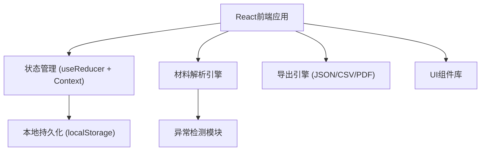
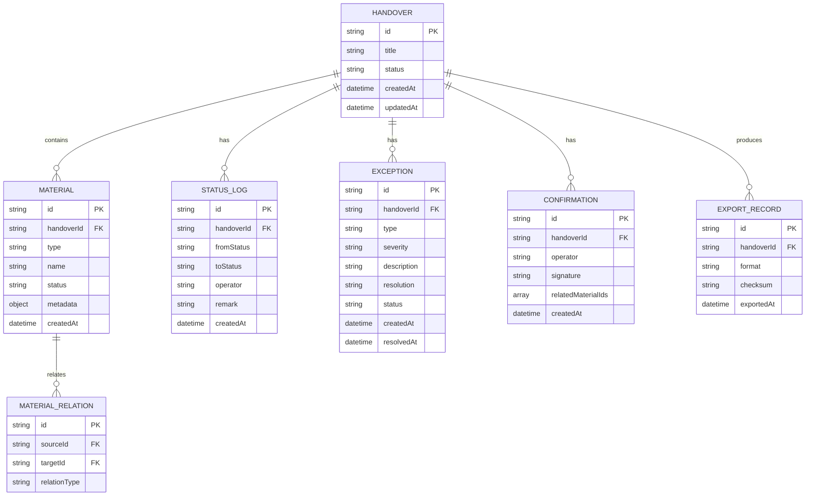

## 1. 架构设计

纯前端单页应用，无后端依赖，数据持久化到浏览器localStorage。



## 2. 技术描述

- **前端框架**：React@18 + TypeScript
- **构建工具**：Vite@5
- **样式方案**：TailwindCSS@3
- **图标库**：Lucide React
- **状态管理**：React useReducer + Context API
- **数据持久化**：localStorage（封装存储层）
- **导出支持**：JSON / CSV / 打印友好HTML

## 3. 路由定义

| 路由 | 页面 | 目的 |
|------|------|------|
| /dashboard | 交接工作台 | 材料上传、状态总览、快速操作 |
| /materials | 材料管理 | 展墙图、保险单、布展清单管理 |
| /timeline | 状态回看 | 时间线、操作历史、状态变更 |
| /exceptions | 异常中心 | 异常列表、异常解释、处理记录 |
| /export | 导出中心 | 导出配置、导出历史 |

## 4. 数据模型

### 4.1 数据模型定义



### 4.2 TypeScript 类型定义

```typescript
// 交接单状态
type HandoverStatus = 'draft' | 'processing' | 'pending_confirm' | 'completed' | 'archived';

// 材料类型
type MaterialType = 'wall_image' | 'insurance_policy' | 'installation_list' | 'light_record' | 'attachment' | 'remark';

// 材料状态
type MaterialStatus = 'normal' | 'missing' | 'duplicate' | 'late' | 'corrected';

// 异常类型
type ExceptionType = 'missing_insurance' | 'duplicate_record' | 'late_attachment' | 'incomplete_remark' | 'data_conflict';

// 异常严重程度
type ExceptionSeverity = 'low' | 'medium' | 'high' | 'critical';

interface Handover {
  id: string;
  title: string;
  status: HandoverStatus;
  description?: string;
  createdAt: string;
  updatedAt: string;
}

interface Material {
  id: string;
  handoverId: string;
  type: MaterialType;
  name: string;
  fileName?: string;
  fileSize?: number;
  status: MaterialStatus;
  isDuplicate?: boolean;
  duplicateOf?: string;
  metadata: Record<string, any>;
  createdAt: string;
}

interface StatusLog {
  id: string;
  handoverId: string;
  fromStatus?: HandoverStatus;
  toStatus: HandoverStatus;
  operator: string;
  remark?: string;
  createdAt: string;
}

interface Exception {
  id: string;
  handoverId: string;
  type: ExceptionType;
  severity: ExceptionSeverity;
  relatedMaterialId?: string;
  description: string;
  explanation?: string;
  resolution?: string;
  status: 'open' | 'resolved' | 'ignored';
  createdAt: string;
  resolvedAt?: string;
}

interface Confirmation {
  id: string;
  handoverId: string;
  operator: string;
  remark?: string;
  relatedMaterialIds: string[];
  confirmedAt: string;
}
```

## 5. 核心模块设计

### 5.1 材料解析引擎

- **文件类型检测**：基于文件名和内容识别材料类型
- **重复项检测**：基于文件名、内容哈希、元数据匹配
- **缺件检测**：基于必选材料清单检查
- **晚到标记**：基于上传时间与交接时间对比

### 5.2 异常检测模块

- **规则引擎**：可配置的异常检测规则
- **异常分类**：自动分类异常类型和严重程度
- **异常关联**：关联相关材料和操作记录

### 5.3 导出引擎

- **一致性保证**：基于数据快照生成导出文件
- **校验和**：计算导出内容的SHA256校验和
- **多格式支持**：JSON（完整数据）、CSV（表格数据）、HTML（打印）

### 5.4 存储层

- **localStorage封装**：自动序列化/反序列化
- **版本管理**：数据结构升级支持
- **备份/恢复**：支持数据导出备份和导入恢复
