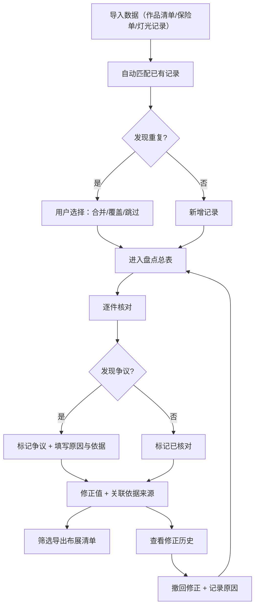

## 1. 产品概述

版画库存盘点是画廊布展前夜的保险单核对与库存管理工具。解决画廊助理在布展前需要从作品清单、展墙图、灯光记录等多源文档中拼凑核对信息，容易漏掉灯光方案被覆盖的问题。

- 目标用户：画廊助理、布展协调人
- 核心价值：让库存盘点结论可溯源、可交接，避免下一班再翻聊天记录

## 2. 核心功能

### 2.1 用户角色

| 角色 | 使用方式 | 核心权限 |
|------|----------|----------|
| 画廊助理 | 直接使用 | 导入、盘点、修正、导出 |
| 布展协调人 | 直接使用 | 查看全部记录、审核修正依据、导出布展清单 |

### 2.2 功能模块

1. **盘点总表**：库存全量视图，含状态标记、来源链接、争议标记
2. **作品详情**：单件作品的完整追溯链——保险单、灯光记录、修正历史
3. **导入与撤回**：多源数据导入（作品清单/保险单/灯光记录），重复检测，撤回修正并保留原因
4. **筛选导出**：按状态/来源/争议筛选后导出布展清单（纯文本表格，可查可续）

### 2.3 页面详情

| 页面名称 | 模块名称 | 功能描述 |
|----------|----------|----------|
| 盘点总表 | 状态概览栏 | 显示已核对/未核对/有争议/已修正的计数 |
| 盘点总表 | 库存表格 | 展示全部作品，列含：作品名、艺术家、尺寸、状态标签、来源标记、争议标记；点击行进入详情 |
| 盘点总表 | 快速筛选 | 按状态、来源、争议类型筛选；支持组合筛选 |
| 作品详情 | 基本信息卡 | 作品名、艺术家、尺寸（含单位）、材质、年份 |
| 作品详情 | 来源追溯 | 列出该作品关联的保险单条目、灯光记录条目，可点击跳转至原文 |
| 作品详情 | 修正历史 | 时间线展示所有修正操作：谁改了什么、修正原因、撤回记录 |
| 作品详情 | 争议标记 | 对尺寸单位错误等争议记录，填写争议原因和修正依据 |
| 导入与撤回 | 数据导入 | 选择来源类型（作品清单/保险单/灯光记录），粘贴或上传CSV，系统自动匹配已有记录 |
| 导入与撤回 | 重复检测 | 导入时高亮显示重复条目，用户选择合并/覆盖/跳过 |
| 导入与撤回 | 撤回修正 | 选择任意历史修正操作，撤回并记录撤回原因 |
| 筛选导出 | 筛选面板 | 多条件筛选：状态、来源、争议、修正时间范围 |
| 筛选导出 | 预览与导出 | 实时预览筛选结果，导出为CSV布展清单（含来源链接列和修正依据列） |

## 3. 核心流程

**主流程**：导入数据 → 自动匹配与重复检测 → 逐件核对并标记争议 → 修正并填写依据 → 筛选导出布展清单

**撤回流程**：查看修正历史 → 选择需撤回的操作 → 填写撤回原因 → 系统恢复原始值并记录

## 4. 用户界面设计

### 4.1 设计风格

- **整体风格**：工业实用主义（industrial-utilitarian），深色底配暖色调高亮，数据密集但层次清晰
- **主色**：深炭灰 `#1a1a1a`（背景）、暖白 `#f5f0e8`（前景文字）、琥珀色 `#d4a056`（强调色/链接）
- **次色**：铁锈红 `#c45c4a`（争议/警告）、鼠尾草绿 `#6b8f71`（已核对/正常）
- **按钮风格**：扁平带细微边框，hover 时微弱发光，操作按钮用琥珀色
- **字体**：数据区域用等宽字体 `JetBrains Mono`，标题和正文用 `Noto Serif SC`（衬线，贴合画廊气质）
- **布局**：左侧固定导航栏，主区域全宽表格/详情，不使用卡片堆叠
- **图标**：使用 lucide-react，线条风格，与工业感统一

### 4.2 页面设计概览

| 页面名称 | 模块名称 | UI要素 |
|----------|----------|--------|
| 盘点总表 | 状态概览栏 | 4个计数标签横排，数字用等宽字体大号，标签用小号衬线 |
| 盘点总表 | 库存表格 | 全宽表格，行hover高亮，状态列用彩色圆点+文字，争议列用铁锈红标记 |
| 盘点总表 | 快速筛选 | 表格上方水平筛选条，下拉选择+标签式已选条件 |
| 作品详情 | 基本信息卡 | 左侧固定信息区，右侧留白给追溯链 |
| 作品详情 | 来源追溯 | 时间线样式，每条来源显示文档类型图标+摘要+跳转链接 |
| 作品详情 | 修正历史 | 垂直时间线，每条修正显示：操作类型、原值→新值、原因、撤回按钮 |
| 作品详情 | 争议标记 | 黄色边框区域，含争议原因输入框和依据来源链接 |
| 导入与撤回 | 数据导入 | 左右分栏：左侧选类型+输入区，右侧实时预览匹配结果 |
| 导入与撤回 | 重复检测 | 重复条目用琥珀色高亮，提供三选一按钮组（合并/覆盖/跳过） |
| 导入与撤回 | 撤回修正 | 修正历史列表，每条右侧有撤回按钮，点击弹出原因输入框 |
| 筛选导出 | 筛选面板 | 左侧垂直筛选条件面板，右侧实时预览结果表格 |
| 筛选导出 | 预览与导出 | 底部固定操作栏，显示匹配条数和导出按钮 |

### 4.3 响应式

- 桌面优先设计，数据表格在宽屏下最优
- 平板：导航栏收缩为图标，表格列按优先级隐藏
- 手机：导航变为底部标签栏，表格变为卡片列表

### 4.4 3D场景

不适用
