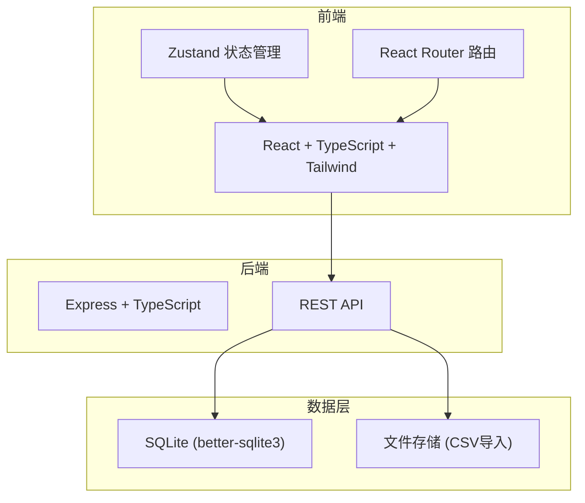
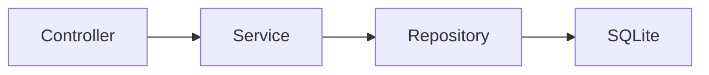
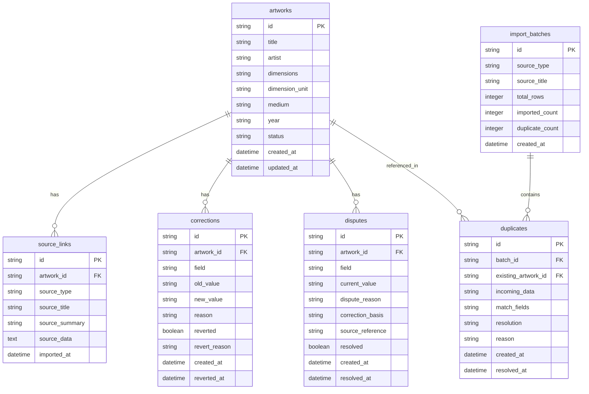

## 1. 架构设计



## 2. 技术说明

- 前端：React@18 + tailwindcss@3 + vite
- 初始化工具：vite-init
- 后端：Express@4 + TypeScript (ESM)
- 数据库：SQLite (better-sqlite3)，无需外部数据库服务
- 状态管理：Zustand

## 3. 路由定义

| 路由 | 用途 |
|------|------|
| / | 盘点总表，默认首页，展示库存全量视图 |
| /artwork/:id | 作品详情，单件作品的完整追溯链 |
| /import | 导入与撤回，数据导入、重复检测、修正撤回 |
| /export | 筛选导出，多条件筛选后导出布展清单 |

## 4. API定义

### 4.1 作品相关

```typescript
interface Artwork {
  id: string;
  title: string;
  artist: string;
  dimensions: string;
  dimension_unit: string;
  medium: string;
  year: string;
  status: "unchecked" | "checked" | "disputed" | "corrected";
  created_at: string;
  updated_at: string;
}

// GET /api/artworks - 获取作品列表（支持筛选）
// 参数: status?, source?, disputed?, page?, limit?
interface ListArtworksQuery {
  status?: Artwork["status"];
  source?: string;
  disputed?: boolean;
  page?: number;
  limit?: number;
}
interface ListArtworksResponse {
  items: Artwork[];
  total: number;
  page: number;
  limit: number;
}

// GET /api/artworks/:id - 获取作品详情（含来源关联和修正历史）
interface ArtworkDetail extends Artwork {
  sources: SourceLink[];
  corrections: Correction[];
  disputes: Dispute[];
}

// PATCH /api/artworks/:id - 修正作品信息
interface CorrectArtworkBody {
  field: string;
  old_value: string;
  new_value: string;
  reason: string;
}
```

### 4.2 来源关联

```typescript
interface SourceLink {
  id: string;
  artwork_id: string;
  source_type: "insurance" | "lighting" | "artwork_list";
  source_title: string;
  source_summary: string;
  source_data: Record<string, unknown>;
  imported_at: string;
}

// GET /api/artworks/:id/sources - 获取作品的来源关联列表
```

### 4.3 修正历史

```typescript
interface Correction {
  id: string;
  artwork_id: string;
  field: string;
  old_value: string;
  new_value: string;
  reason: string;
  reverted: boolean;
  revert_reason?: string;
  created_at: string;
  reverted_at?: string;
}

// POST /api/artworks/:id/corrections - 新增修正
// POST /api/corrections/:id/revert - 撤回修正
interface RevertCorrectionBody {
  reason: string;
}
```

### 4.4 争议标记

```typescript
interface Dispute {
  id: string;
  artwork_id: string;
  field: string;
  current_value: string;
  dispute_reason: string;
  correction_basis: string;
  source_reference?: string;
  resolved: boolean;
  created_at: string;
  resolved_at?: string;
}

// POST /api/artworks/:id/disputes - 新增争议标记
// PATCH /api/disputes/:id - 更新争议（解决争议）
```

### 4.5 数据导入

```typescript
// POST /api/import - 导入数据
interface ImportBody {
  source_type: "insurance" | "lighting" | "artwork_list";
  source_title: string;
  data: Record<string, unknown>[];
}
interface ImportResponse {
  imported: number;
  duplicates: DuplicateEntry[];
  errors: string[];
}

interface DuplicateEntry {
  existing_id: string;
  existing_title: string;
  incoming_title: string;
  match_fields: string[];
}

// POST /api/import/resolve - 解决重复
interface ResolveDuplicateBody {
  duplicate_id: string;
  action: "merge" | "overwrite" | "skip";
  reason?: string;
}
```

### 4.6 导出

```typescript
// POST /api/export - 筛选导出
interface ExportBody {
  filters: {
    status?: Artwork["status"][];
    source?: string[];
    disputed?: boolean;
    corrected_after?: string;
  };
  format: "csv";
}
interface ExportResponse {
  download_url: string;
  count: number;
}
```

### 4.7 统计

```typescript
// GET /api/stats - 获取盘点统计
interface StatsResponse {
  total: number;
  unchecked: number;
  checked: number;
  disputed: number;
  corrected: number;
}
```

## 5. 服务端架构图



## 6. 数据模型

### 6.1 数据模型定义



### 6.2 数据定义语言

```sql
CREATE TABLE artworks (
  id TEXT PRIMARY KEY,
  title TEXT NOT NULL,
  artist TEXT NOT NULL,
  dimensions TEXT,
  dimension_unit TEXT DEFAULT 'cm',
  medium TEXT,
  year TEXT,
  status TEXT NOT NULL DEFAULT 'unchecked' CHECK(status IN ('unchecked','checked','disputed','corrected')),
  created_at TEXT NOT NULL DEFAULT (datetime('now')),
  updated_at TEXT NOT NULL DEFAULT (datetime('now'))
);

CREATE TABLE source_links (
  id TEXT PRIMARY KEY,
  artwork_id TEXT NOT NULL REFERENCES artworks(id) ON DELETE CASCADE,
  source_type TEXT NOT NULL CHECK(source_type IN ('insurance','lighting','artwork_list')),
  source_title TEXT NOT NULL,
  source_summary TEXT,
  source_data TEXT,
  imported_at TEXT NOT NULL DEFAULT (datetime('now'))
);

CREATE TABLE corrections (
  id TEXT PRIMARY KEY,
  artwork_id TEXT NOT NULL REFERENCES artworks(id) ON DELETE CASCADE,
  field TEXT NOT NULL,
  old_value TEXT,
  new_value TEXT,
  reason TEXT NOT NULL,
  reverted INTEGER NOT NULL DEFAULT 0,
  revert_reason TEXT,
  created_at TEXT NOT NULL DEFAULT (datetime('now')),
  reverted_at TEXT
);

CREATE TABLE disputes (
  id TEXT PRIMARY KEY,
  artwork_id TEXT NOT NULL REFERENCES artworks(id) ON DELETE CASCADE,
  field TEXT NOT NULL,
  current_value TEXT,
  dispute_reason TEXT NOT NULL,
  correction_basis TEXT,
  source_reference TEXT,
  resolved INTEGER NOT NULL DEFAULT 0,
  created_at TEXT NOT NULL DEFAULT (datetime('now')),
  resolved_at TEXT
);

CREATE TABLE import_batches (
  id TEXT PRIMARY KEY,
  source_type TEXT NOT NULL CHECK(source_type IN ('insurance','lighting','artwork_list')),
  source_title TEXT NOT NULL,
  total_rows INTEGER NOT NULL DEFAULT 0,
  imported_count INTEGER NOT NULL DEFAULT 0,
  duplicate_count INTEGER NOT NULL DEFAULT 0,
  created_at TEXT NOT NULL DEFAULT (datetime('now'))
);

CREATE TABLE duplicates (
  id TEXT PRIMARY KEY,
  batch_id TEXT NOT NULL REFERENCES import_batches(id) ON DELETE CASCADE,
  existing_artwork_id TEXT NOT NULL REFERENCES artworks(id),
  incoming_data TEXT NOT NULL,
  match_fields TEXT NOT NULL,
  resolution TEXT CHECK(resolution IN ('merge','overwrite','skip')),
  reason TEXT,
  created_at TEXT NOT NULL DEFAULT (datetime('now')),
  resolved_at TEXT
);

CREATE INDEX idx_artworks_status ON artworks(status);
CREATE INDEX idx_source_links_artwork ON source_links(artwork_id);
CREATE INDEX idx_source_links_type ON source_links(source_type);
CREATE INDEX idx_corrections_artwork ON corrections(artwork_id);
CREATE INDEX idx_disputes_artwork ON disputes(artwork_id);
CREATE INDEX idx_disputes_resolved ON disputes(resolved);
CREATE INDEX idx_duplicates_batch ON duplicates(batch_id);
CREATE INDEX idx_duplicates_resolved ON duplicates(resolved_at);
```
