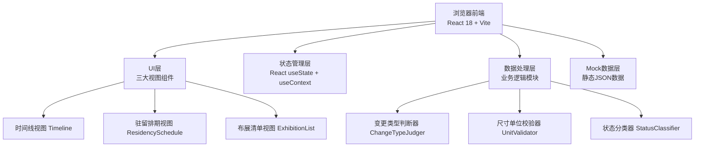
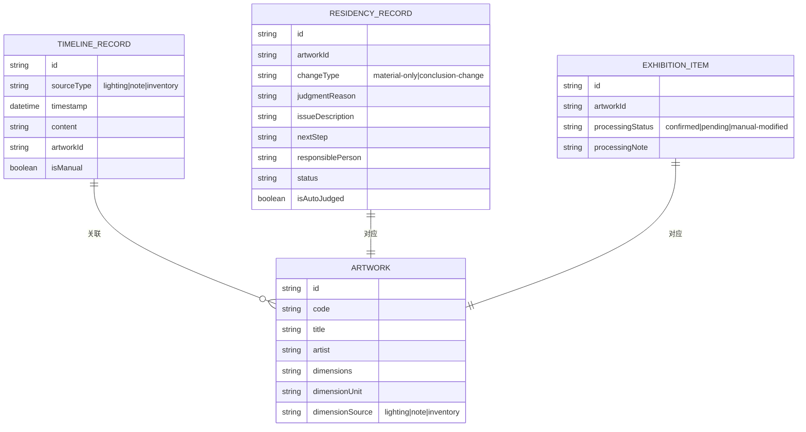

## 1. 架构设计



## 2. 技术选型

- **前端框架**：React 18 + TypeScript
- **构建工具**：Vite 5
- **样式方案**：TailwindCSS 3 + CSS Variables
- **状态管理**：React Hooks (useState, useContext, useReducer)
- **后端**：无，纯前端工具，使用Mock数据
- **数据库**：无，数据存储于前端内存/浏览器localStorage
- **字体**：Google Fonts (Cormorant Garamond, Source Serif Pro, JetBrains Mono)

## 3. 目录结构

```
src/
├── components/
│   ├── layout/
│   │   ├── Header.tsx          # 顶部导航与标签切换
│   │   └── TabContainer.tsx    # 标签页容器
│   ├── timeline/
│   │   ├── TimelineView.tsx    # 时间线主视图
│   │   ├── TimelineAxis.tsx    # 时间轴轴线
│   │   └── TimelineCard.tsx    # 时间线记录卡片
│   ├── schedule/
│   │   ├── ScheduleView.tsx    # 驻留排期主视图
│   │   ├── ScheduleRow.tsx     # 排期表格行
│   │   └── StatusBadge.tsx     # 状态标签组件
│   └── exhibition/
│       ├── ExhibitionView.tsx  # 布展清单主视图
│       ├── ArtworkCard.tsx     # 作品卡片
│       └── ColumnHeader.tsx    # 列标题组件
├── data/
│   ├── mockData.ts             # Mock数据
│   └── types.ts                # TypeScript类型定义
├── logic/
│   ├── changeTypeJudger.ts     # 变更类型判断逻辑
│   ├── unitValidator.ts        # 尺寸单位校验逻辑
│   └── statusClassifier.ts     # 状态分类逻辑
├── context/
│   └── AppContext.tsx          # 全局状态管理
├── App.tsx
├── main.tsx
└── index.css
```

## 4. 路由定义

| 路由 | 用途 |
|------|------|
| / | 默认路由，展示时间线视图 |
| /#timeline | 时间线视图（锚点导航） |
| /#schedule | 艺术驻留排期视图（锚点导航） |
| /#exhibition | 布展清单视图（锚点导航） |

> 注：使用锚点导航而非React Router，减少依赖，保持轻量。

## 5. 数据模型

### 5.1 数据类型定义



### 5.2 核心接口类型（TypeScript）

```typescript
type SourceType = 'lighting' | 'note' | 'inventory';
type ChangeType = 'material-only' | 'conclusion-change';
type ProcessingStatus = 'confirmed' | 'pending' | 'manual-modified';

interface TimelineRecord {
  id: string;
  sourceType: SourceType;
  timestamp: Date;
  content: string;
  artworkId: string;
  isManual: boolean;
}

interface Artwork {
  id: string;
  code: string;
  title: string;
  artist: string;
  dimensions: string;
  dimensionUnit: string;
  dimensionSource: SourceType;
}

interface ResidencyRecord {
  id: string;
  artworkId: string;
  artwork: Artwork;
  changeType: ChangeType;
  judgmentReason: string;
  issueDescription: string;
  nextStep: string;
  responsiblePerson: string;
  status: string;
  isAutoJudged: boolean;
  unitError?: {
    hasError: boolean;
    source: SourceType;
    expectedUnit: string;
    actualUnit: string;
  };
}

interface ExhibitionItem {
  id: string;
  artwork: Artwork;
  processingStatus: ProcessingStatus;
  processingNote: string;
  lastModified?: Date;
}
```

## 6. 核心业务逻辑

### 6.1 变更类型判断器 (changeTypeJudger.ts)

判断规则：
1. 检查记录时间戳与对应作品清单的时间先后
2. 分析内容关键词：
   - 包含「补充」「补全」「说明」「附件」等 → 补材料
   - 包含「修改」「调整」「变更」「重设」「移动」等 + 核心字段（位置/尺寸/灯光）→ 改结论
3. 自动判断的记录必须附带 `judgmentReason` 字段

### 6.2 尺寸单位校验器 (unitValidator.ts)

校验规则：
1. 从灯光记录、策展备注、作品清单中提取尺寸字段
2. 比对三者的单位是否一致
3. 不一致时标记 `unitError`，记录错误来源和期望值
4. 生成明确的问题描述和下一步责任人

### 6.3 状态分类器 (statusClassifier.ts)

分类规则：
1. 已确认 (confirmed)：所有来源数据一致，无单位错误，自动判断通过
2. 待补 (pending)：存在单位错误、缺少关键字段、来源冲突未解决
3. 人工改过 (manual-modified)：策展人手动编辑过 `processingNote` 或状态
