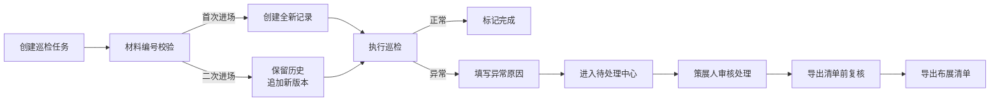

## 1. 产品概述

装置灯光巡检系统是为画廊布展场景设计的轻量级巡检工具，解决布展前夜作品调换无留痕、状态追踪混乱的问题。通过记录每条巡检记录的来源、状态、修改历史和异常原因，确保同一批材料二次进场时不覆盖历史记录，支持批量处理且重复运行稳定。

目标用户：策展人、布展工人、画廊助理；核心价值：留痕可追溯、异常可定位、批量操作不混乱。

## 2. 核心功能

### 2.1 用户角色

| 角色 | 接入方式 | 核心权限 |
|------|----------|----------|
| 策展人 | 系统登录 | 创建巡检任务、查看完整历史、审批异常处理 |
| 布展工人 | 系统登录 | 执行巡检、更新状态、批量处理记录 |
| 画廊助理 | 系统登录 | 查看巡检记录、导出布展清单、上传策展备注 |

### 2.2 功能模块

1. **巡检记录首页**：记录列表、筛选搜索、批量操作栏、统计概览
2. **记录详情页**：完整历史轨迹、来源信息、状态流转、修改人/时间/原因
3. **待处理中心**：异常记录列表、处理入口、批量审核
4. **导出与设置**：布展清单导出、策展备注样例管理、灯光方案对比

### 2.3 页面详情

| 页面名称 | 模块名称 | 功能描述 |
|----------|----------|----------|
| 巡检记录首页 | 记录列表 | 展示所有巡检记录，支持按状态/来源/时间筛选 |
| 巡检记录首页 | 批量操作栏 | 支持多选批量修改状态、批量标记正常/异常 |
| 巡检记录首页 | 统计概览 | 展示正常/待处理/异常数量统计卡片 |
| 记录详情页 | 历史轨迹 | 时间线展示完整修改历史，包含修改人、时间、原因 |
| 记录详情页 | 来源信息 | 显示记录创建来源（首次录入/二次进场/人工创建） |
| 待处理中心 | 异常列表 | 聚焦待处理记录，显示异常原因和待处理时长 |
| 导出与设置 | 清单导出 | 导出布展清单前提供复核预览，支持导出Excel |
| 导出与设置 | 备注管理 | 策展备注样例上传、查看、替换功能 |
| 导出与设置 | 方案对比 | 灯光方案历史版本对比，查看被覆盖记录 |

## 3. 核心流程

用户创建巡检任务 → 系统根据材料编号判断是否为二次进场 → 首次进场创建新记录，二次进场保留历史追加新版本 → 执行巡检标记状态（正常/异常/待处理） → 异常记录填写原因进入待处理中心 → 策展人审核处理 → 导出布展清单前复核确认。

## 4. 用户界面设计

### 4.1 设计风格

- **主色调**：深炭灰（#1a1a2e）作为主色，搭配赭石橙（#e94560）作为强调色，营造专业画廊氛围
- **辅助色**：米白（#f5f5f0）背景色，墨绿（#16213e）作为信息色
- **按钮风格**：微圆角（4px），悬浮时轻微上浮效果，异常状态按钮使用红色边框
- **字体**：标题使用 Noto Serif SC（衬线字体，体现艺术感），正文使用 Noto Sans SC（易读性）
- **布局风格**：卡片式布局，左侧导航+右侧内容区，使用细边框和阴影区分层级
- **图标风格**：线性图标，统一24px尺寸，状态使用彩色圆点标识

### 4.2 页面设计概览

| 页面名称 | 模块名称 | UI元素 |
|----------|----------|--------|
| 巡检记录首页 | 统计卡片 | 三栏等宽卡片，图标+数字+标签，背景渐变色 |
| 巡检记录首页 | 记录表格 | 斑马纹行，状态列使用彩色标签，悬停高亮 |
| 记录详情页 | 时间线 | 左侧竖线时间轴，右侧事件卡片，修改人头像 |
| 待处理中心 | 异常卡片 | 红色边框警示，异常原因高亮显示，处理倒计时 |
| 导出与设置 | 方案对比 | 左右分栏对比，差异处高亮标注 |

### 4.3 响应式

桌面优先设计，支持1280px以上分辨率；平板端适配为单栏布局，移动端折叠导航为抽屉式。

### 4.4 交互细节

- 记录行hover时显示操作按钮
- 状态变更时有淡入淡出过渡动画
- 批量操作时顶部显示已选数量和操作进度条
- 二次进场记录旁显示"历史版本"徽章，点击展开历史对比
