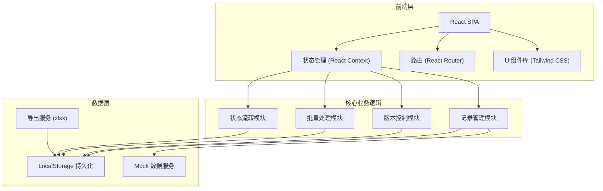
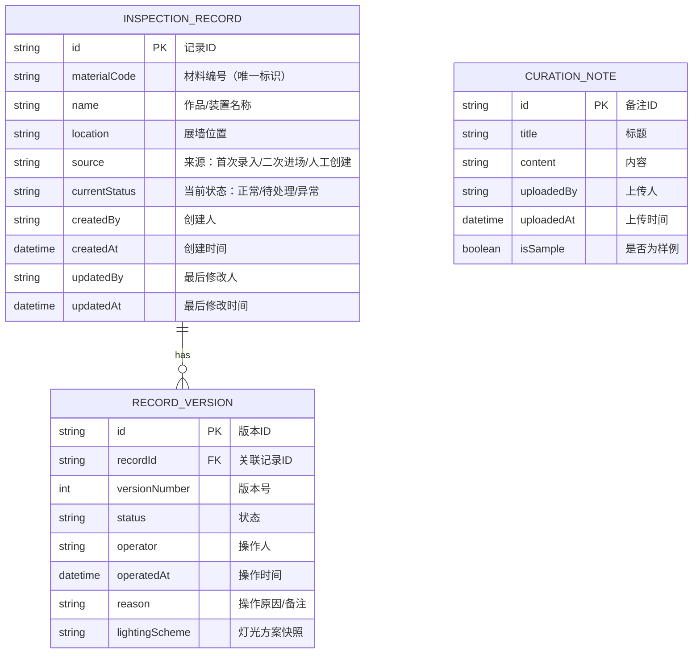

## 1. 架构设计



## 2. 技术描述

- **前端框架**：React@18 + TypeScript
- **构建工具**：Vite@5
- **样式方案**：Tailwind CSS@3
- **路由管理**：React Router@6
- **图标库**：Lucide React
- **导出功能**：xlsx (SheetJS)
- **数据持久化**：LocalStorage（轻量级方案，无需后端）
- **状态管理**：React Context + useReducer

## 3. 路由定义

| 路由 | 页面用途 |
|------|----------|
| / | 巡检记录首页（记录列表+统计概览） |
| /record/:id | 记录详情页（历史轨迹+来源信息） |
| /pending | 待处理中心（异常记录列表） |
| /export | 导出与设置（清单导出+备注管理+方案对比） |

## 4. 数据模型

### 4.1 数据模型定义



### 4.2 TypeScript 类型定义

```typescript
type RecordStatus = 'normal' | 'pending' | 'abnormal';
type RecordSource = 'first_entry' | 're_entry' | 'manual';

interface InspectionRecord {
  id: string;
  materialCode: string;
  name: string;
  location: string;
  source: RecordSource;
  currentStatus: RecordStatus;
  createdBy: string;
  createdAt: string;
  updatedBy: string;
  updatedAt: string;
  versions: RecordVersion[];
}

interface RecordVersion {
  id: string;
  versionNumber: number;
  status: RecordStatus;
  operator: string;
  operatedAt: string;
  reason: string;
  lightingScheme?: string;
}

interface CurationNote {
  id: string;
  title: string;
  content: string;
  uploadedBy: string;
  uploadedAt: string;
  isSample: boolean;
}

interface BatchOperationResult {
  successCount: number;
  failedCount: number;
  errors: string[];
}
```

## 5. 核心模块设计

### 5.1 版本控制模块
- 核心逻辑：根据 materialCode 判断材料是否已存在
- 二次进场时：保留所有历史版本，新增版本追加到 versions 数组
- 防重复机制：同一材料同一天多次巡检仅追加版本，不创建新记录

### 5.2 批量处理模块
- 支持批量选择记录进行状态变更
- 幂等性设计：重复执行同一批量操作不产生副作用
- 操作前校验：验证每条记录的状态流转合法性

### 5.3 状态流转模块
```
正常 → 待处理（填写原因）
正常 → 异常（填写原因）
待处理 → 正常（处理完成）
待处理 → 异常（确认异常）
异常 → 正常（修复完成）
异常 → 待处理（重新审核）
```

## 6. Mock 数据规划

- 预置 15-20 条巡检记录，包含不同状态和来源
- 每条记录包含 2-5 个历史版本，模拟真实场景
- 预置 2 条策展备注样例
- 预置 3 个灯光方案历史版本用于对比展示
