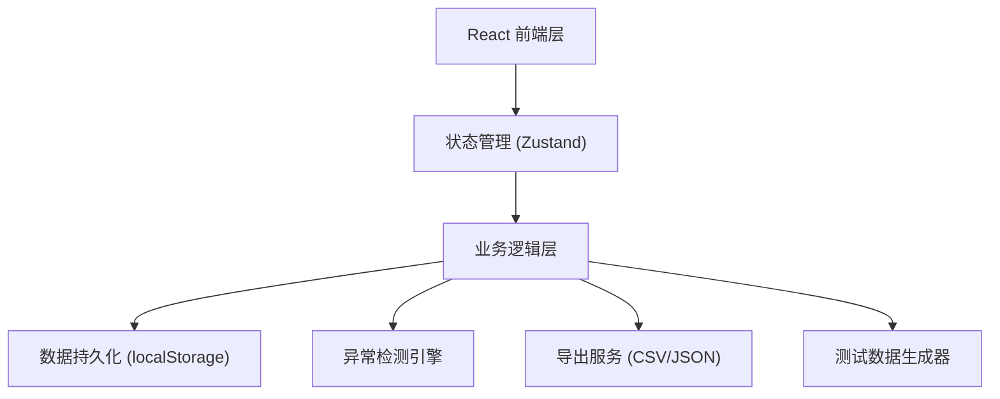
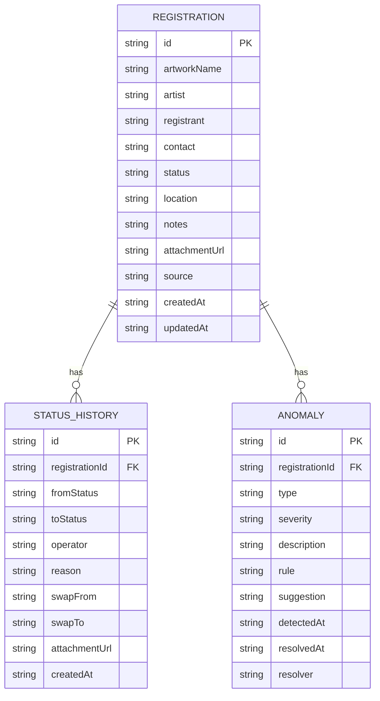

## 1. 架构设计

纯前端单页应用，数据存储在浏览器 localStorage，支持导出 JSON 备份。无后端依赖，便于内网离线使用。



## 2. 技术描述

- **前端框架**：React@18 + TypeScript
- **构建工具**：Vite@5
- **样式**：TailwindCSS@3
- **状态管理**：Zustand（轻量，适合复杂状态流转）
- **路由**：React Router DOM@6
- **日期处理**：date-fns（时间戳格式化、相对时间）
- **数据存储**：localStorage + 自动导出备份
- **无后端、无数据库**：所有数据在前端处理，支持导入导出迁移

## 3. 路由定义

| 路由 | 页面 | 核心功能 |
|-------|---------|----------|
| `/` | 报名列表页 | 数据表格、筛选、行内操作、批量导入导出 |
| `/registration/:id` | 报名详情页 | 完整信息、状态时间线、作品调换操作 |
| `/anomalies` | 异常面板 | 异常分类展示、批量处理、导出异常报告 |

## 4. 数据模型

### 4.1 ER 图



### 4.2 状态枚举

```typescript
type RegistrationStatus = 
  | 'pending'      // 待确认
  | 'confirmed'    // 已确认
  | 'arrived'      // 已到场
  | 'swapped'      // 已调换
  | 'missing'      // 缺失
  | 'cancelled';   // 已取消

type AnomalyType = 
  | 'duplicate'    // 重复项
  | 'late_attachment' // 晚到附件
  | 'missing_info' // 信息缺失
  | 'conflict'     // 作品冲突
  | 'swap_record'; // 调换记录（永久标记）

type AnomalySeverity = 'low' | 'medium' | 'high';
```

### 4.3 核心数据结构 TypeScript 定义

```typescript
interface Registration {
  id: string;
  artworkName: string;
  artist: string;
  registrant: string;
  contact: string;
  status: RegistrationStatus;
  location?: string;
  notes?: string;
  attachmentUrl?: string;
  attachmentReceivedAt?: string;
  source: 'manual' | 'import' | 'correction';
  createdAt: string;
  updatedAt: string;
}

interface StatusHistory {
  id: string;
  registrationId: string;
  fromStatus: RegistrationStatus | null;
  toStatus: RegistrationStatus;
  operator: string;
  reason: string;
  swapFrom?: string;
  swapTo?: string;
  attachmentUrl?: string;
  createdAt: string;
}

interface Anomaly {
  id: string;
  registrationId: string;
  type: AnomalyType;
  severity: AnomalySeverity;
  description: string;
  rule: string;
  suggestion: string;
  detectedAt: string;
  resolvedAt?: string;
  resolver?: string;
}

interface ExportRecord {
  exportId: string;
  exportedAt: string;
  exportedBy: string;
  filterCriteria: string;
  count: number;
}
```

## 5. 核心业务逻辑

### 5.1 异常检测引擎

- **重复项检测**：作品名+艺术家完全匹配，或联系电话重复
- **晚到附件**：报名已确认但附件在24小时后上传
- **信息缺失**：必填字段为空
- **作品冲突**：同一位置分配多个作品
- **调换标记**：所有经历过调换的记录永久标记

### 5.2 导出逻辑（布展清单）

CSV 导出固定包含以下列，确保下一班能直接接手：

| 列名 | 说明 |
|------|------|
| 作品名称 | 当前名称 |
| 艺术家 | 当前艺术家 |
| 报名人 | |
| 联系方式 | |
| 当前状态 | |
| 展位 | |
| 最后变更人 | |
| 最后变更时间 | ISO 时间戳 |
| 最后变更原因 | 状态变更时填写的原因 |
| 历史状态链 | `待确认→已确认→已调换→已到场` 格式 |
| 异常标记 | `[重][调]` 格式 |
| 记录ID | 可回溯的唯一标识 |
| 导出编号 | 本次导出的唯一标识 |
| 导出时间 | |

### 5.3 测试数据包

包含 30 条混合数据：
- 15 条正常记录
- 5 条重复项（2组重复，1组三重重复）
- 4 条晚到附件
- 3 条信息缺失
- 2 条作品调换记录
- 1 条作品冲突

> 注：所有数据为模拟数据，不涉及真实个人信息。
