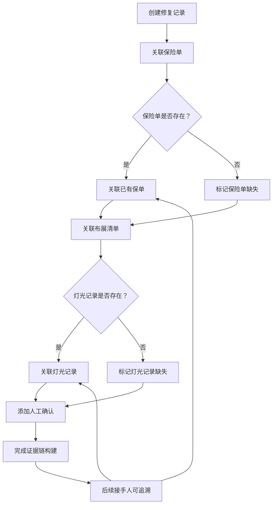

## 1. 产品概述

画廊藏品修复记录管理系统——解决画廊助理接手修复记录时靠记忆追溯保险单变更、灯光记录缺失、策展备注重复等问题。将保险单、人工确认和布展清单串接成可追溯的证据链，确保核心依据不因人员交接而丢失。

- 目标用户：画廊助理、修复师、策展人
- 核心价值：消除信息孤岛，让每一次修复结论都能回溯到保险单条款或灯光记录，让接手人无需"问一圈"即可还原完整决策链

## 2. 核心功能

### 2.1 用户角色

| 角色 | 注册方式 | 核心权限 |
|------|----------|----------|
| 画廊助理 | 管理员分配 | 创建/编辑修复记录，导入导出，撤回修正 |
| 修复师 | 管理员分配 | 查看修复记录，添加修复备注，关联保险单 |
| 策展人 | 管理员分配 | 查看布展清单，关联修复记录与布展信息 |

### 2.2 功能模块

1. **修复记录总览页**：记录列表、筛选、批量操作、导出
2. **修复记录详情页**：完整证据链视图，可跳转至关联的保险单/灯光记录/布展清单
3. **保险单管理页**：保险单列表、状态追踪、变更历史
4. **布展清单页**：展览与藏品布展信息、灯光记录关联
5. **操作中心**：导入、撤回修正、筛选后导出的统一入口

### 2.3 页面详情

| 页面名称 | 模块名称 | 功能描述 |
|----------|----------|----------|
| 修复记录总览页 | 记录列表 | 展示所有修复记录，支持按状态/日期/保险单关联状态筛选，标记缺失证据的记录 |
| 修复记录总览页 | 筛选面板 | 多维度筛选：保险单状态、灯光记录完整性、布展清单关联、修复状态 |
| 修复记录总览页 | 批量操作栏 | 批量导出、批量关联保险单、批量标记确认 |
| 修复记录详情页 | 基本信息卡 | 修复编号、藏品名称、修复日期、修复师、修复状态 |
| 修复记录详情页 | 证据链时间线 | 按时间展示保险单变更、人工确认、灯光调整、布展安排，每条可点击跳转至源记录 |
| 修复记录详情页 | 关联保险单面板 | 展示关联的保险单详情、变更历史，支持新增/更换关联 |
| 修复记录详情页 | 关联布展清单面板 | 展示布展信息与灯光记录，标记灯光记录缺失状态 |
| 修复记录详情页 | 撤回修正面板 | 展示修正历史，支持撤回到指定版本 |
| 保险单管理页 | 保险单列表 | 所有保险单及其状态，支持按保单号/藏品/有效期筛选 |
| 保险单管理页 | 变更追踪 | 保险单每次修改的记录，关联到受影响的修复记录 |
| 布展清单页 | 布展列表 | 展览信息与布展藏品列表 |
| 布展清单页 | 灯光记录面板 | 每件藏品的灯光设置记录，标记缺失项 |
| 操作中心 | 导入向导 | 支持JSON/CSV导入保险单、修复记录、布展清单，含重复检测与冲突提示 |
| 操作中心 | 撤回修正 | 选择修复记录并回退到指定修正版本，保留完整审计日志 |
| 操作中心 | 筛选导出 | 按筛选条件导出为JSON/CSV，确保导出数据与界面筛选口径一致 |

## 3. 核心流程

**修复记录创建与证据链构建流程：**
1. 画廊助理创建修复记录，填写基本信息
2. 关联已有保险单（若无则标记"保险单缺失"）
3. 关联布展清单与灯光记录（若灯光记录缺失则标记警告）
4. 添加人工确认记录
5. 修复记录状态更新时，自动在证据链时间线中追加条目
6. 后续接手人可从任意结论点回溯到保险单条款或灯光记录

**数据导入与冲突处理流程：**
1. 选择导入类型（保险单/修复记录/布展清单）
2. 系统检测重复数据（按编号或关键字段匹配）
3. 对重复数据给出"跳过/覆盖/保留两份"选项
4. 对缺失关联的数据标记警告
5. 导入完成后生成导入报告

## 4. 用户界面设计

### 4.1 设计风格

- 主色调：深炭灰 (#1C1C1E) + 暖象牙白 (#FAF9F6)，传达画廊的沉稳与专业
- 强调色：琥珀金 (#C9A84C)，用于证据链关键节点与状态标记
- 警告色：珊瑚红 (#E07A5F)，用于缺失/冲突标记
- 确认色：鼠尾草绿 (#81B29A)，用于已完成/已确认状态
- 字体：Noto Serif SC（标题）+ Noto Sans SC（正文），中西文统一
- 按钮风格：圆角矩形（8px），轻微阴影，hover时提升阴影
- 布局风格：左侧导航 + 右侧内容区，卡片式内容组织
- 图标：Lucide图标库，线性风格

### 4.2 页面设计概览

| 页面名称 | 模块名称 | UI要素 |
|----------|----------|--------|
| 修复记录总览页 | 记录列表 | 表格布局，行左侧色条标识证据完整度（绿/黄/红），hover展开预览 |
| 修复记录总览页 | 筛选面板 | 顶部折叠式筛选栏，多选标签+日期范围+状态切换 |
| 修复记录详情页 | 证据链时间线 | 垂直时间线，左侧图标+连线，右侧详情卡片，可点击跳转 |
| 修复记录详情页 | 关联面板 | 右侧固定面板，标签页切换保险单/布展/确认 |
| 保险单管理页 | 保险单列表 | 卡片网格布局，每张卡片含保单号、状态色条、关联修复记录数 |
| 操作中心 | 导入向导 | 分步骤表单，步骤指示器+预览确认+导入结果报告 |

### 4.3 响应式设计

- 桌面优先设计，最小宽度1024px
- 1920px+充分利用横向空间展示证据链全貌
- 1024-1440px适当折叠侧面板为抽屉
- 移动端暂不作为主要适配目标

### 4.4 3D场景指导

不适用
