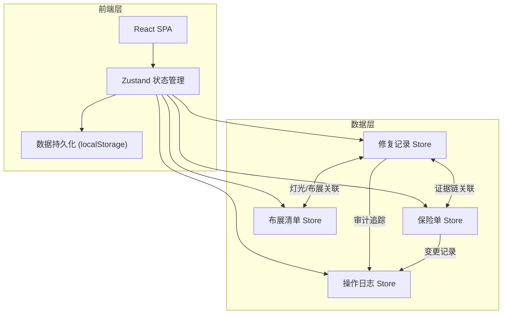
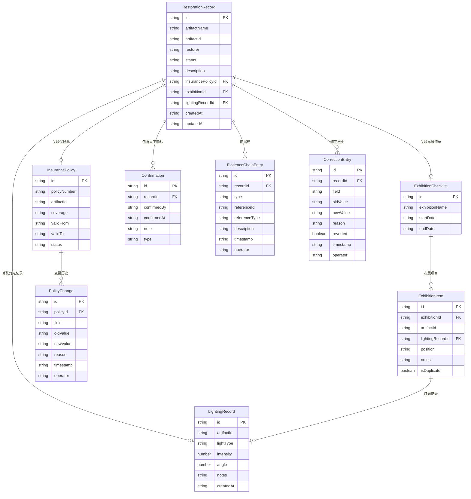

## 1. 架构设计



采用纯前端架构，使用localStorage进行数据持久化，Zustand进行状态管理。所有数据在浏览器本地运行，无需后端服务。

## 2. 技术说明

- 前端：React@18 + TypeScript + Tailwind CSS@3 + Vite
- 初始化工具：vite-init (react-ts 模板)
- 后端：无（纯前端，数据存储在 localStorage）
- 状态管理：Zustand（含持久化中间件）
- 图标库：lucide-react
- 日期处理：date-fns
- 数据导出：原生实现（JSON/CSV）

## 3. 路由定义

| 路由 | 用途 |
|------|------|
| / | 修复记录总览页（默认首页） |
| /record/:id | 修复记录详情页，含证据链时间线 |
| /insurance | 保险单管理页 |
| /exhibition | 布展清单页 |
| /operations | 操作中心（导入/撤回/导出） |

## 4. API 定义

无后端 API。前端通过 Zustand Store 直接操作数据，所有数据模型定义如下：

### 4.1 核心数据类型

```typescript
interface RestorationRecord {
  id: string;
  artifactName: string;
  artifactId: string;
  restorer: string;
  status: 'draft' | 'in_progress' | 'completed' | 'archived';
  description: string;
  insurancePolicyId: string | null;
  exhibitionId: string | null;
  lightingRecordId: string | null;
  confirmations: Confirmation[];
  evidenceChain: EvidenceChainEntry[];
  correctionHistory: CorrectionEntry[];
  createdAt: string;
  updatedAt: string;
}

interface InsurancePolicy {
  id: string;
  policyNumber: string;
  artifactId: string;
  coverage: string;
  validFrom: string;
  validTo: string;
  status: 'active' | 'expired' | 'pending' | 'cancelled';
  changeHistory: PolicyChange[];
  linkedRecordIds: string[];
}

interface ExhibitionChecklist {
  id: string;
  exhibitionName: string;
  startDate: string;
  endDate: string;
  items: ExhibitionItem[];
}

interface ExhibitionItem {
  id: string;
  artifactId: string;
  lightingRecordId: string | null;
  position: string;
  notes: string;
  isDuplicate: boolean;
}

interface LightingRecord {
  id: string;
  artifactId: string;
  lightType: string;
  intensity: number;
  angle: number;
  notes: string;
  createdAt: string;
}

interface Confirmation {
  id: string;
  recordId: string;
  confirmedBy: string;
  confirmedAt: string;
  note: string;
  type: 'insurance_verified' | 'lighting_checked' | 'exhibition_confirmed' | 'manual_review';
}

interface EvidenceChainEntry {
  id: string;
  recordId: string;
  type: 'insurance_change' | 'confirmation' | 'lighting_update' | 'exhibition_update' | 'correction' | 'status_change';
  referenceId: string;
  referenceType: 'insurance' | 'lighting' | 'exhibition' | 'confirmation';
  description: string;
  timestamp: string;
  operator: string;
}

interface CorrectionEntry {
  id: string;
  recordId: string;
  field: string;
  oldValue: string;
  newValue: string;
  reason: string;
  reverted: boolean;
  revertedAt: string | null;
  revertedBy: string | null;
  timestamp: string;
  operator: string;
}

interface PolicyChange {
  id: string;
  policyId: string;
  field: string;
  oldValue: string;
  newValue: string;
  reason: string;
  timestamp: string;
  operator: string;
  affectedRecordIds: string[];
}

interface ImportResult {
  id: string;
  type: 'insurance' | 'record' | 'exhibition';
  totalCount: number;
  successCount: number;
  skippedCount: number;
  errorCount: number;
  conflicts: ImportConflict[];
  timestamp: string;
}

interface ImportConflict {
  localId: string;
  importedId: string;
  conflictType: 'duplicate' | 'field_mismatch';
  resolution: 'skip' | 'overwrite' | 'keep_both' | null;
  fields: string[];
}
```

## 5. 服务器架构图

不适用（纯前端架构）

## 6. 数据模型

### 6.1 数据模型定义



### 6.2 数据定义语言

使用 localStorage 存储，数据以 JSON 序列化形式保存。初始种子数据包含以下场景：

1. **正常保险单场景**：完整的保险单 + 灯光记录 + 布展清单
2. **缺灯光记录场景**：保险单正常但灯光记录为null，界面显示缺失警告
3. **重复策展备注场景**：同一藏品出现在多个布展清单中，isDuplicate标记为true
4. **边界情况**：保险单已过期、修复记录无关联、确认记录缺失等

```typescript
const SEED_DATA = {
  insurancePolicies: [...],
  restorationRecords: [...],
  exhibitionChecklists: [...],
  lightingRecords: [...],
};
```
