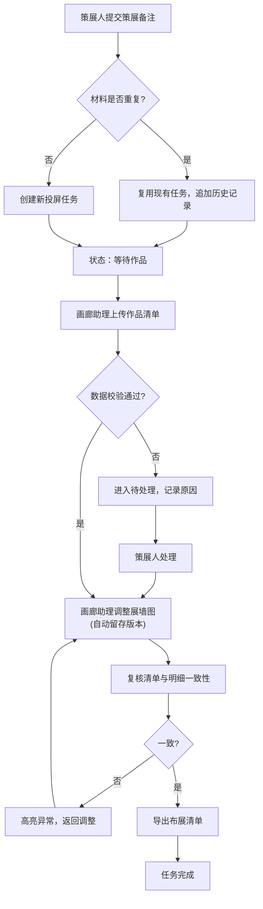

## 1. 产品概述

数字艺术投屏管理系统，用于解决画廊策展流程中策展备注与作品清单不同步、历史记录追溯困难、人工修改无留痕等问题。面向策展人和画廊助理，提供可重复运行的投屏任务管理、完整的审计追踪和版本历史功能。

- 解决问题：策展材料异步到达、重复执行无幂等性、人工修改无痕迹、数据不一致
- 目标用户：策展人、画廊助理
- 核心价值：清晰的状态流转、完整的操作留痕、数据一致性保障

## 2. 核心功能

### 2.1 用户角色

| 角色 | 注册方式 | 核心权限 |
|------|----------|----------|
| 策展人 | 系统内置 | 创建投屏任务、查看全部记录、审批待处理项 |
| 画廊助理 | 系统内置 | 上传作品清单、修改展墙图、导出布展清单、复核数据 |

### 2.2 功能模块

1. **投屏任务列表页**：任务概览、状态筛选、搜索、新建任务
2. **任务详情页**：基本信息、状态时间线、策展备注、作品清单、展墙图历史、操作记录
3. **待处理中心**：待处理任务列表、原因展示、处理操作
4. **导出复核页**：布展清单预览、数据一致性检查、导出功能

### 2.3 页面详情

| 页面名称 | 模块名称 | 功能描述 |
|----------|----------|----------|
| 投屏任务列表页 | 任务卡片 | 显示任务ID、来源、当前状态、创建时间、最后修改人 |
| 投屏任务列表页 | 筛选搜索 | 按状态、时间范围、来源筛选，关键词搜索 |
| 投屏任务列表页 | 新建任务 | 输入策展备注，创建新投屏任务（幂等性校验） |
| 任务详情页 | 状态时间线 | 可视化展示状态流转历史，含时间、操作人、备注 |
| 任务详情页 | 策展备注区 | 显示策展备注内容、样例模板、上传时间 |
| 任务详情页 | 作品清单区 | 作品列表、上传时间、与历史版本对比 |
| 任务详情页 | 展墙图历史 | 版本列表、前后版本对比查看、修改人记录 |
| 任务详情页 | 操作日志 | 完整的审计追踪：谁、何时、改了什么 |
| 待处理中心 | 待处理列表 | 显示进入待处理的原因、责任人、等待时长 |
| 导出复核页 | 清单预览 | 布展清单与明细的联动预览 |
| 导出复核页 | 一致性检查 | 自动校验清单与明细是否一致，高亮异常 |
| 导出复核页 | 导出功能 | 导出PDF/Excel格式的布展清单 |

## 3. 核心流程

策展人提交策展备注 → 系统创建投屏任务（校验幂等性，重复材料不新建）→ 任务进入"等待作品"状态 → 画廊助理上传作品清单 → 系统校验数据一致性 → 如发现问题进入"待处理"状态并记录原因 → 策展人处理待处理项 → 画廊助理可手动调整展墙图（自动留存历史版本）→ 复核布展清单与明细一致性 → 导出最终布展清单 → 任务完成

## 4. 用户界面设计

### 4.1 设计风格

- 主色调：深炭灰 (#1A1A2E) 搭配墨绿 (#16213E)，体现艺术感与专业感
- 点缀色：金色 (#E8B86D)，用于强调重要状态和操作按钮
- 中性色：象牙白 (#F5F0E8)、浅灰 (#E0D8D0)，保证阅读舒适度
- 按钮风格：微圆角 (4px)，轻微悬浮效果，金色边框强调主按钮
- 字体：标题用 Noto Serif SC（宋体风格，体现文艺气质），正文用 Noto Sans SC（清晰易读）
- 布局风格：卡片式布局，左侧导航 + 主内容区，时间线采用竖线连接的节点式设计
- 图标风格：线性简约图标，统一 24px 尺寸，金色填充激活状态

### 4.2 页面设计概述

| 页面名称 | 模块名称 | UI 元素 |
|----------|----------|---------|
| 投屏任务列表页 | 任务卡片 | 深灰底色卡片，金色状态标签，时间线微动画，hover 轻微上浮 |
| 任务详情页 | 状态时间线 | 竖线连接节点，当前状态金色高亮，历史状态半透明灰色 |
| 任务详情页 | 展墙图对比 | 左右分栏对比，滑动杆可调节对比位置，版本标签金色标注 |
| 待处理中心 | 原因展示 | 红色边框提示框，清晰展示问题原因和建议处理方案 |
| 导出复核页 | 一致性检查 | 绿色对勾/红色叉号直观展示校验结果，一键定位异常项 |

### 4.3 响应式

- 桌面优先设计 (1440px)
- 平板适配：左侧导航折叠为图标模式
- 移动端：底部导航栏，卡片纵向堆叠，时间线简化为横向滑动

### 4.4 动效设计

- 页面加载：卡片渐入 + 轻微上浮动画 (stagger 效果)
- 状态变更：金色光晕脉冲效果
- 展墙图切换：淡入淡出过渡 (300ms)
- 按钮悬浮：背景色渐变 + 轻微缩放 (1.02x)
