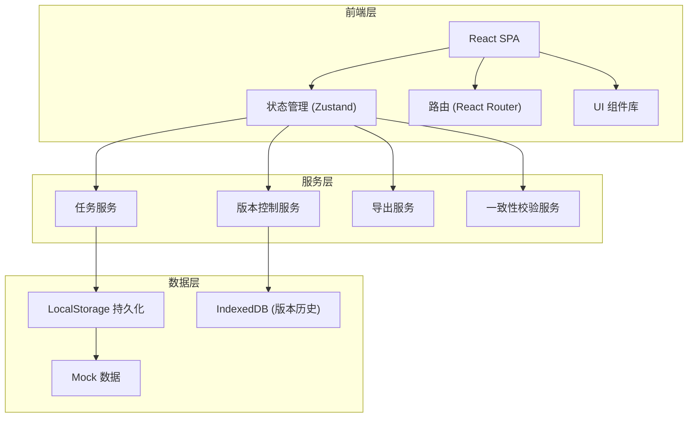
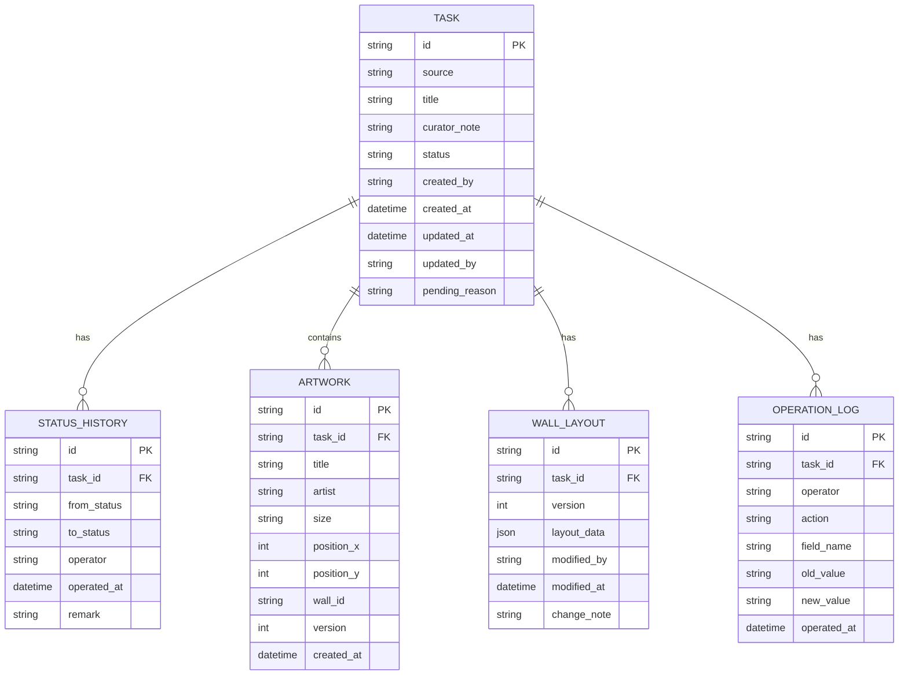

## 1. 架构设计



## 2. 技术描述

- 前端框架：React@18 + TypeScript
- 构建工具：Vite@5
- 样式方案：TailwindCSS@3
- 状态管理：Zustand
- 路由：React Router@6
- 图标：Lucide React
- 数据持久化：LocalStorage + IndexedDB
- 导出功能：jspdf + xlsx

## 3. 路由定义

| 路由 | 页面 | 功能 |
|------|------|------|
| / | 投屏任务列表 | 任务概览、筛选搜索、新建任务 |
| /tasks/:id | 任务详情 | 状态时间线、策展备注、作品清单、展墙图历史、操作日志 |
| /pending | 待处理中心 | 待处理任务列表、原因展示、处理操作 |
| /export/:id | 导出复核 | 清单预览、一致性检查、导出功能 |

## 4. 数据模型

### 4.1 ER 图



### 4.2 TypeScript 类型定义

```typescript
type TaskStatus = 'waiting_artworks' | 'pending' | 'reviewing' | 'completed';

interface Task {
  id: string;
  source: string;
  title: string;
  curatorNote: string;
  status: TaskStatus;
  createdBy: string;
  createdAt: string;
  updatedAt: string;
  updatedBy: string;
  pendingReason?: string;
}

interface StatusHistory {
  id: string;
  taskId: string;
  fromStatus: TaskStatus | null;
  toStatus: TaskStatus;
  operator: string;
  operatedAt: string;
  remark?: string;
}

interface Artwork {
  id: string;
  taskId: string;
  title: string;
  artist: string;
  size: string;
  positionX: number;
  positionY: number;
  wallId: string;
  version: number;
  createdAt: string;
}

interface WallLayout {
  id: string;
  taskId: string;
  version: number;
  layoutData: Record<string, unknown>;
  modifiedBy: string;
  modifiedAt: string;
  changeNote: string;
}

interface OperationLog {
  id: string;
  taskId: string;
  operator: string;
  action: 'create' | 'update' | 'delete';
  fieldName: string;
  oldValue?: string;
  newValue?: string;
  operatedAt: string;
}
```

## 5. 核心服务设计

### 5.1 任务服务 (TaskService)

- `createTask(source, curatorNote)`: 创建任务，包含幂等性校验
- `checkDuplicate(sourceHash)`: 检查是否为重复材料
- `updateTaskStatus(taskId, newStatus, reason?)`: 更新任务状态
- `getTaskList(filters)`: 获取任务列表

### 5.2 版本控制服务 (VersionService)

- `saveWallLayout(taskId, layoutData, changeNote)`: 保存展墙图新版本
- `compareLayouts(version1, version2)`: 对比两个版本差异
- `getLayoutHistory(taskId)`: 获取展墙图历史版本

### 5.3 一致性校验服务 (ConsistencyService)

- `checkArtworkConsistency(taskId)`: 校验作品清单与展墙图一致性
- `checkListDetailConsistency(taskId)`: 校验布展清单与明细一致性
- `getInconsistencies(taskId)`: 获取不一致项列表

### 5.4 导出服务 (ExportService)

- `exportToPDF(taskId)`: 导出 PDF 格式布展清单
- `exportToExcel(taskId)`: 导出 Excel 格式布展清单
- `generatePreview(taskId)`: 生成预览数据
