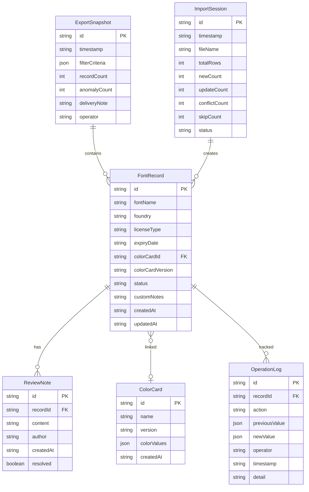

## 1. 架构设计

```mermaid
flowchart TB
    subgraph "前端层"
        "React + TypeScript + Tailwind CSS"
        "Zustand 状态管理"
        "React Router 路由"
    end
    subgraph "数据持久层"
        "localStorage / IndexedDB"
        "操作日志"
        "导出快照"
    end
    subgraph "工具层"
        "CSV/JSON 解析器"
        "重复检测引擎"
        "一致性校验引擎"
        "交付文档生成器"
    end
    "前端层" --> "数据持久层"
    "前端层" --> "工具层"
```

纯前端应用，无需后端服务。所有数据持久化到浏览器本地存储（IndexedDB），确保核心证据不因页面刷新丢失。

## 2. 技术说明

- 前端：React@18 + TypeScript + Tailwind CSS@3 + Vite
- 初始化工具：vite-init
- 后端：无（纯前端，数据存 IndexedDB）
- 数据库：IndexedDB（通过 idb 库操作），用于持久化字体记录、操作日志、导出快照

## 3. 路由定义

| 路由 | 用途 |
|------|------|
| / | 授权总览页：状态看板、异常告警、变更时间线 |
| /fonts | 字体授权列表页：核心工作区，筛选/排序/批量操作/详情侧栏 |
| /import | 导入与复核页：文件导入、重复检测、字段补全、冲突处理 |
| /export | 导出与交付页：筛选导出、一致性校验、交付说明生成 |

## 4. API 定义（无后端，纯前端数据模型）

### 4.1 核心类型定义

```typescript
interface FontRecord {
  id: string
  fontName: string
  foundry: string
  licenseType: '商业' | '个人' | '开源' | '自定义'
  licenseFile?: string
  expiryDate?: string
  usageScope?: string
  colorCardId?: string
  colorCardVersion?: string
  status: 'confirmed' | 'pending' | 'expired' | 'conflict'
  reviewNotes: ReviewNote[]
  customNotes: string
  createdAt: string
  updatedAt: string
  sourceImportId?: string
}

interface ColorCard {
  id: string
  name: string
  version: string
  colorValues: { hex: string; name: string }[]
  createdAt: string
}

interface ReviewNote {
  id: string
  content: string
  author: string
  createdAt: string
  resolved: boolean
}

interface OperationLog {
  id: string
  recordId: string
  action: 'import' | 'update' | 'confirm' | 'revoke' | 'merge' | 'skip' | 'export'
  previousValue?: Partial<FontRecord>
  newValue?: Partial<FontRecord>
  operator: string
  timestamp: string
  detail: string
}

interface ExportSnapshot {
  id: string
  timestamp: string
  filterCriteria: Record<string, string[]>
  recordCount: number
  anomalyCount: number
  deliveryNote: string
  operator: string
  records: FontRecord[]
}

interface ImportSession {
  id: string
  timestamp: string
  fileName: string
  totalRows: number
  newCount: number
  updateCount: number
  conflictCount: number
  skipCount: number
  status: 'preview' | 'processing' | 'completed' | 'cancelled'
}
```

### 4.2 Zustand Store 定义

```typescript
interface FontLicenseStore {
  records: FontRecord[]
  colorCards: ColorCard[]
  operationLogs: OperationLog[]
  exportSnapshots: ExportSnapshot[]
  importSessions: ImportSession[]

  addRecords: (records: FontRecord[]) => void
  updateRecord: (id: string, patch: Partial<FontRecord>) => void
  batchUpdateStatus: (ids: string[], status: FontRecord['status']) => void
  linkColorCard: (recordId: string, cardId: string, version: string) => void
  addReviewNote: (recordId: string, note: ReviewNote) => void
  logOperation: (log: Omit<OperationLog, 'id' | 'timestamp'>) => void
  revokeOperation: (logId: string) => void

  importData: (file: File) => Promise<ImportSession>
  detectDuplicates: (records: Partial<FontRecord>[]) => Map<string, FontRecord[]>
  validateBeforeExport: (ids: string[]) => { valid: string[]; anomalies: { id: string; reason: string }[] }
  exportRecords: (ids: string[], format: 'csv' | 'json') => ExportSnapshot
  generateDeliveryNote: (snapshot: ExportSnapshot) => string
}
```

## 5. 无后端架构

## 6. 数据模型

### 6.1 数据模型关系



### 6.2 IndexedDB 存储

使用 idb 库管理 IndexedDB，建库脚本如下：

- 数据库名：`FontLicenseTracker`
- 版本：1
- Object Stores：
  - `records`：主键 `id`，索引 `fontName`、`status`、`expiryDate`、`colorCardId`
  - `colorCards`：主键 `id`，索引 `name`
  - `operationLogs`：主键 `id`，索引 `recordId`、`timestamp`
  - `exportSnapshots`：主键 `id`，索引 `timestamp`
  - `importSessions`：主键 `id`，索引 `timestamp`

初始化时预置 3 条示例色卡数据和 8 条示例字体记录，覆盖正常/待确认/已过期/冲突四种状态。
