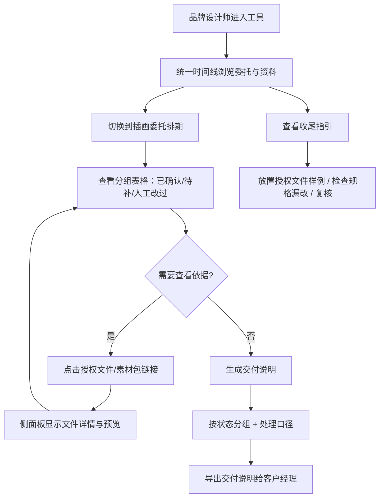

## 1. 产品概述

品牌设计师日常需要同时处理授权文件、素材包和版式稿，当前这些资料分散在不同文件夹中，缺乏统一的可视化排期和可追溯链接。本工具为品牌设计师提供一个轻量级"插画委托排期"管理界面，将三类资料放在同一时间线上浏览，支持从排期结论回溯到授权文件或素材包依据，并自动区分已确认、待补和人工改过的记录，最终生成带处理口径的交付说明供客户经理使用。

- 目标用户：品牌设计师、客户经理
- 核心价值：减少资料查找成本、提高排期透明度、确保交付说明有据可查

## 2. 核心功能

### 2.1 用户角色

| 角色 | 使用方式 | 核心权限 |
|------|----------|----------|
| 品牌设计师 | 直接使用 | 创建/编辑排期、上传授权文件样例、导出交付说明 |
| 客户经理 | 查看交付 | 查看交付说明、追溯依据文件 |

### 2.2 功能模块

1. **统一时间线**：授权文件、素材包、版式稿三类资料在同一时间轴上横向排列，可直观看到每条委托的完整资料链
2. **插画委托排期**：以表格+分组形式展示所有委托记录，按"已确认""待补""人工改过"三种状态分组，每条记录可点击回溯到对应的授权文件或素材包
3. **交付说明生成**：一键导出带处理口径的交付说明，按状态分组汇总，供客户经理直接使用
4. **收尾指引**：简洁的操作指引，包含授权文件样例放置方法、导出规格漏改检查位置、交付前复核步骤

### 2.3 页面详情

| 页面名称 | 模块名称 | 功能描述 |
|----------|----------|----------|
| 统一时间线 | 时间轴视图 | 三类资料在同一横向时间线上展示，每条委托下方依次排列授权文件、素材包、版式稿的关联节点，点击节点可跳转到对应排期记录 |
| 统一时间线 | 筛选与搜索 | 按状态（已确认/待补/人工改过）、日期范围、关键词筛选 |
| 插画委托排期 | 排期总表 | 所有委托记录以分组表格展示，三组：已确认、待补、人工改过；每行显示委托名、日期、关联文件数、状态标签 |
| 插画委托排期 | 依据追溯 | 点击排期记录中的"授权文件"或"素材包"链接，弹出侧面板显示对应的文件信息和预览 |
| 交付说明 | 说明文档 | 按状态分组的交付摘要，每组带处理口径描述，支持导出为文本 |
| 收尾指引 | 操作指南 | 三步指引卡片：1) 如何放置授权文件样例 2) 去哪检查导出规格漏改 3) 导出前如何复核 |

## 3. 核心流程

品牌设计师进入工具后，首先在统一时间线上纵览所有委托及其关联资料。需要编排排期时，切换到"插画委托排期"页面，查看按状态分组的记录表；对任意记录点击"授权文件"或"素材包"链接，即可在侧面板中查看依据来源。排期完成后，点击"生成交付说明"，系统自动按已确认/待补/人工改过三组汇总并附带处理口径，导出给客户经理。

## 4. 用户界面设计

### 4.1 设计风格

- 主色调：暖灰底色（#F5F3EF）+ 深炭文字（#2D2D2D），点缀用靛蓝（#4A6FA5）表示链接和状态
- 次要色调：柔绿（#7BA37E）= 已确认、琥珀（#D4A843）= 待补、朱红（#C75C5C）= 人工改过
- 按钮：圆角 6px，轻投影，无 3D 效果
- 字体：标题用 Noto Serif SC，正文用 Noto Sans SC，尺寸层级 14/16/20/24px
- 布局：左侧导航栏 + 右侧内容区，内容区最大宽度 1200px 居中
- 图标：使用 lucide-react 线性图标

### 4.2 页面设计概览

| 页面名称 | 模块名称 | UI 元素 |
|----------|----------|----------|
| 统一时间线 | 时间轴视图 | 横向时间轴、三类资料节点（圆形图标+文字标签）、连接线、悬浮提示 |
| 统一时间线 | 筛选栏 | 状态下拉、日期选择器、搜索输入框 |
| 插画委托排期 | 分组表格 | 三组卡片式表格、每组标题带状态色条、行内链接按钮 |
| 插画委托排期 | 侧面板 | 右侧滑出面板、文件名+类型+上传日期、缩略图预览区 |
| 交付说明 | 文档视图 | 分组摘要卡片、每组下方处理口径文字、底部导出按钮 |
| 收尾指引 | 指引卡片 | 三张编号卡片、每张含标题+2-3行说明+跳转按钮 |

### 4.3 响应式设计

桌面优先设计，内容区最小宽度 1024px。导航栏在窄屏时折叠为顶部汉堡菜单，表格在窄屏时切换为卡片列表模式。

### 4.4 3D 场景

不涉及
