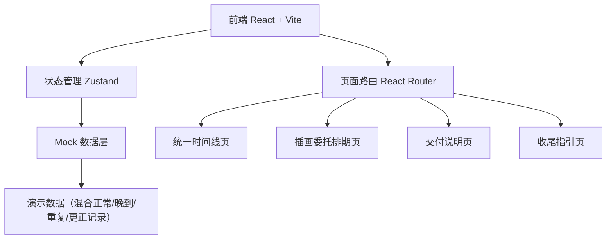
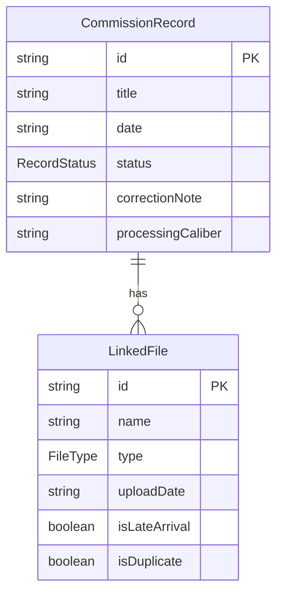

## 1. 架构设计



纯前端项目，无后端服务。数据通过 Zustand store 管理，演示数据内置于前端代码中。

## 2. 技术说明

- 前端：React@18 + TypeScript + Tailwind CSS@3 + Vite
- 初始化工具：vite-init（react-ts 模板）
- 后端：无
- 数据库：无，使用 Mock 数据
- 状态管理：Zustand
- 路由：React Router DOM v6
- 图标：lucide-react

## 3. 路由定义

| 路由 | 用途 |
|------|------|
| / | 重定向到 /timeline |
| /timeline | 统一时间线页面 |
| /schedule | 插画委托排期页面 |
| /delivery | 交付说明页面 |
| /guide | 收尾指引页面 |

## 4. API 定义

无后端 API，所有数据通过前端 Zustand store 的 mock 数据提供。

### 数据类型定义

```typescript
type RecordStatus = "confirmed" | "pending" | "manual_corrected"

interface LinkedFile {
  id: string
  name: string
  type: "authorization" | "asset_pack" | "layout_draft"
  uploadDate: string
  isLateArrival: boolean
  isDuplicate: boolean
  thumbnailUrl?: string
}

interface CommissionRecord {
  id: string
  title: string
  date: string
  status: RecordStatus
  linkedFiles: LinkedFile[]
  correctionNote?: string
  processingCaliber?: string
}

interface DeliveryGroup {
  status: RecordStatus
  label: string
  records: CommissionRecord[]
  caliber: string
}
```

## 5. 服务端架构

不涉及

## 6. 数据模型

### 6.1 数据模型图



### 6.2 演示数据说明

Mock 数据包含以下类型记录：
- **正常记录**：完整的三类关联文件，状态为"已确认"
- **晚到附件**：部分文件标记 `isLateArrival: true`，状态为"待补"
- **重复项**：文件标记 `isDuplicate: true`，需人工确认
- **人工更正**：含 `correctionNote` 字段，状态为"人工改过"
