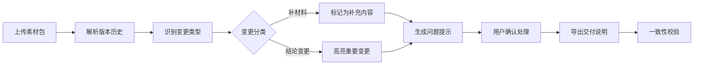

## 1. 产品概述

展板文案校对工具是一款面向设计、市场和印刷供应商的协作校对平台，解决交付前临时补材料、规格混乱、变更追溯难等痛点。

- **核心问题**：素材早到、版式晚补、色卡手工改动混在一起，团队说不清哪些是补材料、哪些真改了结论
- **目标用户**：设计团队、市场团队、印刷供应商等一线协作人员
- **产品价值**：让校对成为一线同事愿意用的工具，降低沟通成本，提高交付质量

## 2. 核心功能

### 2.1 用户角色

| 角色 | 注册方式 | 核心权限 |
|------|----------|----------|
| 校对人员 | 本地登录 | 上传素材、执行校对、查看结果、导出报告 |
| 管理员 | 本地登录 | 配置规则、管理模板、查看统计 |

### 2.2 功能模块

1. **校对工作台**：素材上传、版本对比、批量处理、实时预览
2. **变更分析**：智能区分补材料 vs 结论变更、变更历史追溯
3. **人性化提示**：自然语言错误提示、问题解释、建议方案
4. **导出中心**：交付说明导出、版本一致性验证、屏幕范围同步
5. **设置中心**：校对规则配置、色卡管理、模板管理

### 2.3 页面详情

| 页面名称 | 模块名称 | 功能描述 |
|-----------|-------------|---------------------|
| 校对工作台 | 素材上传区 | 拖拽上传、格式校验、进度显示 |
| 校对工作台 | 版本对比区 | 双栏对比、差异高亮、变更分类 |
| 校对工作台 | 问题列表区 | 人性化提示、问题分类、批量处理 |
| 变更分析页 | 变更概览 | 统计补材料与结论变更数量、趋势图 |
| 变更分析页 | 变更详情 | 每条变更的原因、影响、处理建议 |
| 导出中心页 | 导出配置 | 选择导出范围、格式、模板 |
| 导出中心页 | 一致性校验 | 屏幕范围与导出内容自动校验 |
| 设置中心页 | 规则配置 | 自定义校对规则、关键词、色值标准 |

## 3. 核心流程

用户上传素材包 → 系统自动解析版本历史 → 智能识别变更类型 → 区分补材料与结论变更 → 生成人性化问题提示 → 用户确认处理 → 导出一致的交付说明

## 4. 用户界面设计

### 4.1 设计风格

- **主色调**：深蓝色 (#1e3a5f) - 专业、可靠
- **辅助色**：
  - 补材料标记：浅蓝 (#3b82f6) - 中性、补充
  - 结论变更：橙色 (#f97316) - 警告、重要
  - 错误提示：红色 (#ef4444) - 问题、需处理
- **按钮风格**：圆角 8px，微妙阴影，悬停有微动效
- **字体**：PingFang SC（中文）、SF Pro（英文），清晰易读
- **布局风格**：卡片式布局，左侧导航 + 主内容区，信息层级清晰
- **图标风格**：线性图标，简约现代，emoji 辅助表达情绪

### 4.2 页面设计概述

| 页面名称 | 模块名称 | UI 元素 |
|-----------|-------------|-------------|
| 校对工作台 | 素材上传区 | 大拖放区域、文件图标、进度条动画 |
| 校对工作台 | 版本对比区 | 双栏布局、差异高亮遮罩、时间轴 |
| 校对工作台 | 问题列表区 | 卡片式问题项、彩色标签、展开详情动画 |
| 变更分析页 | 变更概览 | 饼图统计、趋势折线、数据卡片动效 |
| 导出中心页 | 一致性校验 | 绿色对勾/红色叉号状态、同步动画 |

### 4.3 响应式

- 桌面端优先设计（1440px）
- 平板端（768px）：双栏变单栏，导航收起
- 移动端（375px）：简化布局，核心功能保留

### 4.4 微交互设计

- 上传文件时的进度动画
- 变更识别完成后的庆祝动效
- 问题解决后的绿色打勾动画
- 导出时的纸张飞出效果
- 悬停卡片的微妙上浮
