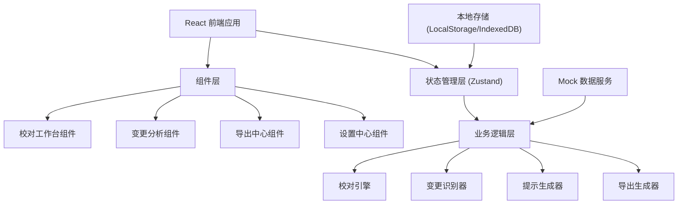

## 1. 架构设计



## 2. 技术描述

- **前端框架**: React@18 + TypeScript
- **构建工具**: Vite@5
- **样式方案**: TailwindCSS@3 + CSS 变量
- **状态管理**: Zustand
- **路由**: React Router@6
- **图表库**: Recharts
- **图标**: Lucide React
- **动画**: Framer Motion
- **本地存储**: LocalStorage + IndexedDB (批量数据)
- **数据**: Mock 数据模拟后端

## 3. 核心技术决策

### 3.1 状态管理设计
使用 Zustand 管理全局状态，包括：
- 当前校对任务状态
- 屏幕范围记录（刷新/重启后恢复）
- 筛选条件缓存
- 批量处理队列

### 3.2 校对引擎设计
- 基于规则的文本对比算法
- 语义分析区分"补材料"与"结论变更"
- 色值差异检测
- 版本历史时间轴管理

### 3.3 一致性保证
- 导出时自动捕获当前屏幕范围
- 筛选条件序列化到 URL 参数
- 页面刷新时从 URL 恢复状态
- 导出文档包含状态快照哈希

### 3.4 批量处理稳定性
- 任务队列机制，避免并发冲突
- 幂等性设计，重复运行结果一致
- 进度持久化，中途中断可恢复
- 结果去重，避免越跑越多

## 4. 路由定义

| 路由 | 页面 | 功能 |
|-------|---------|---------|
| / | 校对工作台 | 素材上传、版本对比、问题列表 |
| /changes | 变更分析 | 变更统计、分类详情、历史追溯 |
| /export | 导出中心 | 交付说明导出、一致性校验 |
| /settings | 设置中心 | 规则配置、色卡管理、模板管理 |

## 5. 数据模型

### 5.1 TypeScript 类型定义

```typescript
// 素材文件
interface MaterialFile {
  id: string;
  name: string;
  type: 'text' | 'image' | 'color' | 'layout';
  content: string;
  uploadTime: number;
  version: string;
}

// 变更记录
interface ChangeRecord {
  id: string;
  fileId: string;
  field: string;
  oldValue: string;
  newValue: string;
  type: 'material' | 'conclusion'; // 补材料 / 结论变更
  category: string;
  severity: 'low' | 'medium' | 'high';
  description: string;
  suggestion: string;
  timestamp: number;
}

// 校对问题
interface ProofreadIssue {
  id: string;
  fileId: string;
  type: 'error' | 'warning' | 'info';
  title: string;
  message: string; // 人性化提示
  suggestion: string;
  location: {
    line?: number;
    field?: string;
  };
  resolved: boolean;
}

// 校对任务
interface ProofreadTask {
  id: string;
  name: string;
  status: 'pending' | 'processing' | 'completed' | 'error';
  files: MaterialFile[];
  changes: ChangeRecord[];
  issues: ProofreadIssue[];
  screenRange: ScreenRange;
  filters: FilterState;
  createdAt: number;
  updatedAt: number;
}

// 屏幕范围（用于一致性校验）
interface ScreenRange {
  scrollTop: number;
  scrollHeight: number;
  visibleStart: number;
  visibleEnd: number;
  timestamp: number;
}

// 筛选条件
interface FilterState {
  searchText: string;
  changeTypes: string[];
  severities: string[];
  resolvedStatus: string;
  sortBy: string;
}

// 导出配置
interface ExportConfig {
  format: 'pdf' | 'docx' | 'markdown';
  includeScreenRange: boolean;
  includeFilters: boolean;
  template: string;
  timestamp: number;
}
```

### 5.2 状态 Store 设计

```typescript
interface AppState {
  // 当前任务
  currentTask: ProofreadTask | null;
  // 任务列表
  tasks: ProofreadTask[];
  // 批量处理队列
  batchQueue: string[];
  batchProcessing: boolean;
  // 屏幕状态
  screenRange: ScreenRange;
  // 筛选条件
  filters: FilterState;
  // Actions
  setCurrentTask: (task: ProofreadTask | null) => void;
  addFile: (file: MaterialFile) => void;
  runProofread: () => Promise<void>;
  runBatchProofread: (taskIds: string[]) => Promise<void>;
  resolveIssue: (issueId: string) => void;
  setFilters: (filters: Partial<FilterState>) => void;
  setScreenRange: (range: ScreenRange) => void;
  exportReport: (config: ExportConfig) => Promise<string>;
  resetState: () => void;
}
```

## 6. 核心算法设计

### 6.1 变更分类算法
1. 关键词匹配识别补材料：补充、新增、完善、补上、更新素材等
2. 语义分析识别结论变更：修改、调整、更正、定稿等
3. 色值变化直接标记为结论变更
4. 版式调整根据影响范围判断

### 6.2 提示生成规则
- 避免技术术语：不说 "field mismatch"，说 "这里的文字前后不一致"
- 给出具体建议：不说 "invalid value"，说 "建议使用标准色值 #FFFFFF"
- 上下文关联：不说 "error at line 42"，说 "在标题部分发现一个问题..."

### 6.3 幂等性保证
- 每个文件生成内容哈希
- 校对结果按哈希缓存
- 重复处理直接返回缓存结果
- 批量处理按任务 ID 去重
